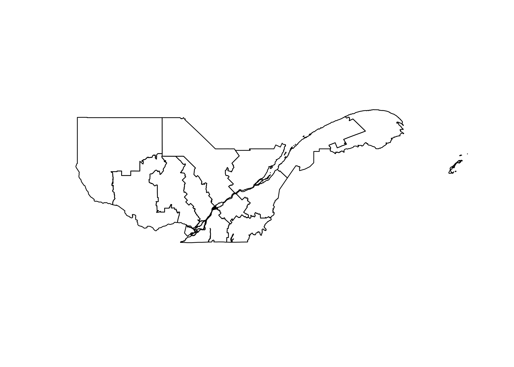
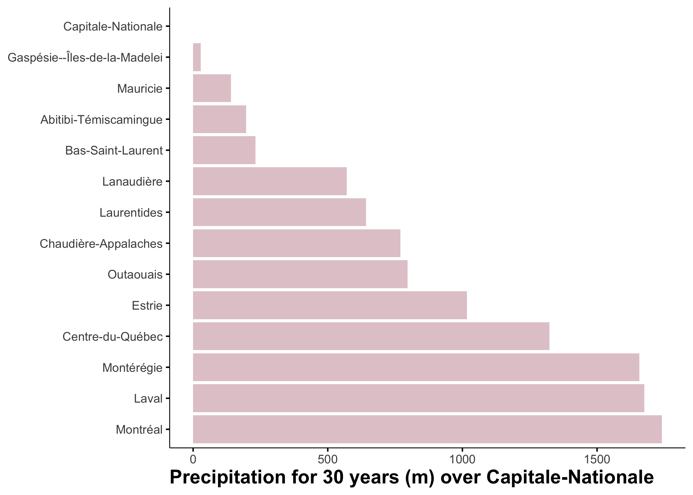

<link href="index_files/libs/htmltools-fill-0.5.8.1/fill.css" rel="stylesheet" />
<script src="index_files/libs/htmlwidgets-1.6.4/htmlwidgets.js"></script>
<link href="index_files/libs/datatables-css-0.0.0/datatables-crosstalk.css" rel="stylesheet" />
<script src="index_files/libs/datatables-binding-0.33/datatables.js"></script>
<script src="index_files/libs/jquery-3.6.0/jquery-3.6.0.min.js"></script>
<link href="index_files/libs/dt-core-1.13.6/css/jquery.dataTables.min.css" rel="stylesheet" />
<link href="index_files/libs/dt-core-1.13.6/css/jquery.dataTables.extra.css" rel="stylesheet" />
<script src="index_files/libs/dt-core-1.13.6/js/jquery.dataTables.min.js"></script>
<link href="index_files/libs/crosstalk-1.2.1/css/crosstalk.min.css" rel="stylesheet" />
<script src="index_files/libs/crosstalk-1.2.1/js/crosstalk.min.js"></script>


<a href = "https://johaniefournier.aweb.page/p/4b2b1e24-af09-488d-8ff6-7b46ce61e367"> 
</a>

<br>

Precipitation plays a crucial role in Quebec's climate, influencing everything from agriculture to hydrology and urban planning. Understanding long-term rainfall patterns is essential for assessing climate variability, detecting anomalies, and making informed environmental decisions.

In this blog post, we explore 30 years of precipitation data from the AgERA5 dataset, a high-resolution global reanalysis dataset widely used for climate studies. Using Exploratory Data Analysis (EDA) techniques, we investigate rainfall trends, seasonal variations, and precipitation anomalies across St. Lawrence Lowlands.

By the end of this analysis, you'll gain insights into how precipitation patterns have evolved over tree decades and what this means for Quebec's climate. Whether you're a data scientist, climate researcher, or just curious about our weather trends, this post will provide valuable insights using reproducible R-based data analysis techniques.

## Goal

The primary objective of this analysis is to explore 30 years of precipitation data from the AgERA5 dataset for Quebec using Exploratory Data Analysis (EDA). Specifically, we aim to:

-   Analyze long-term precipitation trends to understand rainfall variability across different regions.
-   Detect anomalies in precipitation patterns to identify periods of unusually high or low rainfall.
-   Visualize yearly precipitation patterns to highlight trends and deviations over time.
-   Provide data-driven insights into how precipitation has evolved and its potential implications for climate research, agriculture, and water resource management.

This analysis will help uncover climate patterns, extreme weather events, and precipitation shifts over the past tree decades in for the agricultural land of Quebec

## Get the data

### Country borders

We need the polygon of the region of interest. We will use the `rgeoboundaries` package to extract the polygon of Quebec.

``` r
qc_sf <- rgeoboundaries::gb_adm2(country = "CAN") |>
  filter(shapeName %in% c("Bas-Saint-Laurent", 
                          "Gaspésie--Îles-de-la-Madelei", 
                          "Capitale-Nationale",
                          "Chaudière-Appalaches",
                          "Estrie",
                          "Centre-du-Québec",
                          "Montérégie",
                          "Montréal",
                          "Laval",
                          "Outaouais",
                          "Abitibi-Témiscamingue",
                          "Lanaudière",
                          "Laurentides",
                          "Mauricie")) |> 
  select(shapeName, geometry) 
qc_sf #geographic coordinate
```

    Simple feature collection with 14 features and 1 field
    Geometry type: MULTIPOLYGON
    Dimension:     XY
    Bounding box:  xmin: -79.58688 ymin: 44.99114 xmax: -61.14201 ymax: 49.25699
    Geodetic CRS:  WGS84
    First 10 features:
                          shapeName                       geometry
    1  Gaspésie--Îles-de-la-Madelei MULTIPOLYGON (((-66.32593 4...
    2             Bas-Saint-Laurent MULTIPOLYGON (((-67.59801 4...
    3            Capitale-Nationale MULTIPOLYGON (((-69.70949 4...
    4          Chaudière-Appalaches MULTIPOLYGON (((-70.09711 4...
    5                        Estrie MULTIPOLYGON (((-71.46412 4...
    6              Centre-du-Québec MULTIPOLYGON (((-72.03755 4...
    7                    Montérégie MULTIPOLYGON (((-72.3144 45...
    8                      Montréal MULTIPOLYGON (((-73.47668 4...
    9                         Laval MULTIPOLYGON (((-73.53145 4...
    10                   Lanaudière MULTIPOLYGON (((-73.03963 4...

``` r
plot(qc_sf$geometry)
```


### Precipitation data

We will extract precipitation data from the AgERA5 dataset using the KrigR package. The AgERA5 dataset provides high-resolution climate data, including precipitation, temperature, and wind speed, for global climate research.


<br>



### Data preperation

We will convert the raster data to a dataframe and extract the precipitation values for the region of interest.

``` r
# Change layer names
months_vector <- seq(
    from = as.Date(start_date),
    to = as.Date(end_date),
    by = "month"
)
names(precipitation_raw) <- months_vector

# Raster to dataframe
precipitation_sf <- as.data.frame(
    precipitation_raw,
    xy = TRUE, na.rm = TRUE)|>
    tidyr::pivot_longer(
        !c(x, y),
        names_to = "date",
        values_to = "value"
    ) |> 
  mutate(year=year(date), 
         month=month(date)) |> 
  select(x, y, date, year, month, value) |> 
  st_as_sf(coords=c("x", "y")) |> 
  st_set_crs("WGS84") |> 
  st_intersection(qc_sf) 

 precipitation_dt<-precipitation_sf |> 
  as_tibble() |> 
  select(-geometry) |> 
  group_by(shapeName, date, year, month) |> 
  summarise(mean=mean(value, na.rm=TRUE)) |> 
  ungroup()
```

## General trend

Let's start by exploring the precipitation data to understand its distribution and general trends.

``` r
skimr::skim(precipitation_dt)
```

|                                                  |                  |
|:-------------------------------------------------|:-----------------|
| Name                                             | precipitation_dt |
| Number of rows                                   | 5208             |
| Number of columns                                | 5                |
| \_\_\_\_\_\_\_\_\_\_\_\_\_\_\_\_\_\_\_\_\_\_\_   |                  |
| Column type frequency:                           |                  |
| character                                        | 2                |
| numeric                                          | 3                |
| \_\_\_\_\_\_\_\_\_\_\_\_\_\_\_\_\_\_\_\_\_\_\_\_ |                  |
| Group variables                                  | None             |

Data summary

**Variable type: character**

| skim_variable | n_missing | complete_rate | min | max | empty | n_unique | whitespace |
|:-------------|---------:|-------------:|----:|----:|------:|--------:|----------:|
| shapeName     |         0 |             1 |   5 |  28 |     0 |       14 |          0 |
| date          |         0 |             1 |  10 |  10 |     0 |      372 |          0 |

**Variable type: numeric**

| skim_variable | n_missing | complete_rate |    mean |    sd |      p0 |     p25 |     p50 |     p75 |    p100 | hist  |
|:---------|-------:|---------:|-----:|----:|-----:|-----:|-----:|-----:|-----:|:----|
| year          |         0 |             1 | 2008.00 |  8.95 | 1993.00 | 2000.00 | 2008.00 | 2016.00 | 2023.00 | ▇▇▇▇▇ |
| month         |         0 |             1 |    6.50 |  3.45 |    1.00 |    3.75 |    6.50 |    9.25 |   12.00 | ▇▅▅▅▇ |
| mean          |         0 |             1 |  277.59 | 11.07 |  249.07 |  267.67 |  278.09 |  288.27 |  297.28 | ▁▇▆▆▇ |

## Trend over time

Is there a general trend over time? Let's find out!

``` r
precipitation_dt_year<-precipitation_dt |> 
  group_by(year) |>  
  summarise(sum=sum(mean)) |>  
  ungroup()

ggplot(data=precipitation_dt_year, aes(x=year, y=sum))+
  geom_line()
```


Precipitation has increased over time.

## Space trend

Is there a general trend over space? Let's find out!

``` r
precipitation_dt_site<-precipitation_dt  |> 
  group_by(shapeName) |>  
  summarise(sum=sum(mean)-102494.3) |>  
  ungroup() 

ggplot(data=precipitation_dt_site, 
       aes(x=reorder(shapeName, -sum), y=sum))+
  geom_bar(stat="identity")+
  coord_flip()+
  theme(axis.title.y = element_blank()) +
  ylab("Precipitation for 30 years (m) over Capitale-Nationale")
```



The total precipitation for 30 years is different for each *shapeName*.

## Spatio-temporal trend

Can we link the spatial trend to the temporal trend? Let's find out!

``` r
precipitation_dt |>
  group_by(shapeName, year) |> 
  summarize(value_year=sum(mean)) |> 
  mutate(year_date=as.Date(as.character(year), "%Y")) |>
  ungroup() |> 
  group_by(shapeName) |>
    plot_time_series(
        .date_var    = year_date,
        .value       = value_year,
        .interactive = FALSE,
        .facet_ncol  = 4,
        .facet_scales = "free",
    )
```


The trend looks similar for all the *shapeName* but the values are different.

## Anomalies and outliers

Are there any anomalies or outliers in the precipitation data? Let's investigate!

### Time serie anomalies

What are the yearly precipitation anomalies?

``` r
library(anomalize)

precipitation_dt |> 
  group_by(shapeName, year) |> 
  summarize(value_year=sum(mean)) |> 
  mutate(year_date=as.Date(as.character(year), "%Y")) |>
  select(-year) |> 
  ungroup() |> 
  filter(shapeName %in% "Chaudière-Appalaches") |>
  time_decompose(value_year) |> 
  anomalize(remainder) |>
  plot_anomaly_decomposition()
```


### Weather anomalies

What are monthly precipitation anomalies?

#### Reference group

``` r
# estimating anomalies
ref <- precipitation_dt |>
  group_by(shapeName, month) |>
  summarise(ref = mean(mean))

monthly_anomalies <- precipitation_dt |> 
  left_join(ref, by = c("shapeName", "month")) |> 
  mutate(anomalie = (mean * 100 / ref) - 100,
  sign = ifelse(anomalie > 0, "pos", "neg") |> factor(c("pos", "neg")),
  date=as.Date(date),
  month_name_abb = month(date, label = TRUE))
```

#### Statistical Metrics

``` r
data_norm <- group_by(monthly_anomalies, month_name_abb) |>
                summarise(
                  mx = max(anomalie),
                  min = min(anomalie),
                  q25 = stats::quantile(anomalie, .25),
                  q75 = stats::quantile(anomalie, .75),
                  iqr = q75 - q25
                )
DT::datatable(data_norm) |> 
  DT::formatRound(c("mx","min","q25","q75","iqr"), digits=1)
```

<div class="datatables html-widget html-fill-item" id="htmlwidget-20aa3bcbff54f7c90012" style="width:100%;height:auto;"></div>
<script type="application/json" data-for="htmlwidget-20aa3bcbff54f7c90012">{"x":{"filter":"none","vertical":false,"data":[["1","2","3","4","5","6","7","8","9","10","11","12"],["Jan","Feb","Mar","Apr","May","Jun","Jul","Aug","Sep","Oct","Nov","Dec"],[1.983677047689511,2.351604149805041,2.064466129538289,1.584334930177135,1.601174762195797,1.010898653903297,0.8875683911325893,0.9303366507165407,1.011886222390984,1.5695833653335,1.210498447591448,2.429992381249335],[-3.692583086060907,-3.121678171011752,-2.048590502037001,-1.376858755959489,-1.678720484990734,-0.9325845831535702,-0.8808372815981613,-0.7761996166413923,-0.9810709662076107,-1.275540296228186,-1.453862609557035,-2.213939206270055],[-0.7444417410283748,-0.3531504994713544,-0.504599007134928,-0.366114106289988,-0.4330092376914294,-0.2869002727173076,-0.2909851576140312,-0.2635717933819564,-0.3252643677792193,-0.5075487314015561,-0.4615515679743289,-0.6376791040485941],[0.9634759045330092,0.6340730198896338,0.5124632211318598,0.3834008628466314,0.4530857351544846,0.2902091924472074,0.3066097042258669,0.233843929504399,0.3299036028324913,0.3778076821109018,0.6196425553043987,0.6872557826093981],[1.707917645561384,0.9872235193609882,1.017062228266788,0.7495149691366194,0.886094972845914,0.577109465164515,0.5975948618398981,0.4974157228863554,0.6551679706117106,0.8853564135124579,1.081194123278728,1.324934886657992]],"container":"<table class=\"display\">\n  <thead>\n    <tr>\n      <th> <\/th>\n      <th>month_name_abb<\/th>\n      <th>mx<\/th>\n      <th>min<\/th>\n      <th>q25<\/th>\n      <th>q75<\/th>\n      <th>iqr<\/th>\n    <\/tr>\n  <\/thead>\n<\/table>","options":{"columnDefs":[{"targets":2,"render":"function(data, type, row, meta) {\n    return type !== 'display' ? data : DTWidget.formatRound(data, 1, 3, \",\", \".\", null);\n  }"},{"targets":3,"render":"function(data, type, row, meta) {\n    return type !== 'display' ? data : DTWidget.formatRound(data, 1, 3, \",\", \".\", null);\n  }"},{"targets":4,"render":"function(data, type, row, meta) {\n    return type !== 'display' ? data : DTWidget.formatRound(data, 1, 3, \",\", \".\", null);\n  }"},{"targets":5,"render":"function(data, type, row, meta) {\n    return type !== 'display' ? data : DTWidget.formatRound(data, 1, 3, \",\", \".\", null);\n  }"},{"targets":6,"render":"function(data, type, row, meta) {\n    return type !== 'display' ? data : DTWidget.formatRound(data, 1, 3, \",\", \".\", null);\n  }"},{"className":"dt-right","targets":[2,3,4,5,6]},{"orderable":false,"targets":0},{"name":" ","targets":0},{"name":"month_name_abb","targets":1},{"name":"mx","targets":2},{"name":"min","targets":3},{"name":"q25","targets":4},{"name":"q75","targets":5},{"name":"iqr","targets":6}],"order":[],"autoWidth":false,"orderClasses":false}},"evals":["options.columnDefs.0.render","options.columnDefs.1.render","options.columnDefs.2.render","options.columnDefs.3.render","options.columnDefs.4.render"],"jsHooks":[]}</script>

#### Create the graph

``` r
library(ggthemes)
library(gganimate)

gg <- ggplot(data_norm ) +
  geom_crossbar(aes(x = month_name_abb, 
                    y = 0, 
                    ymin = min, 
                    ymax = mx),
    fatten = 0, fill = "grey90", colour = "NA") + 
  geom_crossbar(aes(x = month_name_abb, 
                    y = 0, 
                    ymin = q25, 
                    ymax = q75),
  fatten = 0, fill = "grey70"
)  +
  geom_crossbar(
  data = filter(monthly_anomalies, shapeName=="Chaudière-Appalaches"),
  aes(x = month_name_abb, 
      y = 0, 
      ymin = 0, 
      ymax = anomalie, 
      group= year,
      fill = sign),
  fatten = 0, width = 0.7, alpha = .7, colour = "NA",
  show.legend = FALSE
) + 
  transition_time(as.integer(year)) +
  ggtitle('Precipitation anomaly in Chaudière-Appalaches {frame_time}') +
  shadow_mark(past=FALSE) +
  geom_hline(yintercept = 0) +
  scale_fill_manual(values = c("#99000d", "#034e7b")) +
  scale_y_continuous("Precipitation anomaly (%)",
    breaks = seq(-5, 5, 1)
  ) +
  labs(
    x = "",
    caption = "Data: AgERA5"
  ) +
  theme_hc()
num_years <- max(monthly_anomalies$year) - min(monthly_anomalies$year) + 1

# Save the animation as a GIF
gganimate::animate(gg, duration = 30, fps = 4, width = 500, height = 300, renderer = gifski_renderer())
anim_save("gif/output.gif")
```

``` r
# Read and display the saved GIF animation
animation <- magick::image_read("gif/output.gif")
print(animation, info = FALSE)
```


This animation shows the monthly precipitation anomalies in Chaudière-Appalaches over the past 30 years. The blue bars represent positive anomalies, while the red bars represent negative anomalies.

## Conclusion

In this analysis, we explored 30 years of precipitation data from the AgERA5 dataset for Quebec using Exploratory Data Analysis (EDA) techniques. By analyzing long-term precipitation trends, seasonal variations, and anomalies, we uncovered valuable insights into how rainfall patterns have evolved over the past tree decades.

## Session Info

``` r
sessionInfo()
```

    R version 4.4.2 (2024-10-31)
    Platform: aarch64-apple-darwin20
    Running under: macOS Sequoia 15.2

    Matrix products: default
    BLAS:   /Library/Frameworks/R.framework/Versions/4.4-arm64/Resources/lib/libRblas.0.dylib 
    LAPACK: /Library/Frameworks/R.framework/Versions/4.4-arm64/Resources/lib/libRlapack.dylib;  LAPACK version 3.12.0

    locale:
    [1] en_US.UTF-8/en_US.UTF-8/en_US.UTF-8/C/en_US.UTF-8/en_US.UTF-8

    time zone: America/Toronto
    tzcode source: internal

    attached base packages:
    [1] stats     graphics  grDevices datasets  utils     methods   base     

    other attached packages:
     [1] anomalize_0.3.0      jofou.lib_0.0.0.9000 reticulate_1.40.0   
     [4] tidytuesdayR_1.1.2   tictoc_1.2.1         rgeoboundaries_1.3.1
     [7] terra_1.8-10         sf_1.0-19            pins_1.4.0          
    [10] fs_1.6.5             timetk_2.9.0         yardstick_1.3.2     
    [13] workflowsets_1.1.0   workflows_1.1.4      tune_1.2.1          
    [16] rsample_1.2.1        parsnip_1.2.1        modeldata_1.4.0     
    [19] infer_1.0.7          dials_1.3.0          scales_1.3.0        
    [22] broom_1.0.7          tidymodels_1.2.0     recipes_1.1.0       
    [25] doFuture_1.0.1       future_1.34.0        foreach_1.5.2       
    [28] skimr_2.1.5          gganimate_1.0.9      forcats_1.0.0       
    [31] stringr_1.5.1        dplyr_1.1.4          purrr_1.0.2         
    [34] readr_2.1.5          tidyr_1.3.1          tibble_3.2.1        
    [37] ggplot2_3.5.1        tidyverse_2.0.0      lubridate_1.9.4     
    [40] kableExtra_1.4.0     inspectdf_0.0.12.1   openxlsx_4.2.7.1    
    [43] knitr_1.49          

    loaded via a namespace (and not attached):
      [1] rstudioapi_0.17.1   jsonlite_1.8.9      magrittr_2.0.3     
      [4] magick_2.8.5        farver_2.1.2        rmarkdown_2.29     
      [7] vctrs_0.6.5         memoise_2.0.1       hoardr_0.5.5       
     [10] base64enc_0.1-3     htmltools_0.5.8.1   progress_1.2.3     
     [13] curl_6.1.0          TTR_0.24.4          sass_0.4.9         
     [16] parallelly_1.41.0   bslib_0.8.0         KernSmooth_2.23-26 
     [19] htmlwidgets_1.6.4   zoo_1.8-12          cachem_1.1.0       
     [22] ggfittext_0.10.2    mime_0.12           lifecycle_1.0.4    
     [25] iterators_1.0.14    pkgconfig_2.0.3     Matrix_1.7-2       
     [28] R6_2.5.1            fastmap_1.2.0       digest_0.6.37      
     [31] colorspace_2.1-1    furrr_0.3.1         crosstalk_1.2.1    
     [34] labeling_0.4.3      urltools_1.7.3      timechange_0.3.0   
     [37] compiler_4.4.2      proxy_0.4-27        withr_3.0.2        
     [40] tseries_0.10-58     backports_1.5.0     DBI_1.2.3          
     [43] MASS_7.3-64         lava_1.8.1          rappdirs_0.3.3     
     [46] classInt_0.4-11     tibbletime_0.1.9    tools_4.4.2        
     [49] units_0.8-5         lmtest_0.9-40       quantmod_0.4.26    
     [52] zip_2.3.1           future.apply_1.11.3 nnet_7.3-20        
     [55] quadprog_1.5-8      glue_1.8.0          nlme_3.1-166       
     [58] grid_4.4.2          generics_0.1.3      gtable_0.3.6       
     [61] countrycode_1.6.0   tzdb_0.4.0          class_7.3-23       
     [64] data.table_1.16.4   hms_1.1.3           xml2_1.3.6         
     [67] pillar_1.10.1       splines_4.4.2       lhs_1.2.0          
     [70] tweenr_2.0.3        lattice_0.22-6      renv_1.0.7         
     [73] survival_3.8-3      tidyselect_1.2.1    urca_1.3-4         
     [76] svglite_2.1.3       forecast_8.23.0     crul_1.5.0         
     [79] xfun_0.50           hardhat_1.4.0       timeDate_4041.110  
     [82] DT_0.33             stringi_1.8.4       DiceDesign_1.10    
     [85] yaml_2.3.10         evaluate_1.0.3      codetools_0.2-20   
     [88] httpcode_0.3.0      cli_3.6.3           rpart_4.1.24       
     [91] systemfonts_1.2.1   jquerylib_0.1.4     repr_1.1.7         
     [94] munsell_0.5.1       Rcpp_1.0.14         globals_0.16.3     
     [97] triebeard_0.4.1     png_0.1-8           parallel_4.4.2     
    [100] fracdiff_1.5-3      assertthat_0.2.1    gower_1.0.2        
    [103] prettyunits_1.2.0   sweep_0.2.5         GPfit_1.0-8        
    [106] listenv_0.9.1       viridisLite_0.4.2   ipred_0.9-15       
    [109] xts_0.14.1          prodlim_2024.06.25  e1071_1.7-16       
    [112] crayon_1.5.3        rlang_1.1.5        
