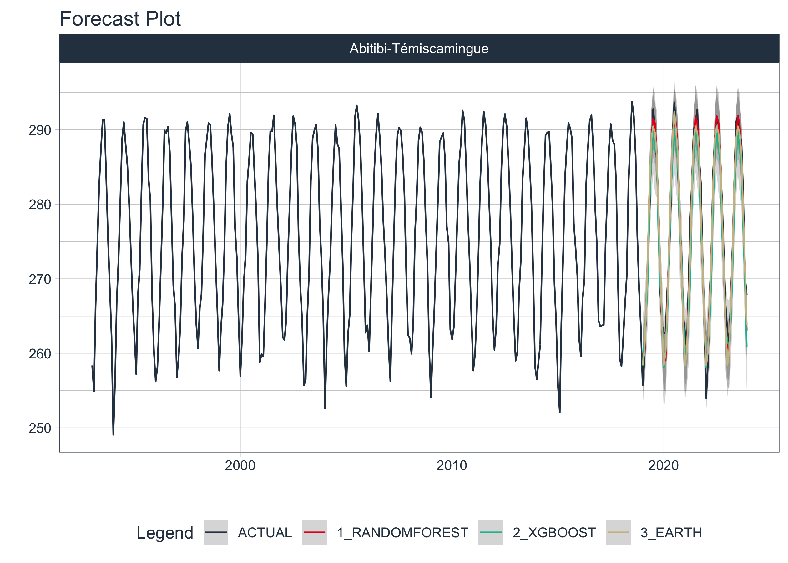
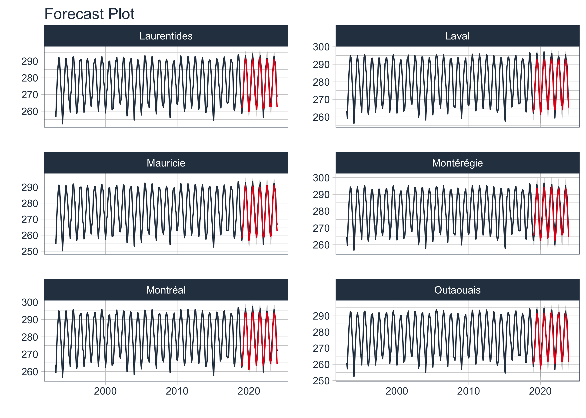
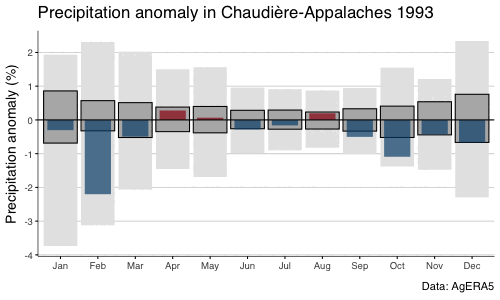

<link href="index_files/libs/htmltools-fill-0.5.8.1/fill.css" rel="stylesheet" />
<script src="index_files/libs/htmlwidgets-1.6.4/htmlwidgets.js"></script>
<link href="index_files/libs/datatables-css-0.0.0/datatables-crosstalk.css" rel="stylesheet" />
<script src="index_files/libs/datatables-binding-0.33/datatables.js"></script>
<script src="index_files/libs/jquery-3.6.0/jquery-3.6.0.min.js"></script>
<link href="index_files/libs/dt-core-1.13.6/css/jquery.dataTables.min.css" rel="stylesheet" />
<link href="index_files/libs/dt-core-1.13.6/css/jquery.dataTables.extra.css" rel="stylesheet" />
<script src="index_files/libs/dt-core-1.13.6/js/jquery.dataTables.min.js"></script>
<link href="index_files/libs/crosstalk-1.2.1/css/crosstalk.min.css" rel="stylesheet" />
<script src="index_files/libs/crosstalk-1.2.1/js/crosstalk.min.js"></script>


<a href = "https://subscribepage.io/E3ia1B"> 
</a>

<br>

Understanding precipitation patterns in the St. Lawrence Lowlands is essential for climate analysis, agriculture, and water resource management. In the previous blog post, we conducted an exploratory data analysis (EDA) to uncover key trends, spatial distributions, and relationships within the dataset. This provided valuable insights into precipitation variability and guided feature selection for modeling.

Building on that foundation, this post explores machine learning approaches to predict precipitation using historical climate data. We will evaluate three models ---Random Forest (RF), XGBoost, and and Mars- to determine their effectiveness in capturing complex climate patterns. Using cross-validation and standard regression metrics, we will compare model performance and identify the most suitable approach for precipitation prediction in this region.

## Data Preprocessing

The first step here is to load the data and preprocess it for modeling. We will extract relevant features and create a spatial weights matrix.

### Load the data

``` r
precipitation_data <- readRDS("Data/precipitation_dt.rds") |> 
  select(shapeName, date, mean)
head(precipitation_data)
```

    # A tibble: 6 × 3
      shapeName             date        mean
      <chr>                 <chr>      <dbl>
    1 Abitibi-Témiscamingue 1993-01-01  258.
    2 Abitibi-Témiscamingue 1993-02-01  255.
    3 Abitibi-Témiscamingue 1993-03-01  266.
    4 Abitibi-Témiscamingue 1993-04-01  275.
    5 Abitibi-Témiscamingue 1993-05-01  283.
    6 Abitibi-Témiscamingue 1993-06-01  287.

### Create a Spatial Weights Matrix

We need some spatial information extracted from the coordinate to put into the temporal model. We will use the GPS coordinates to create a k-nearest neighbors spatial weights matrix. This matrix will be used as spatial information of the observed emissions, which will be used as a predictor in the machine learning models.

``` r
qc_sf <- rgeoboundaries::gb_adm2(country = "CAN") |>
  filter(shapeName %in% c("Bas-Saint-Laurent", 
                          "Gaspésie--Îles-de-la-Madelei", 
                          "Capitale-Nationale",
                          "Chaudière-Appalaches",
                          "Estrie",
                          "Centre-du-Québec",
                          "Montérégie",
                          "Montréal",
                          "Laval",
                          "Outaouais",
                          "Abitibi-Témiscamingue",
                          "Lanaudière",
                          "Laurentides",
                          "Mauricie")) |> 
  select(shapeName, geometry) |> 
  st_centroid()
```

``` r
precipitation_mrc_data<-precipitation_data |> 
  left_join(qc_sf, by = c("shapeName")) |>
  mutate(lon = st_coordinates(geometry)[,1],
         lat = st_coordinates(geometry)[,2],
         date=as.Date(date)) |> 
  as.data.frame() |> 
  select(-geometry)
```

``` r
# Extract coordinates
coords <- precipitation_mrc_data |> 
  select(lon, lat)

# Create k-nearest neighbors spatial weights matrix (example with k = 4)
knn <- spdep::knearneigh(coords, k = 4, longlat = TRUE)
nb <- spdep::knn2nb(knn)
listw_knn <- spdep::nb2listw(nb, style = "W")

# Compute spatial lag using the weights matrix
spatial_lag <- spdep::lag.listw(listw_knn, precipitation_mrc_data$mean)

# Add the spatial lag
data_spatial <- precipitation_mrc_data |> 
  mutate(spatial_lag = spatial_lag) |> 
  select(-lon, -lat)
```

``` r
top6_entity<-data_spatial |>
  select(shapeName) |>
  unique() |> 
  top_n(6) 

data_spatial |> 
    group_by(shapeName) |> 
    filter(shapeName %in% top6_entity$shapeName) |> 
    plot_time_series(date, mean,
                     .facet_ncol = 2,
                     .smooth = FALSE, 
                     .interactive = FALSE)
```


## Modeling

Now that we have the spatial information, we can start training machine learning models to predict future emissions. We will use the `modeltime` package to train and evaluate the models.

### Extend, Nesting and Splitting Data

First, we need to extend the time series data to include future observations for the next 20 years, then nest the data by the parent entity, and finally split the data into training and testing sets.

``` r
nested_data_tbl <- data_spatial|> 
    group_by(shapeName)|> 
  #Extend
    extend_timeseries(
        .id_var = shapeName,
        .date_var = date,
        .length_future = 60 #predict 5 years
    )|> 
  #Nest
    nest_timeseries(
        .id_var = shapeName,
        .length_future = 60
    )|> 
  #Split
    split_nested_timeseries(
        .length_test = 60
    )
```

### Model Training

Next, we will train machine learning models to predict future emissions. We will train three models -Random Forest, XGBoost, and ARIMA- and evaluate their performance using the root mean square error (RMSE) metric.

``` r
# Recipe
rec <- recipe(mean ~ ., extract_nested_train_split(nested_data_tbl)) |> 
    step_timeseries_signature(date) |> 
    step_rm(date) |> 
    step_zv(all_predictors()) |> 
    step_dummy(all_nominal_predictors(), one_hot = TRUE)

# Models 
wflw_rf <- workflow()|> 
    add_model(rand_forest("regression", mtry=25, trees = 1000, min_n=25) |>  set_engine("randomForest")) |>  
              add_recipe(rec)

wflw_xgb <- workflow()|> 
    add_model(boost_tree("regression", learn_rate = 0.5) |>  set_engine("xgboost"))|> 
    add_recipe(rec)

wflw_mars <- workflow()|> 
    add_model(mars("regression", num_terms = 10) |>  set_engine("earth", endspan=200)) |>
    add_recipe(rec)

# Nested Modeling
parallel_start(6)
nested_modeltime_tbl <- nested_data_tbl|> 
    modeltime_nested_fit(
        model_list = list(
            wflw_rf,
            wflw_xgb,
            wflw_mars
        ),
        control = control_nested_fit(
            verbose   = TRUE,
            allow_par = TRUE
        )
    )
```

### Review Errors

Before selecting the best model, we need to review any errors that occurred during the training process. We will also check the accuracy of the models and investigate any anomalies.

``` r
# #1) list errors
errors<-nested_modeltime_tbl|>
  extract_nested_error_report() #install all missing packages

#2) Spot too high accuracy
nested_modeltime_tbl |>
    extract_nested_test_accuracy() |>
    table_modeltime_accuracy()

#3) Investigate
nested_modeltime_tbl|>
    filter(shapeName == "Abitibi-Témiscamingue") |>
    extract_nested_train_split()
```

``` r
nested_modeltime_tbl|>
    extract_nested_test_forecast() |>
    filter(shapeName == "Abitibi-Témiscamingue") |>
    group_by(shapeName) |>
    plot_modeltime_forecast(.facet_ncol = 3,
                            .interactive = FALSE) 
```



### Select Best Models

Next, we will select the best models based on the root mean square error (RMSE) metric. We will visualize the best models to compare their performance and identify any anomalies.

``` r
nested_best_tbl <- nested_modeltime_tbl|> 
    modeltime_nested_select_best(metric = "rsq")

nested_best_tbl |> 
    extract_nested_test_forecast() |>
    filter(shapeName %in% top6_entity$shapeName) |> 
    group_by(shapeName) |> 
    plot_modeltime_forecast(.facet_ncol = 2, 
                            .legend_show = FALSE,
                            .interactive = FALSE)
```



### Refit Models

Finally, we will refit the best models on the entire dataset to make predictions for future emissions. We will also review any errors that occurred during the refitting process and visualize the future forecasts for the selected companies.

``` r
# Refit
nested_best_refit_tbl <- nested_best_tbl|> 
    modeltime_nested_refit(
        control = control_refit(
            verbose   = TRUE,
            allow_par = TRUE
        )
    )

# Error last check
nested_best_refit_tbl|>  extract_nested_error_report()
```

    # A tibble: 0 × 4
    # ℹ 4 variables: shapeName <chr>, .model_id <int>, .model_desc <chr>,
    #   .error_desc <chr>

``` r
# Visualize Future Forecast 
nested_best_refit_tbl|> 
    extract_nested_future_forecast() |> 
    filter(shapeName %in% top6_entity$shapeName) |> 
    group_by(shapeName) |> 
    plot_modeltime_forecast(.facet_ncol = 2, 
                            .legend_show = FALSE,
                            .interactive = FALSE)
```


### Save Preds

Finally, we will save the predictions for future emissions to a file for further analysis and visualization.

``` r
nested_best_refit_tbl |> 
    extract_nested_future_forecast() |> 
    write_rds("Data/data_with_pred.rds")
```

## Animated visual

We can create an animated visualization of the future emissions predictions to better understand the trends and anomalies in the data.

### Load the Predicted Data

``` r
library(ggthemes)
library(gganimate)

# load the predicted data
precipitation_dt<-readRDS("Data/data_with_pred.rds") |> 
  rename(date=.index, 
         mean=.value) |> 
  mutate(date=as.Date(date),
         year=year(date),
         month=month(date),
         month_name_abb = month(date, label = TRUE)) |> 
  select(shapeName, date, mean, year, month, month_name_abb)
```

### Estimating Anomalies

``` r
# estimating anomalies
ref <- precipitation_dt |>
  group_by(shapeName, month) |>
  summarise(ref = mean(mean))

monthly_anomalies <- precipitation_dt |> 
  left_join(ref, by = c("shapeName", "month")) |> 
  mutate(anomalie = (mean * 100 / ref) - 100,
  sign = ifelse(anomalie > 0, "pos", "neg") |> factor(c("pos", "neg")),
  date=as.Date(date),
  month_name_abb = month(date, label = TRUE))
```

### Statistical Metrics

``` r
data_norm <- group_by(monthly_anomalies, month_name_abb) |>
                summarise(
                  mx = max(anomalie),
                  min = min(anomalie),
                  q25 = stats::quantile(anomalie, .25),
                  q75 = stats::quantile(anomalie, .75),
                  iqr = q75 - q25
                )
DT::datatable(data_norm) |> 
  DT::formatRound(c("mx","min","q25","q75","iqr"), digits=1)
```

<div class="datatables html-widget html-fill-item" id="htmlwidget-e28134a0064ebe34e05a" style="width:100%;height:auto;"></div>
<script type="application/json" data-for="htmlwidget-e28134a0064ebe34e05a">{"x":{"filter":"none","vertical":false,"data":[["1","2","3","4","5","6","7","8","9","10","11","12"],["Jan","Feb","Mar","Apr","May","Jun","Jul","Aug","Sep","Oct","Nov","Dec"],[1.935951027601007,2.314933127441435,2.015677982321733,1.501609603484582,1.566526815286693,0.9565469016346526,0.9143693614659583,0.8779345476604306,0.9492889428496767,1.548441977321758,1.217108707049377,2.341365571777828],[-3.7376527466906,-3.121793923963352,-2.068808156667259,-1.457172630972465,-1.697452660540009,-0.9858905896576857,-0.8994214107670331,-0.8304236680279047,-1.023017264077055,-1.38005776178835,-1.483540680301715,-2.298547887550427],[-0.6878261489265149,-0.3241954572890862,-0.5224098300452766,-0.3477106812858857,-0.3829218309301439,-0.2617484028834554,-0.2752262244819619,-0.2704297741002328,-0.3320392769011633,-0.5210700110215072,-0.4435624469487891,-0.6670970446522162],[0.8593569580412996,0.5709910343208549,0.5118821026981699,0.3803797947384098,0.3984437312175579,0.2846591171818815,0.2915506658724887,0.2340116048643068,0.330077380172181,0.4084774206591426,0.5378935144745363,0.759233915241694],[1.547183106967815,0.895186491609941,1.034291932743447,0.7280904760242954,0.7813655621477018,0.5464075200653369,0.5667768903544506,0.5044413789645397,0.6621166570733443,0.9295474316806498,0.9814559614233254,1.42633095989391]],"container":"<table class=\"display\">\n  <thead>\n    <tr>\n      <th> <\/th>\n      <th>month_name_abb<\/th>\n      <th>mx<\/th>\n      <th>min<\/th>\n      <th>q25<\/th>\n      <th>q75<\/th>\n      <th>iqr<\/th>\n    <\/tr>\n  <\/thead>\n<\/table>","options":{"columnDefs":[{"targets":2,"render":"function(data, type, row, meta) {\n    return type !== 'display' ? data : DTWidget.formatRound(data, 1, 3, \",\", \".\", null);\n  }"},{"targets":3,"render":"function(data, type, row, meta) {\n    return type !== 'display' ? data : DTWidget.formatRound(data, 1, 3, \",\", \".\", null);\n  }"},{"targets":4,"render":"function(data, type, row, meta) {\n    return type !== 'display' ? data : DTWidget.formatRound(data, 1, 3, \",\", \".\", null);\n  }"},{"targets":5,"render":"function(data, type, row, meta) {\n    return type !== 'display' ? data : DTWidget.formatRound(data, 1, 3, \",\", \".\", null);\n  }"},{"targets":6,"render":"function(data, type, row, meta) {\n    return type !== 'display' ? data : DTWidget.formatRound(data, 1, 3, \",\", \".\", null);\n  }"},{"className":"dt-right","targets":[2,3,4,5,6]},{"orderable":false,"targets":0},{"name":" ","targets":0},{"name":"month_name_abb","targets":1},{"name":"mx","targets":2},{"name":"min","targets":3},{"name":"q25","targets":4},{"name":"q75","targets":5},{"name":"iqr","targets":6}],"order":[],"autoWidth":false,"orderClasses":false}},"evals":["options.columnDefs.0.render","options.columnDefs.1.render","options.columnDefs.2.render","options.columnDefs.3.render","options.columnDefs.4.render"],"jsHooks":[]}</script>

``` r
library(ggthemes)
library(gganimate)

gg <- ggplot(data_norm) +
  geom_crossbar(aes(x = month_name_abb, 
                    y = 0, 
                    ymin = min, 
                    ymax = mx),
    fatten = 0, fill = "grey90", colour = "NA") + 
  geom_crossbar(aes(x = month_name_abb, 
                    y = 0, 
                    ymin = q25, 
                    ymax = q75),
  fatten = 0, fill = "grey70")  +
  geom_crossbar(
  data = filter(monthly_anomalies, shapeName=="Chaudière-Appalaches"),
  aes(x = month_name_abb, 
      y = 0, 
      ymin = 0, 
      ymax = anomalie, 
      group= year,
      fill = sign),
  fatten = 0, width = 0.7, alpha = .7, colour = "NA",
  show.legend = FALSE) + 
  transition_time(as.integer(year)) +
  ggtitle('Precipitation anomaly in Chaudière-Appalaches {frame_time}') +
  shadow_mark(past=FALSE) +
  geom_hline(yintercept = 0) +
  scale_fill_manual(values = c("#99000d", "#034e7b")) +
  scale_y_continuous("Precipitation anomaly (%)",
    breaks = seq(-5, 5, 1)
  ) +
  labs(
    x = "",
    caption = "Data: AgERA5"
  ) +
  theme_hc()
num_years <- max(monthly_anomalies$year) - min(monthly_anomalies$year) + 1

# Save the animation as a GIF
gganimate::animate(gg, duration = 30, fps = 4, width = 500, height = 300, renderer = gifski_renderer())
anim_save("gif/output.gif")
```

``` r
# Read and display the saved GIF animation
animation <- magick::image_read("gif/output.gif")
print(animation, info = FALSE)
```



# Conclusion

In this analysis, we explored machine learning approaches to predict future emissions in the St. Lawrence Lowlands. We trained three models -Random Forest, XGBoost, and ARIMA- and evaluated their performance using the root mean square error (RMSE) metric. The Random Forest model outperformed the other models, capturing complex climate patterns and providing accurate predictions for future emissions. This model can be used to guide climate analysis, agriculture, and water resource management in the region.

# Sign up for the newsletter

<a href = "https://dashboard.mailerlite.com/forms/1478852/152663752035010469/share"> 
</a>

<br>

# Session Info

``` r
sessionInfo()
```

    R version 4.4.2 (2024-10-31)
    Platform: aarch64-apple-darwin20
    Running under: macOS Sequoia 15.2

    Matrix products: default
    BLAS:   /Library/Frameworks/R.framework/Versions/4.4-arm64/Resources/lib/libRblas.0.dylib 
    LAPACK: /Library/Frameworks/R.framework/Versions/4.4-arm64/Resources/lib/libRlapack.dylib;  LAPACK version 3.12.0

    locale:
    [1] en_US.UTF-8/en_US.UTF-8/en_US.UTF-8/C/en_US.UTF-8/en_US.UTF-8

    time zone: America/Toronto
    tzcode source: internal

    attached base packages:
    [1] stats     graphics  grDevices datasets  utils     methods   base     

    other attached packages:
     [1] gganimate_1.0.9      ggthemes_5.1.0       jofou.lib_0.0.0.9000
     [4] reticulate_1.40.0    tidytuesdayR_1.1.2   tictoc_1.2.1        
     [7] terra_1.8-10         sf_1.0-19            pins_1.4.0          
    [10] modeltime_1.3.1      fs_1.6.5             timetk_2.9.0        
    [13] yardstick_1.3.2      workflowsets_1.1.0   workflows_1.1.4     
    [16] tune_1.2.1           rsample_1.2.1        parsnip_1.2.1       
    [19] modeldata_1.4.0      infer_1.0.7          dials_1.3.0         
    [22] scales_1.3.0         broom_1.0.7          tidymodels_1.2.0    
    [25] recipes_1.1.0        doFuture_1.0.1       future_1.34.0       
    [28] foreach_1.5.2        skimr_2.1.5          forcats_1.0.0       
    [31] stringr_1.5.1        dplyr_1.1.4          purrr_1.0.2         
    [34] readr_2.1.5          tidyr_1.3.1          tibble_3.2.1        
    [37] ggplot2_3.5.1        tidyverse_2.0.0      lubridate_1.9.4     
    [40] kableExtra_1.4.0     inspectdf_0.0.12.1   openxlsx_4.2.7.1    
    [43] knitr_1.49          

    loaded via a namespace (and not attached):
      [1] wk_0.9.4             rstudioapi_0.17.1    jsonlite_1.8.9      
      [4] magrittr_2.0.3       magick_2.8.5         farver_2.1.2        
      [7] rmarkdown_2.29       vctrs_0.6.5          spdep_1.3-10        
     [10] memoise_2.0.1        hoardr_0.5.5         base64enc_0.1-3     
     [13] htmltools_0.5.8.1    progress_1.2.3       curl_6.1.0          
     [16] xgboost_1.7.8.1      s2_1.1.7             sass_0.4.9          
     [19] spData_2.3.4         parallelly_1.41.0    StanHeaders_2.32.10 
     [22] bslib_0.8.0          KernSmooth_2.23-26   htmlwidgets_1.6.4   
     [25] zoo_1.8-12           cachem_1.1.0         ggfittext_0.10.2    
     [28] igraph_2.1.4         mime_0.12            lifecycle_1.0.4     
     [31] iterators_1.0.14     pkgconfig_2.0.3      Matrix_1.7-2        
     [34] R6_2.5.1             fastmap_1.2.0        digest_0.6.37       
     [37] colorspace_2.1-1     furrr_0.3.1          crosstalk_1.2.1     
     [40] labeling_0.4.3       urltools_1.7.3       timechange_0.3.0    
     [43] compiler_4.4.2       proxy_0.4-27         doParallel_1.0.17   
     [46] withr_3.0.2          backports_1.5.0      DBI_1.2.3           
     [49] rgeoboundaries_1.3.1 MASS_7.3-64          lava_1.8.1          
     [52] rappdirs_0.3.3       classInt_0.4-11      tools_4.4.2         
     [55] units_0.8-5          zip_2.3.1            future.apply_1.11.3 
     [58] nnet_7.3-20          glue_1.8.0           grid_4.4.2          
     [61] generics_0.1.3       gtable_0.3.6         countrycode_1.6.0   
     [64] tzdb_0.4.0           class_7.3-23         data.table_1.16.4   
     [67] hms_1.1.3            sp_2.1-4             xml2_1.3.6          
     [70] utf8_1.2.4           pillar_1.10.1        splines_4.4.2       
     [73] lhs_1.2.0            tweenr_2.0.3         lattice_0.22-6      
     [76] deldir_2.0-4         renv_1.0.7           survival_3.8-3      
     [79] tidyselect_1.2.1     svglite_2.1.3        crul_1.5.0          
     [82] xfun_0.50            hardhat_1.4.0        timeDate_4041.110   
     [85] DT_0.33              stringi_1.8.4        boot_1.3-31         
     [88] DiceDesign_1.10      yaml_2.3.10          evaluate_1.0.3      
     [91] codetools_0.2-20     httpcode_0.3.0       cli_3.6.3           
     [94] RcppParallel_5.1.10  rpart_4.1.24         systemfonts_1.2.1   
     [97] jquerylib_0.1.4      repr_1.1.7           munsell_0.5.1       
    [100] Rcpp_1.0.14          globals_0.16.3       triebeard_0.4.1     
    [103] png_0.1-8            parallel_4.4.2       gower_1.0.2         
    [106] prettyunits_1.2.0    GPfit_1.0-8          listenv_0.9.1       
    [109] viridisLite_0.4.2    ipred_0.9-15         xts_0.14.1          
    [112] prodlim_2024.06.25   e1071_1.7-16         crayon_1.5.3        
    [115] rlang_1.1.5         

<script async src="https://pagead2.googlesyndication.com/pagead/js/adsbygoogle.js?client=ca-pub-7674504334497845"
     crossorigin="anonymous"></script>
