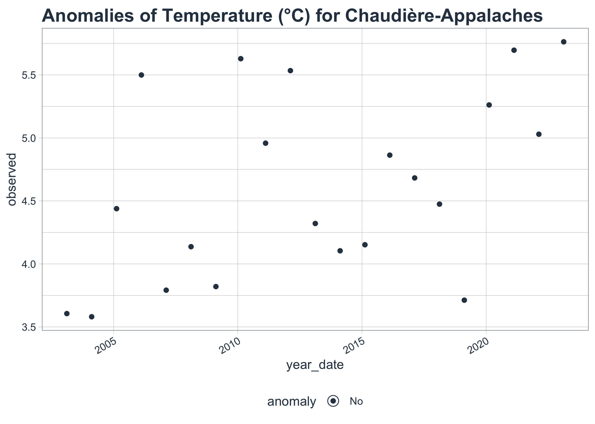
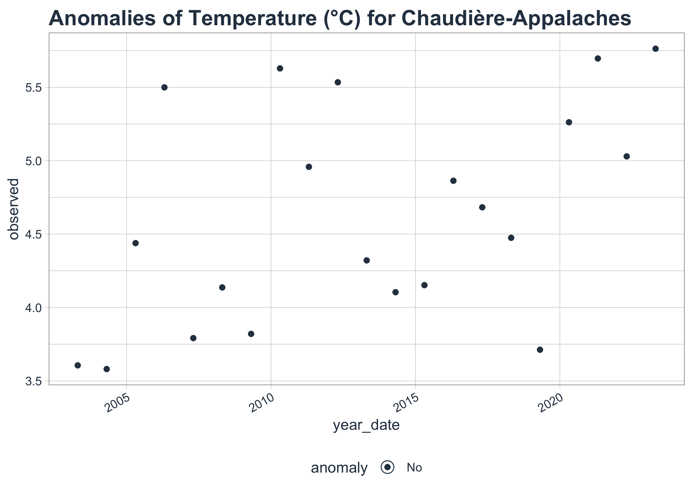
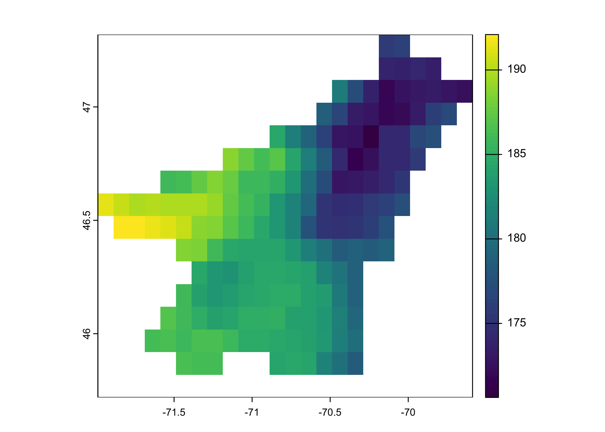
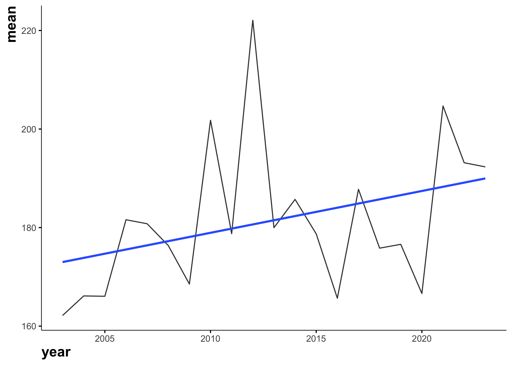
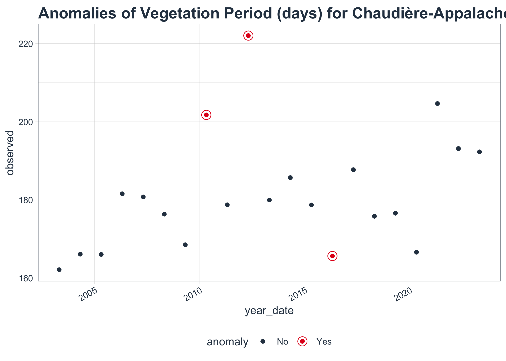

<script async src="https://pagead2.googlesyndication.com/pagead/js/adsbygoogle.js?client=ca-pub-7674504334497845" crossorigin="anonymous"></script>

<a href = "https://subscribepage.io/E3ia1B"> 
</a>

<br>

Climate change is reshaping agricultural and ecological landscapes worldwide, and Chaudières-Appalaches is no exception. Over the past 20 years, regional temperature trends, Growing Degree Days (GDD), and vegetation periods have experienced significant shifts, influencing crop productivity, plant phenology, and ecosystem dynamics.

Understanding these changes is crucial for farmers, agronomists, and climate researchers who rely on precise climate data to make informed decisions. In this analysis, we dive into historical temperature records, explore GDD trends, and assess how the vegetation period has evolved in response to rising temperatures and climate variability.

Using R for exploratory data analysis (EDA) and visualization, we uncover key patterns and anomalies that highlight the broader implications of climate shifts on agriculture and natural ecosystems. Whether you're a data enthusiast, a scientist, or a policymaker, this post will provide valuable insights into how climate trends are reshaping Chaudières-Appalaches---one growing season at a time.

## Goal

This study aims to provide a data-driven perspective on how temperature trends, Growing Degree Days (GDD), and vegetation periods have evolved in Chaudières-Appalaches over the past 20 years. Through exploratory data analysis (EDA) and visualization in R, we seek to:

-   **Analyze Long-Term Temperature Trends**: Identify patterns, anomalies, and overall shifts in average, maximum, and minimum temperatures.
-   **Evaluate Growing Degree Days (GDD) Evolution**: Assess how heat accumulation has changed over time and its impact on crop development and agricultural productivity.
-   **Examine Vegetation Period Changes**: Investigate variations in the length of the growing season, including earlier springs, later frosts, and potential agricultural adaptations.
-   **Uncover Climate Change Implications**: Explore how temperature anomalies and GDD shifts may be affecting farming strategies, crop selection, and ecosystem resilience.
-   **Demonstrate Reproducible Climate Analysis in R**: Provide a step-by-step approach for analyzing climate data using tidyverse, tidymodels, ggplot2, and other R tools.

By the end of this analysis, readers will gain a deeper understanding of climate-driven changes in Chaudières-Appalaches and their potential impacts on agriculture, forestry, and environmental planning.

## Get the data

{}

### Region borders

We need the polygon of the region of interest. We will use the `rgeoboundaries` package to extract the polygon of Quebec.

{}

``` r
qc_sf <- rgeoboundaries::gb_adm2(country = "CAN") |>
  filter(shapeName %in% c("Chaudière-Appalaches")) |> 
  select(shapeName, geometry) 
qc_sf #geographic coordinate
```

    Simple feature collection with 1 feature and 1 field
    Geometry type: MULTIPOLYGON
    Dimension:     XY
    Bounding box:  xmin: -72.03755 ymin: 45.76874 xmax: -69.62496 ymax: 47.34147
    Geodetic CRS:  WGS84
                 shapeName                       geometry
    1 Chaudière-Appalaches MULTIPOLYGON (((-70.09711 4...

``` r
plot(qc_sf$geometry)
```


### Temperature data

We will extract temperature data from the AgERA5 dataset using the KrigR package. The AgERA5 dataset provides high-resolution (0,1°) climate data, including precipitation, temperature, and wind speed, for global climate research.

``` r
# Load the KrigR package
#api_user <- "*******************************" # PLEASE INSERT YOUR USER NUMBER
#api_key <- "********************************" # PLEASE INSERT YOUR API TOKEN

# List of available dataset
KrigR::Meta.List()

# Dataset description
KrigR::Meta.QuickFacts(
    "reanalysis-era5-land"
)
```

``` r
#extract precipitation data
start_date <- "2003-01-01 00:00"
end_date <- "2023-12-31 24:00"

temperature_raw <- KrigR::CDownloadS(
    Variable = "2m_temperature",
    DataSet = "reanalysis-era5-land",
    DateStart = start_date,
    DateStop = end_date,
    TResolution = "day",
    TZone = "CET",
    TStep = 1,
    Dir = Dir.Data,
    FileName = "temperature_raw",
    Extent = as(qc_sf, "Spatial"),
    API_User = api_user,
    API_Key = api_key,
    closeConnections = TRUE)
```

### Data preperation

We will convert the raster data to a dataframe and extract the temperature values for the region of interest.

``` r
# Change layer names
day_vector <- seq(
    from = as.Date(start_date)-1,
    to = as.Date(end_date),
    by = "day"
)
names(temperature_raw) <- day_vector

# Raster to dataframe
temperature_sf <- temperature_raw |> 
  as.data.frame(
    precipitation_raw,
    xy = TRUE, na.rm = TRUE)|>
    tidyr::pivot_longer(
        !c(x, y),
        names_to = "date",
        values_to = "value"
    ) |> 
  mutate(year=year(date), 
         month=month(date),
         value=value-273.15) |> 
  select(x, y, date, year, month, value) |> 
  st_as_sf(coords=c("x", "y")) |> 
  st_set_crs("WGS84") |> 
  st_intersection(qc_sf)
```

In this data set, we have the temperature of each day for the region of interest.This information is essential for understanding the long-term trends and seasonal patterns in temperature variations. But, we can also use this data to find the growing degree day and the vegetation period length. Both are essential for agriculture.

``` r
#All dayly data
temp_dt<-temperature_sf |> 
  as_tibble() |> 
  select(-geometry, -shapeName) |> 
  mutate(date=as.Date(date)) |> 
  filter(date>="2003-01-01", date<="2023-12-31")

# Growing season length
library(vegperiod)

vegperiod_dt<-temp_dt |>
  group_by(lon, lat) |>
  reframe(vegperiod=vegperiod(
    dates=date, 
    Tavg=value, 
    start.method="StdMeteo", 
    end.method="StdMeteo"
  )) |> 
  unnest(cols = c(vegperiod)) |> 
  mutate(vege_period=end-start) |> 
  select(lon, lat, year, vege_period)

# Growing degree-days
library(pollen)

gdd_dt<-temperature_sf |> 
  mutate(lon = st_coordinates(geometry)[,1],
         lat = st_coordinates(geometry)[,2]) |> 
  as.data.frame() |>
  select(-geometry, -shapeName) |>
  mutate(gdd=gdd(
    tmax = value, 
    tmin = value,  
    tbase = 5, 
    type = "B"
  )) |> 
  mutate(doy=yday(date)) |> 
  filter(doy==91 | doy==304) |> 
  select(lon, lat, year, doy, gdd) |> 
  pivot_wider(names_from = doy, values_from = gdd) |> 
  mutate(gdd=`304`-`91`) |> 
  select(lon, lat, year, gdd)
```

# Temperature

## General trend

Let's start by exploring the temperature data to understand its distribution and general trends.

``` r
skimr::skim(temp_dt)
```

|                                                  |         |
|:-------------------------------------------------|:--------|
| Name                                             | temp_dt |
| Number of rows                                   | 1342250 |
| Number of columns                                | 6       |
| \_\_\_\_\_\_\_\_\_\_\_\_\_\_\_\_\_\_\_\_\_\_\_   |         |
| Column type frequency:                           |         |
| Date                                             | 1       |
| numeric                                          | 5       |
| \_\_\_\_\_\_\_\_\_\_\_\_\_\_\_\_\_\_\_\_\_\_\_\_ |         |
| Group variables                                  | None    |

Data summary

**Variable type: Date**

| skim_variable | n_missing | complete_rate | min        | max        | median     | n_unique |
|:------------|---------:|------------:|:---------|:---------|:---------|--------:|
| date          |         0 |             1 | 2003-01-01 | 2023-12-31 | 2013-07-01 |     7670 |

**Variable type: numeric**

| skim_variable | n_missing | complete_rate |    mean |    sd |      p0 |     p25 |     p50 |     p75 |    p100 | hist  |
|:---------|-------:|---------:|-----:|----:|-----:|-----:|-----:|-----:|-----:|:----|
| year          |         0 |             1 | 2013.00 |  6.06 | 2003.00 | 2008.00 | 2013.00 | 2018.00 | 2023.00 | ▇▆▆▆▆ |
| month         |         0 |             1 |    6.52 |  3.45 |    1.00 |    4.00 |    7.00 |   10.00 |   12.00 | ▇▅▅▅▇ |
| value         |         0 |             1 |    4.62 | 11.65 |  -32.41 |   -3.95 |    5.28 |   15.02 |   27.22 | ▁▃▇▇▆ |
| lon           |         0 |             1 |  -70.73 |  0.52 |  -71.94 |  -71.14 |  -70.74 |  -70.34 |  -69.64 | ▂▆▆▇▃ |
| lat           |         0 |             1 |   46.49 |  0.36 |   45.87 |   46.17 |   46.47 |   46.77 |   47.27 | ▅▆▇▅▂ |

``` r
temp_dt |> 
  group_by(year) |>
  skimr::skim()
```

|                                                  |                         |
|:-------------------------------------------------|:------------------------|
| Name                                             | group_by(temp_dt, year) |
| Number of rows                                   | 1342250                 |
| Number of columns                                | 6                       |
| \_\_\_\_\_\_\_\_\_\_\_\_\_\_\_\_\_\_\_\_\_\_\_   |                         |
| Column type frequency:                           |                         |
| Date                                             | 1                       |
| numeric                                          | 4                       |
| \_\_\_\_\_\_\_\_\_\_\_\_\_\_\_\_\_\_\_\_\_\_\_\_ |                         |
| Group variables                                  | year                    |

Data summary

**Variable type: Date**

| skim_variable | year | n_missing | complete_rate | min        | max        | median     | n_unique |
|:-----------|----:|--------:|-----------:|:---------|:---------|:---------|-------:|
| date          | 2003 |         0 |             1 | 2003-01-01 | 2003-12-31 | 2003-07-02 |      365 |
| date          | 2004 |         0 |             1 | 2004-01-01 | 2004-12-31 | 2004-07-01 |      366 |
| date          | 2005 |         0 |             1 | 2005-01-01 | 2005-12-31 | 2005-07-02 |      365 |
| date          | 2006 |         0 |             1 | 2006-01-01 | 2006-12-31 | 2006-07-02 |      365 |
| date          | 2007 |         0 |             1 | 2007-01-01 | 2007-12-31 | 2007-07-02 |      365 |
| date          | 2008 |         0 |             1 | 2008-01-01 | 2008-12-31 | 2008-07-01 |      366 |
| date          | 2009 |         0 |             1 | 2009-01-01 | 2009-12-31 | 2009-07-02 |      365 |
| date          | 2010 |         0 |             1 | 2010-01-01 | 2010-12-31 | 2010-07-02 |      365 |
| date          | 2011 |         0 |             1 | 2011-01-01 | 2011-12-31 | 2011-07-02 |      365 |
| date          | 2012 |         0 |             1 | 2012-01-01 | 2012-12-31 | 2012-07-01 |      366 |
| date          | 2013 |         0 |             1 | 2013-01-01 | 2013-12-31 | 2013-07-02 |      365 |
| date          | 2014 |         0 |             1 | 2014-01-01 | 2014-12-31 | 2014-07-02 |      365 |
| date          | 2015 |         0 |             1 | 2015-01-01 | 2015-12-31 | 2015-07-02 |      365 |
| date          | 2016 |         0 |             1 | 2016-01-01 | 2016-12-31 | 2016-07-01 |      366 |
| date          | 2017 |         0 |             1 | 2017-01-01 | 2017-12-31 | 2017-07-02 |      365 |
| date          | 2018 |         0 |             1 | 2018-01-01 | 2018-12-31 | 2018-07-02 |      365 |
| date          | 2019 |         0 |             1 | 2019-01-01 | 2019-12-31 | 2019-07-02 |      365 |
| date          | 2020 |         0 |             1 | 2020-01-01 | 2020-12-31 | 2020-07-01 |      366 |
| date          | 2021 |         0 |             1 | 2021-01-01 | 2021-12-31 | 2021-07-02 |      365 |
| date          | 2022 |         0 |             1 | 2022-01-01 | 2022-12-31 | 2022-07-02 |      365 |
| date          | 2023 |         0 |             1 | 2023-01-01 | 2023-12-31 | 2023-07-02 |      365 |

**Variable type: numeric**

| skim_variable | year | n_missing | complete_rate |   mean |    sd |     p0 |    p25 |    p50 |    p75 |   p100 | hist  |
|:---------|----:|-------:|---------:|-----:|----:|-----:|-----:|-----:|-----:|-----:|:----|
| month         | 2003 |         0 |             1 |   6.53 |  3.45 |   1.00 |   4.00 |   7.00 |  10.00 |  12.00 | ▇▅▅▅▇ |
| month         | 2004 |         0 |             1 |   6.51 |  3.45 |   1.00 |   4.00 |   7.00 |  10.00 |  12.00 | ▇▅▅▅▇ |
| month         | 2005 |         0 |             1 |   6.53 |  3.45 |   1.00 |   4.00 |   7.00 |  10.00 |  12.00 | ▇▅▅▅▇ |
| month         | 2006 |         0 |             1 |   6.53 |  3.45 |   1.00 |   4.00 |   7.00 |  10.00 |  12.00 | ▇▅▅▅▇ |
| month         | 2007 |         0 |             1 |   6.53 |  3.45 |   1.00 |   4.00 |   7.00 |  10.00 |  12.00 | ▇▅▅▅▇ |
| month         | 2008 |         0 |             1 |   6.51 |  3.45 |   1.00 |   4.00 |   7.00 |  10.00 |  12.00 | ▇▅▅▅▇ |
| month         | 2009 |         0 |             1 |   6.53 |  3.45 |   1.00 |   4.00 |   7.00 |  10.00 |  12.00 | ▇▅▅▅▇ |
| month         | 2010 |         0 |             1 |   6.53 |  3.45 |   1.00 |   4.00 |   7.00 |  10.00 |  12.00 | ▇▅▅▅▇ |
| month         | 2011 |         0 |             1 |   6.53 |  3.45 |   1.00 |   4.00 |   7.00 |  10.00 |  12.00 | ▇▅▅▅▇ |
| month         | 2012 |         0 |             1 |   6.51 |  3.45 |   1.00 |   4.00 |   7.00 |  10.00 |  12.00 | ▇▅▅▅▇ |
| month         | 2013 |         0 |             1 |   6.53 |  3.45 |   1.00 |   4.00 |   7.00 |  10.00 |  12.00 | ▇▅▅▅▇ |
| month         | 2014 |         0 |             1 |   6.53 |  3.45 |   1.00 |   4.00 |   7.00 |  10.00 |  12.00 | ▇▅▅▅▇ |
| month         | 2015 |         0 |             1 |   6.53 |  3.45 |   1.00 |   4.00 |   7.00 |  10.00 |  12.00 | ▇▅▅▅▇ |
| month         | 2016 |         0 |             1 |   6.51 |  3.45 |   1.00 |   4.00 |   7.00 |  10.00 |  12.00 | ▇▅▅▅▇ |
| month         | 2017 |         0 |             1 |   6.53 |  3.45 |   1.00 |   4.00 |   7.00 |  10.00 |  12.00 | ▇▅▅▅▇ |
| month         | 2018 |         0 |             1 |   6.53 |  3.45 |   1.00 |   4.00 |   7.00 |  10.00 |  12.00 | ▇▅▅▅▇ |
| month         | 2019 |         0 |             1 |   6.53 |  3.45 |   1.00 |   4.00 |   7.00 |  10.00 |  12.00 | ▇▅▅▅▇ |
| month         | 2020 |         0 |             1 |   6.51 |  3.45 |   1.00 |   4.00 |   7.00 |  10.00 |  12.00 | ▇▅▅▅▇ |
| month         | 2021 |         0 |             1 |   6.53 |  3.45 |   1.00 |   4.00 |   7.00 |  10.00 |  12.00 | ▇▅▅▅▇ |
| month         | 2022 |         0 |             1 |   6.53 |  3.45 |   1.00 |   4.00 |   7.00 |  10.00 |  12.00 | ▇▅▅▅▇ |
| month         | 2023 |         0 |             1 |   6.53 |  3.45 |   1.00 |   4.00 |   7.00 |  10.00 |  12.00 | ▇▅▅▅▇ |
| value         | 2003 |         0 |             1 |   3.61 | 12.48 | -28.52 |  -5.80 |   4.24 |  14.58 |  26.27 | ▂▅▇▇▆ |
| value         | 2004 |         0 |             1 |   3.58 | 12.15 | -32.41 |  -5.15 |   4.38 |  14.22 |  23.57 | ▁▃▆▆▇ |
| value         | 2005 |         0 |             1 |   4.44 | 12.14 | -27.34 |  -4.72 |   4.90 |  15.88 |  26.23 | ▁▆▇▇▇ |
| value         | 2006 |         0 |             1 |   5.50 | 10.49 | -21.71 |  -1.52 |   5.80 |  14.55 |  24.81 | ▂▅▇▇▆ |
| value         | 2007 |         0 |             1 |   3.79 | 12.17 | -25.80 |  -5.32 |   4.72 |  14.80 |  24.85 | ▂▅▇▇▇ |
| value         | 2008 |         0 |             1 |   4.14 | 11.30 | -25.61 |  -5.21 |   5.61 |  14.48 |  24.08 | ▁▆▆▇▇ |
| value         | 2009 |         0 |             1 |   3.82 | 11.40 | -29.32 |  -4.27 |   4.42 |  13.40 |  25.09 | ▁▅▇▇▆ |
| value         | 2010 |         0 |             1 |   5.63 | 10.73 | -20.83 |  -2.05 |   5.29 |  14.99 |  27.22 | ▂▅▇▇▅ |
| value         | 2011 |         0 |             1 |   4.96 | 11.24 | -27.51 |  -3.69 |   5.96 |  15.52 |  25.30 | ▁▅▇▇▇ |
| value         | 2012 |         0 |             1 |   5.53 | 11.17 | -24.58 |  -2.49 |   6.65 |  15.69 |  25.59 | ▁▅▇▇▇ |
| value         | 2013 |         0 |             1 |   4.32 | 11.87 | -26.36 |  -3.61 |   5.63 |  14.49 |  25.65 | ▂▅▇▇▆ |
| value         | 2014 |         0 |             1 |   4.10 | 12.11 | -29.74 |  -4.60 |   5.17 |  15.10 |  25.52 | ▁▅▇▇▇ |
| value         | 2015 |         0 |             1 |   4.15 | 12.38 | -27.44 |  -4.85 |   4.92 |  15.49 |  24.68 | ▂▅▆▆▇ |
| value         | 2016 |         0 |             1 |   4.86 | 11.47 | -26.67 |  -3.76 |   4.66 |  15.70 |  24.83 | ▁▅▇▆▇ |
| value         | 2017 |         0 |             1 |   4.68 | 11.90 | -25.96 |  -4.08 |   6.66 |  15.19 |  24.02 | ▂▃▇▆▇ |
| value         | 2018 |         0 |             1 |   4.47 | 12.08 | -25.95 |  -4.53 |   3.59 |  15.71 |  27.00 | ▁▆▇▆▆ |
| value         | 2019 |         0 |             1 |   3.71 | 11.70 | -23.30 |  -5.96 |   4.79 |  14.04 |  25.78 | ▃▆▇▇▆ |
| value         | 2020 |         0 |             1 |   5.26 | 11.07 | -23.29 |  -2.82 |   4.02 |  14.87 |  26.92 | ▁▅▇▆▆ |
| value         | 2021 |         0 |             1 |   5.70 | 11.49 | -20.08 |  -4.08 |   6.88 |  15.81 |  26.37 | ▃▆▆▇▆ |
| value         | 2022 |         0 |             1 |   5.03 | 11.81 | -25.91 |  -3.52 |   6.16 |  15.61 |  24.65 | ▂▃▇▇▇ |
| value         | 2023 |         0 |             1 |   5.76 | 10.81 | -31.51 |  -3.11 |   6.54 |  15.48 |  26.34 | ▁▂▇▆▆ |
| lon           | 2003 |         0 |             1 | -70.73 |  0.52 | -71.94 | -71.14 | -70.74 | -70.34 | -69.64 | ▂▆▆▇▃ |
| lon           | 2004 |         0 |             1 | -70.73 |  0.52 | -71.94 | -71.14 | -70.74 | -70.34 | -69.64 | ▂▆▆▇▃ |
| lon           | 2005 |         0 |             1 | -70.73 |  0.52 | -71.94 | -71.14 | -70.74 | -70.34 | -69.64 | ▂▆▆▇▃ |
| lon           | 2006 |         0 |             1 | -70.73 |  0.52 | -71.94 | -71.14 | -70.74 | -70.34 | -69.64 | ▂▆▆▇▃ |
| lon           | 2007 |         0 |             1 | -70.73 |  0.52 | -71.94 | -71.14 | -70.74 | -70.34 | -69.64 | ▂▆▆▇▃ |
| lon           | 2008 |         0 |             1 | -70.73 |  0.52 | -71.94 | -71.14 | -70.74 | -70.34 | -69.64 | ▂▆▆▇▃ |
| lon           | 2009 |         0 |             1 | -70.73 |  0.52 | -71.94 | -71.14 | -70.74 | -70.34 | -69.64 | ▂▆▆▇▃ |
| lon           | 2010 |         0 |             1 | -70.73 |  0.52 | -71.94 | -71.14 | -70.74 | -70.34 | -69.64 | ▂▆▆▇▃ |
| lon           | 2011 |         0 |             1 | -70.73 |  0.52 | -71.94 | -71.14 | -70.74 | -70.34 | -69.64 | ▂▆▆▇▃ |
| lon           | 2012 |         0 |             1 | -70.73 |  0.52 | -71.94 | -71.14 | -70.74 | -70.34 | -69.64 | ▂▆▆▇▃ |
| lon           | 2013 |         0 |             1 | -70.73 |  0.52 | -71.94 | -71.14 | -70.74 | -70.34 | -69.64 | ▂▆▆▇▃ |
| lon           | 2014 |         0 |             1 | -70.73 |  0.52 | -71.94 | -71.14 | -70.74 | -70.34 | -69.64 | ▂▆▆▇▃ |
| lon           | 2015 |         0 |             1 | -70.73 |  0.52 | -71.94 | -71.14 | -70.74 | -70.34 | -69.64 | ▂▆▆▇▃ |
| lon           | 2016 |         0 |             1 | -70.73 |  0.52 | -71.94 | -71.14 | -70.74 | -70.34 | -69.64 | ▂▆▆▇▃ |
| lon           | 2017 |         0 |             1 | -70.73 |  0.52 | -71.94 | -71.14 | -70.74 | -70.34 | -69.64 | ▂▆▆▇▃ |
| lon           | 2018 |         0 |             1 | -70.73 |  0.52 | -71.94 | -71.14 | -70.74 | -70.34 | -69.64 | ▂▆▆▇▃ |
| lon           | 2019 |         0 |             1 | -70.73 |  0.52 | -71.94 | -71.14 | -70.74 | -70.34 | -69.64 | ▂▆▆▇▃ |
| lon           | 2020 |         0 |             1 | -70.73 |  0.52 | -71.94 | -71.14 | -70.74 | -70.34 | -69.64 | ▂▆▆▇▃ |
| lon           | 2021 |         0 |             1 | -70.73 |  0.52 | -71.94 | -71.14 | -70.74 | -70.34 | -69.64 | ▂▆▆▇▃ |
| lon           | 2022 |         0 |             1 | -70.73 |  0.52 | -71.94 | -71.14 | -70.74 | -70.34 | -69.64 | ▂▆▆▇▃ |
| lon           | 2023 |         0 |             1 | -70.73 |  0.52 | -71.94 | -71.14 | -70.74 | -70.34 | -69.64 | ▂▆▆▇▃ |
| lat           | 2003 |         0 |             1 |  46.49 |  0.36 |  45.87 |  46.17 |  46.47 |  46.77 |  47.27 | ▅▆▇▅▂ |
| lat           | 2004 |         0 |             1 |  46.49 |  0.36 |  45.87 |  46.17 |  46.47 |  46.77 |  47.27 | ▅▆▇▅▂ |
| lat           | 2005 |         0 |             1 |  46.49 |  0.36 |  45.87 |  46.17 |  46.47 |  46.77 |  47.27 | ▅▆▇▅▂ |
| lat           | 2006 |         0 |             1 |  46.49 |  0.36 |  45.87 |  46.17 |  46.47 |  46.77 |  47.27 | ▅▆▇▅▂ |
| lat           | 2007 |         0 |             1 |  46.49 |  0.36 |  45.87 |  46.17 |  46.47 |  46.77 |  47.27 | ▅▆▇▅▂ |
| lat           | 2008 |         0 |             1 |  46.49 |  0.36 |  45.87 |  46.17 |  46.47 |  46.77 |  47.27 | ▅▆▇▅▂ |
| lat           | 2009 |         0 |             1 |  46.49 |  0.36 |  45.87 |  46.17 |  46.47 |  46.77 |  47.27 | ▅▆▇▅▂ |
| lat           | 2010 |         0 |             1 |  46.49 |  0.36 |  45.87 |  46.17 |  46.47 |  46.77 |  47.27 | ▅▆▇▅▂ |
| lat           | 2011 |         0 |             1 |  46.49 |  0.36 |  45.87 |  46.17 |  46.47 |  46.77 |  47.27 | ▅▆▇▅▂ |
| lat           | 2012 |         0 |             1 |  46.49 |  0.36 |  45.87 |  46.17 |  46.47 |  46.77 |  47.27 | ▅▆▇▅▂ |
| lat           | 2013 |         0 |             1 |  46.49 |  0.36 |  45.87 |  46.17 |  46.47 |  46.77 |  47.27 | ▅▆▇▅▂ |
| lat           | 2014 |         0 |             1 |  46.49 |  0.36 |  45.87 |  46.17 |  46.47 |  46.77 |  47.27 | ▅▆▇▅▂ |
| lat           | 2015 |         0 |             1 |  46.49 |  0.36 |  45.87 |  46.17 |  46.47 |  46.77 |  47.27 | ▅▆▇▅▂ |
| lat           | 2016 |         0 |             1 |  46.49 |  0.36 |  45.87 |  46.17 |  46.47 |  46.77 |  47.27 | ▅▆▇▅▂ |
| lat           | 2017 |         0 |             1 |  46.49 |  0.36 |  45.87 |  46.17 |  46.47 |  46.77 |  47.27 | ▅▆▇▅▂ |
| lat           | 2018 |         0 |             1 |  46.49 |  0.36 |  45.87 |  46.17 |  46.47 |  46.77 |  47.27 | ▅▆▇▅▂ |
| lat           | 2019 |         0 |             1 |  46.49 |  0.36 |  45.87 |  46.17 |  46.47 |  46.77 |  47.27 | ▅▆▇▅▂ |
| lat           | 2020 |         0 |             1 |  46.49 |  0.36 |  45.87 |  46.17 |  46.47 |  46.77 |  47.27 | ▅▆▇▅▂ |
| lat           | 2021 |         0 |             1 |  46.49 |  0.36 |  45.87 |  46.17 |  46.47 |  46.77 |  47.27 | ▅▆▇▅▂ |
| lat           | 2022 |         0 |             1 |  46.49 |  0.36 |  45.87 |  46.17 |  46.47 |  46.77 |  47.27 | ▅▆▇▅▂ |
| lat           | 2023 |         0 |             1 |  46.49 |  0.36 |  45.87 |  46.17 |  46.47 |  46.77 |  47.27 | ▅▆▇▅▂ |

## Trend over time

Is there a general trend over time? Let's find out!

``` r
temp_dt_year<-temp_dt |> 
  group_by(year) |>  
  summarise(sum=sum(value)) |>  
  ungroup()

ggplot(data=temp_dt_year, aes(x=year, y=sum))+
  geom_line()+
  geom_smooth(method="lm", se=FALSE)
```


We can see that the temperature has increased over the past 20 years.

## Space trend

Is there a general trend over space? Let's find out!

``` r
mean<- app(temperature_raw, fun = "mean", na.rm = TRUE)
plot(mean)
```



The mean of temperature for the last 20 years is different for each location in the raster, with more hight temperature in the western section.

## Spatio-temporal trend

Can we link the spatial trend to the temporal trend? Let's find out!

``` r
temperature_sf |> 
  mutate(lon = st_coordinates(geometry)[,1],
         lat = st_coordinates(geometry)[,2]) |> 
group_by(year, lon, lat) |> 
  filter(year>=2003) |> 
  summarise(mean=mean(value, na.rm=TRUE)) |> 
  ungroup() |> 
  ggplot(aes(x=lon, y=lat, fill=mean))+
  geom_tile()+
  facet_wrap(~year)+
  theme_map()+
  scale_fill_viridis_c()+
  labs(title="Distribution of Temperature for Chaudière-Appalaches",
       fill="°C")+
  theme(legend.position = "bottom",
        legend.justification = "center",
        plot.title = element_text(hjust = 0, face = "bold", size=15.5))
```


This graph shows the spatial distribution of temperature over time. The color intensity represents the mean temperature for the year, with darker colors indicating coolest values. This clearly indicates that temperature levels vary across the region and the years.

## Anomalies and outliers

{}

Are there any anomalies or outliers in the temperature data? Let's investigate!

## Time serie anomalies

What are the yearly precipitation anomalies?

``` r
library(anomalize)

temp_dt |> 
  group_by(year) |> 
  summarize(value_year=mean(value)) |> 
  mutate(year_date=as.Date(as.character(year), "%Y")) |>
  select(-year) |> 
  ungroup() |> 
  time_decompose(value_year) |> 
  anomalize(remainder) |>
  plot_anomalies() +
  labs(title="Anomalies of Temperature (°C) for Chaudière-Appalaches")+
  theme(plot.title = element_text(hjust = 0, face = "bold", size=15.5))
```



What are monthly temperature anomalies?

``` r
library(anomalize)

temp_dt |> 
  group_by(date) |> 
  summarize(value=mean(value)) |> 
  mutate(date=as.Date(date)) |>
  ungroup() |> 
  time_decompose(value) |> 
  anomalize(remainder) |>
  plot_anomalies()+
  labs(title="Anomalies of Temperature (°C) for Chaudière-Appalaches")+
  theme(plot.title = element_text(hjust = 0, face = "bold", size=15.5))
```



This graph does not show any monthly precipitation anomalies and does not show the seasonality of precipitation.

# Vegetation period

## General trend

Let's start by exploring the vegetation period data to understand its distribution and general trends.

``` r
skimr::skim(vegperiod_dt)
```

|                                                  |              |
|:-------------------------------------------------|:-------------|
| Name                                             | vegperiod_dt |
| Number of rows                                   | 3675         |
| Number of columns                                | 4            |
| \_\_\_\_\_\_\_\_\_\_\_\_\_\_\_\_\_\_\_\_\_\_\_   |              |
| Column type frequency:                           |              |
| numeric                                          | 4            |
| \_\_\_\_\_\_\_\_\_\_\_\_\_\_\_\_\_\_\_\_\_\_\_\_ |              |
| Group variables                                  | None         |

Data summary

**Variable type: numeric**

| skim_variable | n_missing | complete_rate |    mean |    sd |      p0 |     p25 |     p50 |     p75 |    p100 | hist  |
|:---------|-------:|---------:|-----:|----:|-----:|-----:|-----:|-----:|-----:|:----|
| lon           |         0 |             1 |  -70.73 |  0.52 |  -71.94 |  -71.14 |  -70.74 |  -70.34 |  -69.64 | ▂▆▆▇▃ |
| lat           |         0 |             1 |   46.49 |  0.36 |   45.87 |   46.17 |   46.47 |   46.77 |   47.27 | ▅▆▇▅▂ |
| year          |         0 |             1 | 2013.00 |  6.06 | 2003.00 | 2008.00 | 2013.00 | 2018.00 | 2023.00 | ▇▆▆▆▆ |
| vege_period   |         0 |             1 |  181.49 | 16.71 |  150.00 |  168.00 |  179.00 |  189.00 |  231.00 | ▅▇▆▂▁ |

## Trend over time

Is there a general trend over time? Let's find out!

``` r
vegperiod_dt_year<-vegperiod_dt |> 
  group_by(year) |>  
  summarise(mean=mean(vege_period)) |>  
  ungroup()

ggplot(data=vegperiod_dt_year, aes(x=year, y=mean))+
  geom_line()+
  geom_smooth(method="lm", se=FALSE)
```


We can see that the vegetation period has increased over the past 20 years.

## Space trend

Is there a general trend over space? Let's find out!

``` r
vege_rast<-vegperiod_dt |> 
  group_by(lon, lat) |> 
  summarise(value=mean(vege_period)) |>
  st_as_sf(coords=c("lon", "lat")) |>
  st_set_crs("WGS84") |> 
  ungroup() |> 
  rasterize(temperature_raw, "value") 
plot(vege_rast)
```


The vegetation period is on average longueur in the western section by 15 days!

## Spatio-temporal trend

Can we link the spatial trend to the temporal trend? Let's find out!

``` r
vegperiod_dt |> 
group_by(year, lon, lat) |> 
  summarise(mean=mean(vege_period, na.rm=TRUE)) |> 
  ungroup() |> 
  ggplot(aes(x=lon, y=lat, fill=mean))+
  geom_tile()+
  facet_wrap(~year)+
  theme_map()+
  scale_fill_viridis_c()+
  labs(title="Distribution of Vegetation Period for Chaudière-Appalaches",
       fill="Day")+
  theme(legend.position = "bottom",
        legend.justification = "center",
        plot.title = element_text(hjust = 0, face = "bold", size=15.5))
```



This graph shows the spatial distribution of vegetation period over time. The color intensity represents the mean vegetation period for the year, with darker colors indicating shorter periods. This clearly indicates that vegetation period levels vary across the region and the years.

## Anomalies and outliers

Are there any anomalies or outliers in the data? Let's investigate!

## Time serie anomalies

What are the yearly vegetative period anomalies?

``` r
library(anomalize)

vegperiod_dt |> 
  group_by(year) |> 
  summarize(value_year=mean(vege_period)) |> 
  mutate(year_date=as.Date(as.character(year), "%Y")) |>
  select(-year) |> 
  ungroup() |> 
  time_decompose(value_year) |> 
  anomalize(remainder) |>
  plot_anomalies() +
  labs(title="Anomalies of Vegetation Period (days) for Chaudière-Appalaches")+
  theme(plot.title = element_text(hjust = 0, face = "bold", size=15.5))
```



Some years have a shorter vegetation period than others. This could be due to extreme weather events or other factors that affect plant growth.

# Growth Degree days

## General trend

Let's start by exploring the growing degree days data to understand its distribution and general trends.

``` r
skimr::skim(gdd_dt)
```

|                                                  |        |
|:-------------------------------------------------|:-------|
| Name                                             | gdd_dt |
| Number of rows                                   | 3675   |
| Number of columns                                | 4      |
| \_\_\_\_\_\_\_\_\_\_\_\_\_\_\_\_\_\_\_\_\_\_\_   |        |
| Column type frequency:                           |        |
| numeric                                          | 4      |
| \_\_\_\_\_\_\_\_\_\_\_\_\_\_\_\_\_\_\_\_\_\_\_\_ |        |
| Group variables                                  | None   |

Data summary

**Variable type: numeric**

| skim_variable | n_missing | complete_rate |    mean |     sd |      p0 |     p25 |     p50 |     p75 |    p100 | hist  |
|:---------|-------:|---------:|-----:|-----:|-----:|-----:|-----:|-----:|-----:|:----|
| lon           |         0 |             1 |  -70.73 |   0.52 |  -71.94 |  -71.14 |  -70.74 |  -70.34 |  -69.64 | ▂▆▆▇▃ |
| lat           |         0 |             1 |   46.49 |   0.36 |   45.87 |   46.17 |   46.47 |   46.77 |   47.27 | ▅▆▇▅▂ |
| year          |         0 |             1 | 2013.00 |   6.06 | 2003.00 | 2008.00 | 2013.00 | 2018.00 | 2023.00 | ▇▆▆▆▆ |
| gdd           |         0 |             1 | 1728.99 | 149.23 | 1307.66 | 1626.10 | 1724.96 | 1826.92 | 2256.15 | ▁▆▇▃▁ |

## Trend over time

Is there a general trend over time? Let's find out!

``` r
gdd_dt_year<-gdd_dt |> 
  group_by(year) |>  
  summarise(mean=mean(gdd)) |>  
  ungroup()

ggplot(data=vegperiod_dt_year, aes(x=year, y=mean))+
  geom_line()+
  geom_smooth(method="lm", se=FALSE)
```


We can see that the growing degree days has increased over the past 20 years.

## Space trend

Is there a general trend over space? Let's find out!

``` r
gdd_rast<-gdd_dt |> 
  group_by(lon, lat) |> 
  summarise(value=mean(gdd)) |>
  st_as_sf(coords=c("lon", "lat")) |>
  st_set_crs("WGS84") |> 
  ungroup() |>
  rasterize(temperature_raw, "value") 
plot(gdd_rast)
```


The growing degree days is on average longest in the western section by 300 degree!

## Spatio-temporal trend

Can we link the spatial trend to the temporal trend? Let's find out!

``` r
gdd_dt |> 
group_by(year, lon, lat) |> 
  summarise(mean=mean(gdd, na.rm=TRUE)) |> 
  ungroup() |> 
  ggplot(aes(x=lon, y=lat, fill=mean))+
  geom_tile()+
  facet_wrap(~year)+
  theme_map()+
  scale_fill_viridis_c()+
  labs(title="Distribution of GDD for Chaudière-Appalaches",
       fill="°C")+
  theme(legend.position = "bottom",
        legend.justification = "center",
        plot.title = element_text(hjust = 0, face = "bold", size=15.5))
```


This graph shows the spatial distribution of growing degree days over time. The color intensity represents the mean growing degree days for the year, with darker colors indicating hotter values. This clearly indicates that growing degree days levels vary across the region and the years.

## Anomalies and outliers

{}

Are there any anomalies or outliers in the data? Let's investigate!

## Time serie anomalies

What are the yearly vegetative period anomalies?

``` r
library(anomalize)

gdd_dt |> 
  group_by(year) |> 
  summarize(value_year=mean(gdd)) |> 
  mutate(year_date=as.Date(as.character(year), "%Y")) |>
  select(-year) |> 
  ungroup() |> 
  time_decompose(value_year) |> 
  anomalize(remainder) |>
  plot_anomalies() +
  labs(title="Anomalies of GDD (°C) for Chaudière-Appalaches")+
  theme(plot.title = element_text(hjust = 0, face = "bold", size=15.5))
```


No anomalies were detected in the growing degree days data. This indicates that the dataset is consistent and reliable for forecasting purposes.

## Conclusion

In this study, we conducted an exploratory data analysis of temperature data for Chaudières-Appalaches. We analyzed the temporal and spatial trends, identified anomalies, and explored the relationship between temperature and vegetation period. Our analysis revealed that temperature levels have increased over the past 20 years, with significant spatial variations across the region. We also found that the vegetation period and growing degree days have increased over time, indicating favorable conditions for plant growth. By understanding these trends and patterns, we can develop more accurate forecasting models that account for both temporal and spatial dependencies in the data. This will help us make informed decisions about agricultural practices, land management, and climate change adaptation strategies in the region.

# Sign up for the newsletter

<a href = "https://dashboard.mailerlite.com/forms/1478852/152663752035010469/share"> 
</a>

<br>

# Session Info

``` r
sessionInfo()
```

    R version 4.4.2 (2024-10-31)
    Platform: aarch64-apple-darwin20
    Running under: macOS Sequoia 15.3.2

    Matrix products: default
    BLAS:   /Library/Frameworks/R.framework/Versions/4.4-arm64/Resources/lib/libRblas.0.dylib 
    LAPACK: /Library/Frameworks/R.framework/Versions/4.4-arm64/Resources/lib/libRlapack.dylib;  LAPACK version 3.12.0

    locale:
    [1] en_US.UTF-8/en_US.UTF-8/en_US.UTF-8/C/en_US.UTF-8/en_US.UTF-8

    time zone: America/Toronto
    tzcode source: internal

    attached base packages:
    [1] grid      stats     graphics  grDevices datasets  utils     methods  
    [8] base     

    other attached packages:
     [1] anomalize_0.3.0      reticulate_1.40.0    jofou.lib_0.0.0.9000
     [4] tidytuesdayR_1.1.2   tictoc_1.2.1         KrigR_0.9.4         
     [7] ncdf4_1.23           ecmwfr_2.0.2         rgeoboundaries_1.3.1
    [10] terra_1.8-10         sf_1.0-19            pins_1.4.0          
    [13] fs_1.6.5             timetk_2.9.0         yardstick_1.3.2     
    [16] workflowsets_1.1.0   workflows_1.1.4      tune_1.2.1          
    [19] rsample_1.2.1        parsnip_1.2.1        modeldata_1.4.0     
    [22] infer_1.0.7          dials_1.3.0          scales_1.3.0        
    [25] broom_1.0.7          tidymodels_1.2.0     recipes_1.1.0       
    [28] doFuture_1.0.1       future_1.34.0        foreach_1.5.2       
    [31] skimr_2.1.5          gganimate_1.0.9      forcats_1.0.0       
    [34] stringr_1.5.1        dplyr_1.1.4          purrr_1.0.2         
    [37] readr_2.1.5          tidyr_1.3.1          tibble_3.2.1        
    [40] ggplot2_3.5.1        tidyverse_2.0.0      lubridate_1.9.4     
    [43] kableExtra_1.4.0     inspectdf_0.0.12.1   openxlsx_4.2.7.1    
    [46] knitr_1.49          

    loaded via a namespace (and not attached):
      [1] countrycode_1.6.0   splines_4.4.2       urltools_1.7.3     
      [4] triebeard_0.4.1     hardhat_1.4.0       xts_0.14.1         
      [7] rpart_4.1.24        lifecycle_1.0.4     globals_0.16.3     
     [10] lattice_0.22-6      MASS_7.3-64         backports_1.5.0    
     [13] magrittr_2.0.3      rmarkdown_2.29      yaml_2.3.10        
     [16] fracdiff_1.5-3      zip_2.3.1           sp_2.1-4           
     [19] cowplot_1.1.3       pbapply_1.7-2       DBI_1.2.3          
     [22] abind_1.4-8         quadprog_1.5-8      nnet_7.3-20        
     [25] tweenr_2.0.3        rappdirs_0.3.3      ipred_0.9-15       
     [28] lava_1.8.1          listenv_0.9.1       crul_1.5.0         
     [31] sweep_0.2.5         units_0.8-5         parallelly_1.41.0  
     [34] svglite_2.1.3       codetools_0.2-20    gstat_2.1-2        
     [37] xml2_1.3.6          tidyselect_1.2.1    httpcode_0.3.0     
     [40] farver_2.1.2        urca_1.3-4          viridis_0.6.5      
     [43] base64enc_0.1-3     jsonlite_1.8.9      e1071_1.7-16       
     [46] survival_3.8-3      iterators_1.0.14    systemfonts_1.2.1  
     [49] tools_4.4.2         progress_1.2.3      snow_0.4-4         
     [52] Rcpp_1.0.14         glue_1.8.0          prodlim_2024.06.25 
     [55] gridExtra_2.3       xfun_0.50           mgcv_1.9-1         
     [58] TTR_0.24.4          withr_3.0.2         fastmap_1.2.0      
     [61] blogdown_1.20       digest_0.6.37       timechange_0.3.0   
     [64] R6_2.5.1            mime_0.12           colorspace_2.1-1   
     [67] wk_0.9.4            generics_0.1.3      intervals_0.15.5   
     [70] renv_1.0.7          data.table_1.16.4   FNN_1.1.4.1        
     [73] class_7.3-23        prettyunits_1.2.0   httr_1.4.7         
     [76] pkgconfig_2.0.3     gtable_0.3.6        timeDate_4041.110  
     [79] forecast_8.23.0     lmtest_0.9-40       GPfit_1.0-8        
     [82] furrr_0.3.1         htmltools_0.5.8.1   tseries_0.10-58    
     [85] automap_1.1-12      png_0.1-8           doSNOW_1.0.20      
     [88] gower_1.0.2         rstudioapi_0.17.1   tzdb_0.4.0         
     [91] spacetime_1.3-2     nlme_3.1-166        curl_6.1.0         
     [94] repr_1.1.7          proxy_0.4-27        cachem_1.1.0       
     [97] zoo_1.8-12          KernSmooth_2.23-26  parallel_4.4.2     
    [100] s2_1.1.7            pillar_1.10.1       reshape_0.8.9      
    [103] vctrs_0.6.5         ggfittext_0.10.2    lhs_1.2.0          
    [106] evaluate_1.0.3      magick_2.8.5        cli_3.6.3          
    [109] compiler_4.4.2      rlang_1.1.5         crayon_1.5.3       
    [112] future.apply_1.11.3 labeling_0.4.3      classInt_0.4-11    
    [115] plyr_1.8.9          stringi_1.8.4       viridisLite_0.4.2  
    [118] stars_0.6-7         assertthat_0.2.1    munsell_0.5.1      
    [121] Matrix_1.7-2        hms_1.1.3           tibbletime_0.1.9   
    [124] hoardr_0.5.5        memoise_2.0.1       quantmod_0.4.26    
    [127] DiceDesign_1.10    
