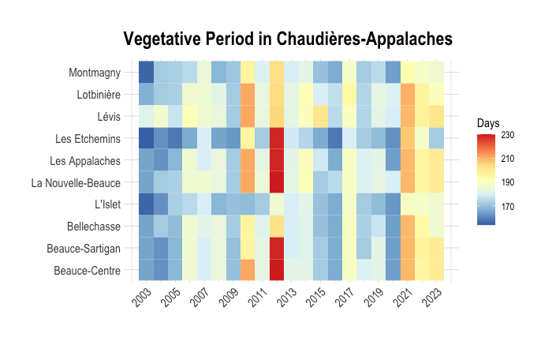

Vegetative period is the period of the year when plants grow and develop. The vegetative period is an essential factor in agriculture, as it determines the length of the growing season and the timing of planting and harvesting. The vegetative period is influenced by various factors, including temperature, precipitation, and day length. In this post, we will create a heatmap to visualize the spatio-temporal evolution of the vegetative period in the Chaudière-Appalaches region of Quebec over the past 20 years.

# Goal

-   temperature data to calculate the vegetative period with the `vegperiod` package
-   create a heatmap to visualize the average vegetative period for each year over the past 20 years with `ggplot2`

# Get the data

## Region borders

We need the polygon of the region of interest. [Données Québec](https://www.donneesquebec.ca/recherche/dataset/decoupages-administratifs) provides a shapefile of the administrative regions of Quebec.

``` r
qc_sf <- read_sf("SHP/mrc_s.shp") |> 
  filter(MRS_NM_REG=="Chaudière-Appalaches") |> 
  select(MRS_NM_MRC, geometry)
```

``` r
plot(qc_sf$geometry)
```


### Temperature data

We will extract temperature data from the AgERA5 dataset using the KrigR package. The AgERA5 dataset provides high-resolution climate data, including precipitation, temperature, and wind speed, for global climate research.

``` r
# Load the KrigR package
#api_user <- "*******************************" # PLEASE INSERT YOUR USER NUMBER
#api_key <- "********************************" # PLEASE INSERT YOUR API TOKEN

# List of available dataset
KrigR::Meta.List()

# Dataset description
KrigR::Meta.QuickFacts(
    "reanalysis-era5-land"
)
```

``` r
#extract precipitation data
start_date <- "2003-01-01 00:00"
end_date <- "2023-12-31 24:00"

temperature_raw <- KrigR::CDownloadS(
    Variable = "2m_temperature",
    DataSet = "reanalysis-era5-land",
    DateStart = start_date,
    DateStop = end_date,
    TResolution = "day",
    TZone = "CET",
    TStep = 1,
    Dir = Dir.Data,
    FileName = "temperature_raw",
    Extent = as(qc_sf, "Spatial"),
    API_User = api_user,
    API_Key = api_key,
    closeConnections = TRUE)
```

### Data preperation

We will convert the raster data to a dataframe and extract the temperature values for the region of interest.

``` r
# Change layer names
day_vector <- seq(
    from = as.Date(start_date)-1,
    to = as.Date(end_date),
    by = "day"
)
names(temperature_raw) <- day_vector

# Raster to dataframe
temperature_sf <- temperature_raw |> 
  as.data.frame(
    precipitation_raw,
    xy = TRUE, na.rm = TRUE)|>
    tidyr::pivot_longer(
        !c(x, y),
        names_to = "date",
        values_to = "value"
    ) |> 
  mutate(year=year(date), 
         month=month(date),
         value=value-273.15) |> 
  select(x, y, date, year, month, value) |> 
  st_as_sf(coords=c("x", "y")) |> 
  st_set_crs("WGS84") |> 
  st_intersection(qc_sf)
```

Next, we need to calculate the vegetative period for each year in the region of interest. The vegetative period is the period of the year when plants grow and develop. We will use the `vegperiod` function from the `vegperiod` package to calculate the vegetative period based on the temperature data.

``` r
#All dayly data
temp_dt<-temperature_sf |> 
  as_tibble() |> 
  mutate(lon = st_coordinates(geometry)[,1],
         lat = st_coordinates(geometry)[,2]) |>
  select(-geometry) |> 
  mutate(date=as.Date(date)) |> 
  filter(date>="2003-01-01", date<="2023-12-31")

# Growing season length
library(vegperiod)

vegperiod_dt<-temp_dt |>
  group_by(MRS_NM_MRC) |>
  reframe(vegperiod=vegperiod(
    dates=date, 
    Tavg=value, 
    start.method="StdMeteo", 
    end.method="StdMeteo"
  )) |> 
  unnest(cols = c(vegperiod)) |> 
  mutate(vege_period=end-start) |> 
  select(MRS_NM_MRC, year, vege_period)
```

## Heatmap

We will create a heatmap to visualize the spatio-temporal evolution of vegetative period in the Chaudière-Appalaches region. The heatmap will show the average vegetative period for each year over the past 20 years.

``` r
library(hrbrthemes)

gg<-ggplot(vegperiod_dt, aes(year, MRS_NM_MRC, fill= vege_period)) + 
  geom_tile() +
  scale_fill_distiller(palette = "RdYlBu") +
  theme_ipsum() +
  scale_x_continuous(breaks=seq(2003,2023,2), limits = c(2002.5, 2023.5))+
  theme(axis.text.x = element_text(angle = 45, hjust = 1))+
  theme(axis.title.x = element_blank(), axis.title.y = element_blank())+
  labs(title = "Vegetative Period in Chaudière-Appalaches",
       fill = "Days")+
  theme(legend.position = "right")
gg
```



# Conclusion

The heatmap shows the spatio-temporal evolution of the vegetative period in the Chaudières-Appalaches region over the past 20 years. The vegetative period is the period of the year when plants grow and develop. The heatmap shows that the vegetative period has been increasing over the past 20 years, which could be due to climate change. The heatmap provides valuable information for farmers and policymakers to make informed decisions about agriculture and land use in the region.

<!-- AWeber Web Form Generator 3.0.1 -->
<style type="text/css">
#af-form-88198013 .af-body{font-family:Tahoma, serif;font-size:18px;color:#333333;background-image:none;background-position:inherit;background-repeat:no-repeat;padding-top:0px;padding-bottom:0px;}
#af-form-88198013 .af-body .privacyPolicy{font-family:Tahoma, serif;font-size:18px;color:#333333;}
#af-form-88198013 {border-style:none;border-width:none;border-color:#F8F8F8;background-color:#F8F8F8;}
#af-form-88198013 .af-standards .af-element{padding-left:50px;padding-right:50px;}
#af-form-88198013 .af-quirksMode{padding-left:50px;padding-right:50px;}
#af-form-88198013 .af-header{font-family:Tahoma, serif;font-size:16px;color:#333333;border-top-style:none;border-right-style:none;border-bottom-style:none;border-left-style:none;border-width:1px;background-image:none;background-position:inherit;background-repeat:no-repeat;background-color:#F8F8F8;padding-left:20px;padding-right:20px;padding-top:40px;padding-bottom:20px;}
#af-form-88198013 .af-footer{font-family:Tahoma, serif;font-size:16px;color:#333333;border-top-style:none;border-right-style:none;border-bottom-style:none;border-left-style:none;border-width:1px;background-image:url("https://awas.aweber-static.com/images/forms/journey/basic/background.png");background-position:top center;background-repeat:no-repeat;background-color:#F8F8F8;padding-left:20px;padding-right:20px;padding-top:80px;padding-bottom:80px;}
#af-form-88198013 .af-body input.text, #af-form-88198013 .af-body textarea{border-color:#000000;border-width:1px;border-style:solid;font-family:Tahoma, serif;font-size:18px;font-weight:normal;font-style:normal;text-decoration:none;color:#333333;background-color:#FFFFFF;}
#af-form-88198013 .af-body input.text:focus, #af-form-88198013 .af-body textarea:focus{border-style:solid;border-width:1px;border-color:#EDEDED;background-color:#FAFAFA;}
#af-form-88198013 .af-body label.previewLabel{font-family:Tahoma, serif;font-size:18px;font-weight:normal;font-style:normal;text-decoration:none;color:#333333;display:block;float:left;text-align:left;width:25%;}
#af-form-88198013 .af-body .af-textWrap{width:70%;display:block;float:right;}
#af-form-88198013 .buttonContainer input.submit{font-family:Tahoma, serif;font-size:24px;font-weight:normal;font-style:normal;text-decoration:none;color:#FFFFFF;background-color:#333333;background-image:none;}
#af-form-88198013 .buttonContainer{text-align:center;}
#af-form-88198013 .af-body label.choice{font-family:inherit;font-size:inherit;font-weight:normal;font-style:normal;text-decoration:none;color:#000000;}
#af-form-88198013 .af-body a{font-weight:normal;font-style:normal;text-decoration:underline;color:#000000;}
#af-form-88198013, #af-form-88198013 .quirksMode{width:100%;max-width:486.0px;}
#af-form-88198013.af-quirksMode{overflow-x:hidden;}
#af-form-88198013 .af-quirksMode .bodyText{padding-top:2px;padding-bottom:2px;}
#af-form-88198013{overflow:hidden;}
#af-form-88198013 button,#af-form-88198013 input,#af-form-88198013 submit,#af-form-88198013 textarea,#af-form-88198013 select,#af-form-88198013 label,#af-form-88198013 optgroup,#af-form-88198013 option {float:none;margin:0;position:static;}
#af-form-88198013 select,#af-form-88198013 label,#af-form-88198013 optgroup,#af-form-88198013 option {padding:0;}
#af-form-88198013 input,#af-form-88198013 button,#af-form-88198013 textarea,#af-form-88198013 select {font-size:100%;}
#af-form-88198013 .buttonContainer input.submit {width:auto;}
#af-form-88198013 form,#af-form-88198013 textarea,.af-form-wrapper,.af-form-close-button,#af-form-88198013 img {float:none;color:inherit;margin:0;padding:0;position:static;background-color:none;border:none;}
#af-form-88198013 div {margin:0;}
#af-form-88198013 {display:block;}
#af-form-88198013 body,#af-form-88198013 dl,#af-form-88198013 dt,#af-form-88198013 dd,#af-form-88198013 h1,#af-form-88198013 h2,#af-form-88198013 h3,#af-form-88198013 h4,#af-form-88198013 h5,#af-form-88198013 h6,#af-form-88198013 pre,#af-form-88198013 code,#af-form-88198013 fieldset,#af-form-88198013 legend,#af-form-88198013 blockquote,#af-form-88198013 th,#af-form-88198013 td { float:none;color:inherit;margin:0;padding:0;position:static;}
#af-form-88198013 p { color:inherit;}
#af-form-88198013 ul,#af-form-88198013 ol {list-style-image:none;list-style-position:outside;list-style-type:disc;padding-left:40px;}
#af-form-88198013 .bodyText p {margin:1em 0;}
#af-form-88198013 table {border-collapse:collapse;border-spacing:0;}
#af-form-88198013 fieldset {border:0;}
.af-clear{clear:both;}
.af-form{box-sizing:border-box; margin:auto; text-align:left;}
.af-element{padding-bottom:5px; padding-top:5px;}
.af-form-wrapper{text-indent: 0;}
.af-body input.submit, .af-body input.image, .af-form .af-element input.button{float:none!important;}
.af-body input.submit{white-space: inherit;}
.af-body input.text{width:100%; padding:2px!important;}
.af-body .af-textWrap{text-align:left;}
.af-element label{float:left; text-align:left;}
.lbl-right .af-element label{text-align:right;}
.af-quirksMode .af-element{padding-left: 0!important; padding-right: 0!important;}
.af-body.af-standards input.submit{padding:4px 12px;}
.af-body input.image{border:none!important;}
.af-body input.text{float:none;}
.af-element label{display:block; float:left;}
.af-header,.af-footer { margin-bottom:0; margin-top:0; padding:10px; }
body {
}

#af-form-88198013 .af-body .af-textWrap {
  width: 100% !important;
}

#af-form-88198013 .af-body .af-element {
  padding-top: 0px!important;
  padding-bottom: 0.5rem!important;
}
#af-form-88198013 .af-body .af-element:first-child {
  margin-top: 0 !important;
}
#af-form-88198013 .af-body input.text,
#af-form-88198013 .af-body textarea {
  box-sizing: border-box !important;
  border-radius:2px;
  margin-bottom: 0.75rem !important;
  padding: 8px 12px !important;
  -webkit-transition-duration: 0.3s;
          transition-duration: 0.3s;
}

#af-form-88198013 .af-body select {
  width: 100%;
}
#af-form-88198013 .choiceList-radio-stacked {
  margin-bottom: 1rem !important;
  width: 100% !important;
}
#af-form-88198013 .af-element-radio {
  margin: 0 !important;
}
#af-form-88198013 .af-element-radio input.radio {
  display: inline;
  height: 0;
  opacity: 0;
  overflow: hidden;
  width: 0;
}
#af-form-88198013 .af-element-radio input.radio:checked ~ label {
  font-weight: 700 !important;
}
#af-form-88198013 .af-element-radio input.radio:focus ~ label {
  box-shadow: inset 0 0 0 2px rgba(25,35,70,.25);
}
#af-form-88198013 .af-element-radio input.radio:checked ~ label:before {
  background-color: #777777;
  border-color: #d6dee3;
}
#af-form-88198013 .af-element-radio label.choice {
  display: block !important;
  font-weight: 300 !important;
  margin: 0rem 0rem 0.5rem 1rem !important;
  padding: 0.25rem 1rem !important;
  position: relative;
  -webkit-transition-duration: 0.3s;
          transition-duration: 0.3s;
}
#af-form-88198013 .af-element-radio label.choice:before {
  background-color: #FFF;
  border: 1px solid #d6dee3;
  border-radius: 50%;
  content: '';
  height: 0.75rem;
  margin-top: 0.25rem;
  margin-left: -1.3rem;
  position: absolute;
  -webkit-transition-duration: 0.3s;
          transition-duration: 0.3s;
  width: 0.75rem;
}
#af-form-88198013 .af-selectWrap, 
#af-form-88198013 .af-dateWrap {
  width:100% !important;
  margin: 0.5rem 0rem 0.5rem !important;
  -webkit-transition-duration: 0.3s;
          transition-duration: 0.3s;
}
#af-form-88198013 .af-selectWrap select {
  padding: 0.5rem !important;
  height: 2.5rem;
}
#af-form-88198013 .af-dateWrap select {
  width: 32% !important;
  height: 2.5rem;
  padding: 0.5rem !important;
  margin: 0rem 0rem 0.75rem 0rem !important;
}
#af-form-88198013 .af-checkWrap {
  padding: 0.5rem 0.5rem 0.75rem !important;
}
#af-form-88198013 .buttonContainer {
  box-sizing: border-box !important;
}
#af-form-88198013 .af-footer {
  box-sizing: border-box !important;
}

#af-form-88198013 .af-footer p {
  margin: 0 !important;
}
#af-form-88198013 input.submit,
#af-form-88198013 #webFormSubmitButton {
  border: none;
  border-radius:2px;
  font-weight: bold;
  margin-top: 0.75rem !important;
  margin-bottom: 1.5rem !Important;
  padding: 0.75rem 2rem !important;
  -webkit-transition-duration: 0.3s;
          transition-duration: 0.3s;
  }
#af-form-88198013 input.submit:hover,
#af-form-88198013 #webFormSubmitButton:hover {
  cursor: pointer;
  opacity: 0.8;
}

#af-form-88198013 input.text:hover {
  cursor: pointer;
  opacity: 0.8;
}

.poweredBy a,
.privacyPolicy p {
  color: #333333 !important;
  font-size: 0.75rem !important;
  margin-bottom: 0rem !important;
}
</style>
<form method="post" class="af-form-wrapper" accept-charset="UTF-8" action="https://www.aweber.com/scripts/addlead.pl">

<input type="hidden" name="meta_web_form_id" value="88198013" />
<input type="hidden" name="meta_split_id" value="" />
<input type="hidden" name="listname" value="awlist6634098" />
<input type="hidden" name="redirect" value="https://www.aweber.com/thankyou-coi.htm?m=text" id="redirect_54bc847594a3cbc94af88c076598c2e4" />

<input type="hidden" name="meta_adtracking" value="Sign_Up_Form" />
<input type="hidden" name="meta_message" value="1" />
<input type="hidden" name="meta_required" value="name,email" />

<input type="hidden" name="meta_tooltip" value="" />

<h5>
<br><span style="font-size:36px;"><strong>WANT MORE?</strong></span>
</h5>
<p>
Sign up for exclusive content, emails & things I doesn't share anywhere else.
</p>

<label class="previewLabel" for="awf_field-117870704">Name:</label>

<input id="awf_field-117870704" type="text" name="name" class="text" value="" onfocus=" if (this.value == '') { this.value = ''; }" onblur="if (this.value == '') { this.value='';} " tabindex="500" />

<label class="previewLabel" for="awf_field-117870705">Email:</label>

<input class="text" id="awf_field-117870705" type="email" name="email" value="" tabindex="501" onfocus=" if (this.value == '') { this.value = ''; }" onblur="if (this.value == '') { this.value='';}" />

<input name="submit" class="submit" type="submit" value="Let&#x27;s do it!" tabindex="502" />

<p>
We respect your <a title="Privacy Policy" href="https://www.aweber.com/permission.htm" target="_blank" rel="nofollow">email privacy</a>
</p>

<p>
<a href="https://www.aweber.com" title="AWeber Email Marketing" target="_blank" rel="nofollow">Powered by AWeber Email Marketing</a>
</p>

<p>
 
</p>


</form>
<!-- /AWeber Web Form Generator 3.0.1 -->

## Session Info

``` r
sessionInfo()
```

    R version 4.4.2 (2024-10-31)
    Platform: aarch64-apple-darwin20
    Running under: macOS Sequoia 15.3.1

    Matrix products: default
    BLAS:   /Library/Frameworks/R.framework/Versions/4.4-arm64/Resources/lib/libRblas.0.dylib 
    LAPACK: /Library/Frameworks/R.framework/Versions/4.4-arm64/Resources/lib/libRlapack.dylib;  LAPACK version 3.12.0

    locale:
    [1] en_US.UTF-8/en_US.UTF-8/en_US.UTF-8/C/en_US.UTF-8/en_US.UTF-8

    time zone: America/Toronto
    tzcode source: internal

    attached base packages:
    [1] stats     graphics  grDevices datasets  utils     methods   base     

    other attached packages:
     [1] reticulate_1.40.0    jofou.lib_0.0.0.9000 tidytuesdayR_1.1.2  
     [4] tictoc_1.2.1         KrigR_0.9.4          ncdf4_1.23          
     [7] ecmwfr_2.0.2         rgeoboundaries_1.3.1 terra_1.8-10        
    [10] sf_1.0-19            pins_1.4.0           fs_1.6.5            
    [13] timetk_2.9.0         yardstick_1.3.2      workflowsets_1.1.0  
    [16] workflows_1.1.4      tune_1.2.1           rsample_1.2.1       
    [19] parsnip_1.2.1        modeldata_1.4.0      infer_1.0.7         
    [22] dials_1.3.0          scales_1.3.0         broom_1.0.7         
    [25] tidymodels_1.2.0     recipes_1.1.0        doFuture_1.0.1      
    [28] future_1.34.0        foreach_1.5.2        skimr_2.1.5         
    [31] gganimate_1.0.9      forcats_1.0.0        stringr_1.5.1       
    [34] dplyr_1.1.4          purrr_1.0.2          readr_2.1.5         
    [37] tidyr_1.3.1          tibble_3.2.1         ggplot2_3.5.1       
    [40] tidyverse_2.0.0      lubridate_1.9.4      kableExtra_1.4.0    
    [43] inspectdf_0.0.12.1   openxlsx_4.2.7.1     knitr_1.49          

    loaded via a namespace (and not attached):
      [1] rstudioapi_0.17.1   jsonlite_1.8.9      magrittr_2.0.3     
      [4] magick_2.8.5        farver_2.1.2        rmarkdown_2.29     
      [7] vctrs_0.6.5         memoise_2.0.1       hoardr_0.5.5       
     [10] base64enc_0.1-3     htmltools_0.5.8.1   progress_1.2.3     
     [13] curl_6.1.0          parallelly_1.41.0   KernSmooth_2.23-26 
     [16] plyr_1.8.9          zoo_1.8-12          stars_0.6-7        
     [19] cachem_1.1.0        ggfittext_0.10.2    lifecycle_1.0.4    
     [22] iterators_1.0.14    pkgconfig_2.0.3     Matrix_1.7-2       
     [25] R6_2.5.1            fastmap_1.2.0       digest_0.6.37      
     [28] reshape_0.8.9       colorspace_2.1-1    furrr_0.3.1        
     [31] timechange_0.3.0    httr_1.4.7          abind_1.4-8        
     [34] compiler_4.4.2      intervals_0.15.5    proxy_0.4-27       
     [37] withr_3.0.2         backports_1.5.0     viridis_0.6.5      
     [40] DBI_1.2.3           MASS_7.3-64         lava_1.8.1         
     [43] rappdirs_0.3.3      classInt_0.4-11     tools_4.4.2        
     [46] units_0.8-5         zip_2.3.1           future.apply_1.11.3
     [49] nnet_7.3-20         glue_1.8.0          grid_4.4.2         
     [52] snow_0.4-4          generics_0.1.3      gtable_0.3.6       
     [55] countrycode_1.6.0   tzdb_0.4.0          class_7.3-23       
     [58] data.table_1.16.4   hms_1.1.3           sp_2.1-4           
     [61] xml2_1.3.6          pillar_1.10.1       splines_4.4.2      
     [64] lhs_1.2.0           tweenr_2.0.3        lattice_0.22-6     
     [67] FNN_1.1.4.1         renv_1.0.7          survival_3.8-3     
     [70] tidyselect_1.2.1    pbapply_1.7-2       gridExtra_2.3      
     [73] svglite_2.1.3       crul_1.5.0          xfun_0.50          
     [76] hardhat_1.4.0       timeDate_4041.110   stringi_1.8.4      
     [79] DiceDesign_1.10     yaml_2.3.10         evaluate_1.0.3     
     [82] codetools_0.2-20    httpcode_0.3.0      automap_1.1-12     
     [85] cli_3.6.3           rpart_4.1.24        systemfonts_1.2.1  
     [88] repr_1.1.7          munsell_0.5.1       spacetime_1.3-2    
     [91] Rcpp_1.0.14         doSNOW_1.0.20       globals_0.16.3     
     [94] png_0.1-8           parallel_4.4.2      gower_1.0.2        
     [97] prettyunits_1.2.0   GPfit_1.0-8         listenv_0.9.1      
    [100] viridisLite_0.4.2   ipred_0.9-15        xts_0.14.1         
    [103] prodlim_2024.06.25  e1071_1.7-16        gstat_2.1-2        
    [106] crayon_1.5.3        rlang_1.1.5         cowplot_1.1.3      
