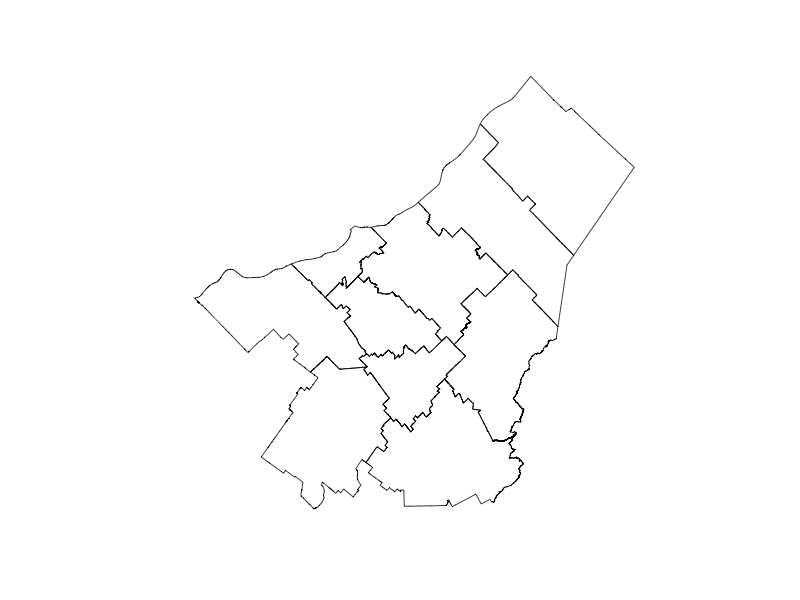

<script async src="https://pagead2.googlesyndication.com/pagead/js/adsbygoogle.js?client=ca-pub-7674504334497845" crossorigin="anonymous"></script>

[](https://subscribepage.io/E3ia1B)

Subscribe button

<br>

Vegetative period is the period of the year when plants grow and develop. The vegetative period is an essential factor in agriculture, as it determines the length of the growing season and the timing of planting and harvesting. The vegetative period is influenced by various factors, including temperature, precipitation, and day length. In this post, we will create a heatmap to visualize the spatio-temporal evolution of the vegetative period in the Chaudière-Appalaches region of Quebec over the past 20 years.

# Goal

-   temperature data to calculate the vegetative period with the `vegperiod` package
-   create a heatmap to visualize the average vegetative period for each year over the past 20 years with `ggplot2`

# Get the data

{}

## Region borders

We need the polygon of the region of interest. [Données Québec](https://www.donneesquebec.ca/recherche/dataset/decoupages-administratifs) provides a shapefile of the administrative regions of Quebec.

{}

``` r
qc_sf <- read_sf("SHP/mrc_s.shp") |> 
  filter(MRS_NM_REG=="Chaudière-Appalaches") |> 
  select(MRS_NM_MRC, geometry)
```

``` r
png("Exports/pp.png", width = 800, height = 600)
plot(qc_sf$geometry)
dev.off()
```

    quartz_off_screen 
                    2 

``` r

```


### Temperature data

We will extract temperature data from the AgERA5 dataset using the KrigR package. The AgERA5 dataset provides high-resolution climate data, including precipitation, temperature, and wind speed, for global climate research.

``` r
# Load the KrigR package
#api_user <- "*******************************" # PLEASE INSERT YOUR USER NUMBER
#api_key <- "********************************" # PLEASE INSERT YOUR API TOKEN

# List of available dataset
KrigR::Meta.List()

# Dataset description
KrigR::Meta.QuickFacts(
    "reanalysis-era5-land"
)
```

``` r
#extract precipitation data
start_date <- "2003-01-01 00:00"
end_date <- "2023-12-31 24:00"

temperature_raw <- KrigR::CDownloadS(
    Variable = "2m_temperature",
    DataSet = "reanalysis-era5-land",
    DateStart = start_date,
    DateStop = end_date,
    TResolution = "day",
    TZone = "CET",
    TStep = 1,
    Dir = Dir.Data,
    FileName = "temperature_raw",
    Extent = as(qc_sf, "Spatial"),
    API_User = api_user,
    API_Key = api_key,
    closeConnections = TRUE)
```

### Data preperation

We will convert the raster data to a dataframe and extract the temperature values for the region of interest.

``` r
# Change layer names
day_vector <- seq(
    from = as.Date(start_date)-1,
    to = as.Date(end_date),
    by = "day"
)
names(temperature_raw) <- day_vector

# Raster to dataframe
temperature_sf <- temperature_raw |> 
  as.data.frame(
    precipitation_raw,
    xy = TRUE, na.rm = TRUE)|>
    tidyr::pivot_longer(
        !c(x, y),
        names_to = "date",
        values_to = "value"
    ) |> 
  mutate(year=year(date), 
         month=month(date),
         value=value-273.15) |> 
  select(x, y, date, year, month, value) |> 
  st_as_sf(coords=c("x", "y")) |> 
  st_set_crs("WGS84") |> 
  st_intersection(qc_sf)
```

Next, we need to calculate the vegetative period for each year in the region of interest. The vegetative period is the period of the year when plants grow and develop. We will use the `vegperiod` function from the `vegperiod` package to calculate the vegetative period based on the temperature data.

``` r
#All dayly data
temp_dt<-temperature_sf |> 
  as_tibble() |> 
  mutate(lon = st_coordinates(geometry)[,1],
         lat = st_coordinates(geometry)[,2]) |>
  select(-geometry) |> 
  mutate(date=as.Date(date)) |> 
  filter(date>="2003-01-01", date<="2023-12-31")

# Growing season length
library(vegperiod)

vegperiod_dt<-temp_dt |>
  group_by(MRS_NM_MRC) |>
  reframe(vegperiod=vegperiod(
    dates=date, 
    Tavg=value, 
    start.method="StdMeteo", 
    end.method="StdMeteo"
  )) |> 
  unnest(cols = c(vegperiod)) |> 
  mutate(vege_period=end-start) |> 
  select(MRS_NM_MRC, year, vege_period)
```

## Heatmap

We will create a heatmap to visualize the spatio-temporal evolution of vegetative period in the Chaudière-Appalaches region. The heatmap will show the average vegetative period for each year over the past 20 years.

``` r
library(hrbrthemes)

gg<-ggplot(vegperiod_dt, aes(year, MRS_NM_MRC, fill= vege_period)) + 
  geom_tile() +
  scale_fill_distiller(palette = "RdYlBu") +
  theme_ipsum() +
  scale_x_continuous(breaks=seq(2003,2023,2), limits = c(2002.5, 2023.5))+
  theme(axis.text.x = element_text(angle = 45, hjust = 1))+
  theme(axis.title.x = element_blank(), axis.title.y = element_blank())+
  labs(title = "Vegetative Period in Chaudière-Appalaches",
       fill = "Days")+
  theme(legend.position = "right")
gg
```


# Conclusion

The heatmap shows the spatio-temporal evolution of the vegetative period in the Chaudières-Appalaches region over the past 20 years. The vegetative period is the period of the year when plants grow and develop. The heatmap shows that the vegetative period has been increasing over the past 20 years, which could be due to climate change. The heatmap provides valuable information for farmers and policymakers to make informed decisions about agriculture and land use in the region.

# Sign up for the newsletter

[](https://dashboard.mailerlite.com/forms/1478852/152663752035010469/share)

Sign up

<br>

# Session Info

``` r
sessionInfo()
```

    R version 4.4.2 (2024-10-31)
    Platform: aarch64-apple-darwin20
    Running under: macOS Sequoia 15.5

    Matrix products: default
    BLAS:   /Library/Frameworks/R.framework/Versions/4.4-arm64/Resources/lib/libRblas.0.dylib 
    LAPACK: /Library/Frameworks/R.framework/Versions/4.4-arm64/Resources/lib/libRlapack.dylib;  LAPACK version 3.12.0

    locale:
    [1] en_US.UTF-8/en_US.UTF-8/en_US.UTF-8/C/en_US.UTF-8/en_US.UTF-8

    time zone: America/Toronto
    tzcode source: internal

    attached base packages:
    [1] stats     graphics  grDevices datasets  utils     methods   base     

    other attached packages:
     [1] reticulate_1.40.0    jofou.lib_0.0.0.9000 tidytuesdayR_1.1.2  
     [4] tictoc_1.2.1         KrigR_0.9.4          ncdf4_1.23          
     [7] ecmwfr_2.0.2         rgeoboundaries_1.3.1 terra_1.8-10        
    [10] sf_1.0-19            pins_1.4.0           fs_1.6.5            
    [13] timetk_2.9.0         yardstick_1.3.2      workflowsets_1.1.0  
    [16] workflows_1.1.4      tune_1.2.1           rsample_1.2.1       
    [19] parsnip_1.2.1        modeldata_1.4.0      infer_1.0.7         
    [22] dials_1.3.0          scales_1.3.0         broom_1.0.7         
    [25] tidymodels_1.2.0     recipes_1.1.0        doFuture_1.0.1      
    [28] future_1.34.0        foreach_1.5.2        skimr_2.1.5         
    [31] gganimate_1.0.9      forcats_1.0.0        stringr_1.5.1       
    [34] dplyr_1.1.4          purrr_1.0.2          readr_2.1.5         
    [37] tidyr_1.3.1          tibble_3.2.1         ggplot2_3.5.1       
    [40] tidyverse_2.0.0      lubridate_1.9.4      kableExtra_1.4.0    
    [43] inspectdf_0.0.12.1   openxlsx_4.2.7.1     knitr_1.49          

    loaded via a namespace (and not attached):
      [1] rstudioapi_0.17.1   jsonlite_1.8.9      magrittr_2.0.3     
      [4] magick_2.8.5        farver_2.1.2        rmarkdown_2.29     
      [7] vctrs_0.6.5         memoise_2.0.1       hoardr_0.5.5       
     [10] base64enc_0.1-3     blogdown_1.20       htmltools_0.5.8.1  
     [13] progress_1.2.3      curl_6.1.0          parallelly_1.41.0  
     [16] KernSmooth_2.23-26  plyr_1.8.9          zoo_1.8-12         
     [19] stars_0.6-7         cachem_1.1.0        ggfittext_0.10.2   
     [22] lifecycle_1.0.4     iterators_1.0.14    pkgconfig_2.0.3    
     [25] Matrix_1.7-2        R6_2.5.1            fastmap_1.2.0      
     [28] digest_0.6.37       reshape_0.8.9       colorspace_2.1-1   
     [31] furrr_0.3.1         timechange_0.3.0    httr_1.4.7         
     [34] abind_1.4-8         compiler_4.4.2      intervals_0.15.5   
     [37] proxy_0.4-27        withr_3.0.2         backports_1.5.0    
     [40] viridis_0.6.5       DBI_1.2.3           MASS_7.3-64        
     [43] lava_1.8.1          rappdirs_0.3.3      classInt_0.4-11    
     [46] tools_4.4.2         units_0.8-5         zip_2.3.1          
     [49] future.apply_1.11.3 nnet_7.3-20         glue_1.8.0         
     [52] grid_4.4.2          snow_0.4-4          generics_0.1.3     
     [55] gtable_0.3.6        countrycode_1.6.0   tzdb_0.4.0         
     [58] class_7.3-23        data.table_1.16.4   hms_1.1.3          
     [61] sp_2.1-4            xml2_1.3.6          pillar_1.10.1      
     [64] splines_4.4.2       lhs_1.2.0           tweenr_2.0.3       
     [67] lattice_0.22-6      FNN_1.1.4.1         renv_1.0.7         
     [70] survival_3.8-3      tidyselect_1.2.1    pbapply_1.7-2      
     [73] gridExtra_2.3       svglite_2.1.3       crul_1.5.0         
     [76] xfun_0.50           hardhat_1.4.0       timeDate_4041.110  
     [79] stringi_1.8.4       DiceDesign_1.10     yaml_2.3.10        
     [82] evaluate_1.0.3      codetools_0.2-20    httpcode_0.3.0     
     [85] automap_1.1-12      cli_3.6.3           rpart_4.1.24       
     [88] systemfonts_1.2.1   repr_1.1.7          munsell_0.5.1      
     [91] spacetime_1.3-2     Rcpp_1.0.14         doSNOW_1.0.20      
     [94] globals_0.16.3      png_0.1-8           parallel_4.4.2     
     [97] gower_1.0.2         prettyunits_1.2.0   GPfit_1.0-8        
    [100] listenv_0.9.1       viridisLite_0.4.2   ipred_0.9-15       
    [103] xts_0.14.1          prodlim_2024.06.25  e1071_1.7-16       
    [106] gstat_2.1-2         crayon_1.5.3        rlang_1.1.5        
    [109] cowplot_1.1.3      
