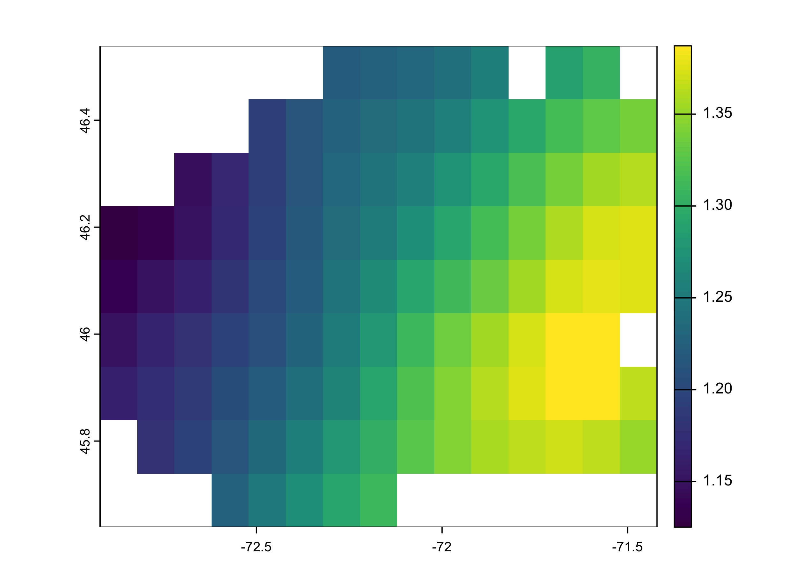

<a href = "https://johaniefournier.aweb.page/p/4b2b1e24-af09-488d-8ff6-7b46ce61e367"> 
</a>

<br>

Precipitation plays a crucial role in Quebec's climate, influencing everything from agriculture to hydrology and urban planning. Understanding long-term rainfall patterns is essential for assessing climate variability, detecting anomalies, and making informed environmental decisions.

Building on my previous series exploring precipitation patterns across the St. Lawrence Lowlands, this post shifts focus to a much smaller scale, allowing for a more in-depth analysis. By examining 30 years of high-resolution precipitation data from the AgERA5 dataset for a single region ---Centre-du-Québec--- I aim to uncover localized trends, seasonal variations, and anomalies that might be overlooked in broader regional studies.

This detailed approach provides valuable insights into long-term precipitation dynamics, which are essential for climate research, agriculture, and water resource management.

## Goal

In this study, I aim to:

-   **Explore Long-Term Trends** -- Identify how precipitation patterns have evolved over the past 30 years, detecting any significant increases, decreases, or shifts.
-   **Analyze Seasonal Variations** -- Examine how precipitation levels fluctuate throughout the year and determine whether seasonality has changed over time.
-   **Detect Anomalies & Extreme Events** -- Identify unusual precipitation events, such as extreme rainfall periods or prolonged dry spells, and assess their frequency and intensity.

## Get the data

### Municipality borders

We need the polygon of the region of interest. We will use the `rgeoboundaries` package to extract the polygon of Quebec.

``` r
qc_sf <- rgeoboundaries::gb_adm2(country = "CAN") |>
  filter(shapeName %in% c("Centre-du-Québec")) |> 
  select(shapeName, geometry) 
qc_sf #geographic coordinate
```

    Simple feature collection with 1 feature and 1 field
    Geometry type: MULTIPOLYGON
    Dimension:     XY
    Bounding box:  xmin: -72.97097 ymin: 45.58932 xmax: -71.37237 ymax: 46.561
    Geodetic CRS:  WGS84
             shapeName                       geometry
    1 Centre-du-Québec MULTIPOLYGON (((-72.03755 4...

``` r
plot(qc_sf$geometry)
```


### Precipitation data

We will extract precipitation data from the AgERA5 dataset using the KrigR package. The AgERA5 dataset provides high-resolution climate data, including precipitation, temperature, and wind speed, for global climate research.

``` r
# Load the KrigR package
#api_user <- "*******************************" # PLEASE INSERT YOUR USER NUMBER
#api_key <- "********************************" # PLEASE INSERT YOUR API TOKEN

# List of available dataset
KrigR::Meta.List()

# Dataset description
KrigR::Meta.QuickFacts(
    "reanalysis-era5-land-monthly-means"
)

# List of available variables
vars_df <- KrigR::Meta.Variables(
    "reanalysis-era5-land"
)
```

``` r
#extract precipitation data
start_date <- "1993-01-01 00:00"
end_date <- "2023-12-31 24:00"

precipitation_raw <- KrigR::CDownloadS(
    Type = "monthly_averaged_reanalysis",
    Variable = "total_precipitation",
    DataSet = "reanalysis-era5-land-monthly-means",
    DateStart = start_date,
    DateStop = end_date,
    TZone = "CET",
    FUN = "mean",
    TResolution = "month",
    TStep = 1,
    Dir = Dir.Data,
    FileName = "precipitation_raw",
    Extent = as(qc_sf, "Spatial"),
    API_User = api_user,
    API_Key = api_key,
    closeConnections = TRUE
)
```

### Data preperation

We will convert the raster data to a dataframe and extract the precipitation values for the region of interest.

``` r
# Change layer names
months_vector <- seq(
    from = as.Date(start_date),
    to = as.Date(end_date),
    by = "month"
)
names(precipitation_raw) <- months_vector

# Raster to dataframe
precipitation_sf <- precipitation_raw |> 
  as.data.frame(
    precipitation_raw,
    xy = TRUE, na.rm = TRUE)|>
    tidyr::pivot_longer(
        !c(x, y),
        names_to = "date",
        values_to = "value"
    ) |> 
  mutate(year=year(date), 
         month=month(date)) |> 
  select(x, y, date, year, month, value) |> 
  st_as_sf(coords=c("x", "y")) |> 
  st_set_crs("WGS84") |> 
  st_intersection(qc_sf) 

 precipitation_dt<-precipitation_sf |> 
  as_tibble() |> 
  select(-geometry) |> 
  group_by(shapeName, date, year, month) |> 
  summarise(mean=mean(value, na.rm=TRUE)) |> 
  ungroup()
```

## General trend

Let's start by exploring the precipitation data to understand its distribution and general trends.

``` r
skimr::skim(precipitation_dt)
```

|                                                  |                  |
|:-------------------------------------------------|:-----------------|
| Name                                             | precipitation_dt |
| Number of rows                                   | 372              |
| Number of columns                                | 5                |
| \_\_\_\_\_\_\_\_\_\_\_\_\_\_\_\_\_\_\_\_\_\_\_   |                  |
| Column type frequency:                           |                  |
| character                                        | 2                |
| numeric                                          | 3                |
| \_\_\_\_\_\_\_\_\_\_\_\_\_\_\_\_\_\_\_\_\_\_\_\_ |                  |
| Group variables                                  | None             |

Data summary

**Variable type: character**

| skim_variable | n_missing | complete_rate | min | max | empty | n_unique | whitespace |
|:-------------|---------:|-------------:|----:|----:|------:|--------:|----------:|
| shapeName     |         0 |             1 |  16 |  16 |     0 |        1 |          0 |
| date          |         0 |             1 |  10 |  10 |     0 |      372 |          0 |

**Variable type: numeric**

| skim_variable | n_missing | complete_rate |   mean |   sd |   p0 |     p25 |    p50 |     p75 |    p100 | hist  |
|:----------|-------:|----------:|-----:|----:|----:|------:|-----:|------:|------:|:----|
| year          |         0 |             1 | 2008.0 | 8.96 | 1993 | 2000.00 | 2008.0 | 2016.00 | 2023.00 | ▇▇▇▇▇ |
| month         |         0 |             1 |    6.5 | 3.46 |    1 |    3.75 |    6.5 |    9.25 |   12.00 | ▇▅▅▅▇ |
| mean          |         0 |             1 |    0.0 | 0.00 |    0 |    0.00 |    0.0 |    0.00 |    0.01 | ▃▇▆▂▁ |

## Trend over time

Is there a general trend over time? Let's find out!

``` r
precipitation_dt_year<-precipitation_dt |> 
  group_by(year) |>  
  summarise(sum=sum(mean)) |>  
  ungroup()

ggplot(data=precipitation_dt_year, aes(x=year, y=sum))+
  geom_line()
```


Precipitation has increased over time.

## Space trend

Is there a general trend over space? Let's find out!

``` r
sum<- terra::app(precipitation_raw, fun = "sum", na.rm = TRUE)
plot(sum)
```



The total precipitation for 30 years is different for each location in the raster, with les precipitation in the western section.

## Spatio-temporal trend

Can we link the spatial trend to the temporal trend? Let's find out!

``` r
precipitation_sf |> 
  mutate(lon = st_coordinates(geometry)[,1],
         lat = st_coordinates(geometry)[,2]) |> 
group_by(year, lon, lat) |> 
  summarise(sum=sum(value, na.rm=TRUE)*10000) |> 
  ungroup() |> 
  ggplot(aes(x=lon, y=lat, fill=sum))+
  geom_tile()+
  facet_wrap(~year)+
  theme_map()+
  scale_fill_viridis_c()+
  labs(title="Distribution of Precipitations for Centre-du-Québec",
       fill="Total (mm)")+
  theme(legend.position = "bottom",
        legend.justification = "center",
        plot.title = element_text(hjust = 0, face = "bold", size=15.5))
```


This graph shows the spatial distribution of precipitation over time. The color intensity represents the amount of precipitation, with darker colors indicating higher values. This clearly indicates that precipitation levels vary across the region and the years.

## Anomalies and outliers

Are there any anomalies or outliers in the precipitation data? Let's investigate!

### Time serie anomalies

What are the yearly precipitation anomalies?

``` r
library(anomalize)

precipitation_dt |> 
  group_by(shapeName, year) |> 
  summarize(value_year=sum(mean)*1000) |> 
  mutate(year_date=as.Date(as.character(year), "%Y")) |>
  select(-year) |> 
  ungroup() |> 
  time_decompose(value_year) |> 
  anomalize(remainder) |>
  plot_anomalies() +
  labs(title="Anomalies of Precipitations (mm) for Centre-du-Québec")+
  theme(plot.title = element_text(hjust = 0, face = "bold", size=15.5))
```


This graph shows the yearly precipitation anomalies in Centre-du-Québec over the past 30 years. The blue bars represent positive anomalies, while the red bars represent negative anomalies.

### Weather anomalies

What are monthly precipitation anomalies?

``` r
library(anomalize)

precipitation_dt |> 
  group_by(shapeName, date) |> 
  summarize(value=sum(mean)) |> 
  mutate(date=as.Date(date)) |>
  ungroup() |> 
  time_decompose(value) |> 
  anomalize(remainder) |>
  plot_anomalies()+
  labs(title="Anomalies of Precipitations (mm) for Centre-du-Québec")+
  theme(plot.title = element_text(hjust = 0, face = "bold", size=15.5))
```


This graph does not show any monthly precipitation anomalies and does not show the seasonality of precipitation.

Let's se I we can do better.

``` r
ggplot(precipitation_dt, aes(x = month, y = mean*1000, group = month)) +
  geom_boxplot(fill="#DBBDC3")+
  geom_dotplot(binaxis = "y", stackdir = "center", dotsize = 0.5, alpha=0.3)+
  labs(title="Cummulative Monthly Precipitations (mm) for Centre-du-Québec 1993-2023",
       x="Month",
       y="Precipitation (mm)")+
  theme(plot.title = element_text(hjust = 0, face = "bold", size=12),
        axis.title.x = element_text(hjust = 0, face = "bold", size=8),
        axis.title.y = element_text(hjust = 1, face = "bold", size=8))+
  scale_x_continuous(breaks=seq(1,12,1), limits=c(0.5, 12.5))
```


We can clearly see that the precipitation levels vary across the month of the year, with higher levels during summers months.

## Conclusion

In this post, we explored 30 years of high-resolution precipitation data for Centre-du-Québec, focusing on trends, patterns, and anomalies. Our analysis revealed several key insights:

-   **General Trend** -- Precipitation levels have not significantly increased over the past 30 years. But in 2021-2023, the precipitation decreased.

-   **Spatial Variation** -- Precipitation levels vary across the region, with higher levels in the western section.

-   **Spatio-Temporal Trend** -- The spatial distribution of precipitation varies over time, with different patterns emerging each year.

-   **Anomalies & Outliers** -- We identified yearly and monthly precipitation anomalies, highlighting unusual weather events and extreme precipitation periods.

This detailed analysis provides valuable insights into long-term precipitation dynamics in Centre-du-Québec, offering essential information for climate research, agriculture, and water resource management.

<!-- AWeber Web Form Generator 3.0.1 -->
<style type="text/css">
#af-form-88198013 .af-body{font-family:Tahoma, serif;font-size:18px;color:#333333;background-image:none;background-position:inherit;background-repeat:no-repeat;padding-top:0px;padding-bottom:0px;}
#af-form-88198013 .af-body .privacyPolicy{font-family:Tahoma, serif;font-size:18px;color:#333333;}
#af-form-88198013 {border-style:none;border-width:none;border-color:#F8F8F8;background-color:#F8F8F8;}
#af-form-88198013 .af-standards .af-element{padding-left:50px;padding-right:50px;}
#af-form-88198013 .af-quirksMode{padding-left:50px;padding-right:50px;}
#af-form-88198013 .af-header{font-family:Tahoma, serif;font-size:16px;color:#333333;border-top-style:none;border-right-style:none;border-bottom-style:none;border-left-style:none;border-width:1px;background-image:none;background-position:inherit;background-repeat:no-repeat;background-color:#F8F8F8;padding-left:20px;padding-right:20px;padding-top:40px;padding-bottom:20px;}
#af-form-88198013 .af-footer{font-family:Tahoma, serif;font-size:16px;color:#333333;border-top-style:none;border-right-style:none;border-bottom-style:none;border-left-style:none;border-width:1px;background-image:url("https://awas.aweber-static.com/images/forms/journey/basic/background.png");background-position:top center;background-repeat:no-repeat;background-color:#F8F8F8;padding-left:20px;padding-right:20px;padding-top:80px;padding-bottom:80px;}
#af-form-88198013 .af-body input.text, #af-form-88198013 .af-body textarea{border-color:#000000;border-width:1px;border-style:solid;font-family:Tahoma, serif;font-size:18px;font-weight:normal;font-style:normal;text-decoration:none;color:#333333;background-color:#FFFFFF;}
#af-form-88198013 .af-body input.text:focus, #af-form-88198013 .af-body textarea:focus{border-style:solid;border-width:1px;border-color:#EDEDED;background-color:#FAFAFA;}
#af-form-88198013 .af-body label.previewLabel{font-family:Tahoma, serif;font-size:18px;font-weight:normal;font-style:normal;text-decoration:none;color:#333333;display:block;float:left;text-align:left;width:25%;}
#af-form-88198013 .af-body .af-textWrap{width:70%;display:block;float:right;}
#af-form-88198013 .buttonContainer input.submit{font-family:Tahoma, serif;font-size:24px;font-weight:normal;font-style:normal;text-decoration:none;color:#FFFFFF;background-color:#333333;background-image:none;}
#af-form-88198013 .buttonContainer{text-align:center;}
#af-form-88198013 .af-body label.choice{font-family:inherit;font-size:inherit;font-weight:normal;font-style:normal;text-decoration:none;color:#000000;}
#af-form-88198013 .af-body a{font-weight:normal;font-style:normal;text-decoration:underline;color:#000000;}
#af-form-88198013, #af-form-88198013 .quirksMode{width:100%;max-width:486.0px;}
#af-form-88198013.af-quirksMode{overflow-x:hidden;}
#af-form-88198013 .af-quirksMode .bodyText{padding-top:2px;padding-bottom:2px;}
#af-form-88198013{overflow:hidden;}
#af-form-88198013 button,#af-form-88198013 input,#af-form-88198013 submit,#af-form-88198013 textarea,#af-form-88198013 select,#af-form-88198013 label,#af-form-88198013 optgroup,#af-form-88198013 option {float:none;margin:0;position:static;}
#af-form-88198013 select,#af-form-88198013 label,#af-form-88198013 optgroup,#af-form-88198013 option {padding:0;}
#af-form-88198013 input,#af-form-88198013 button,#af-form-88198013 textarea,#af-form-88198013 select {font-size:100%;}
#af-form-88198013 .buttonContainer input.submit {width:auto;}
#af-form-88198013 form,#af-form-88198013 textarea,.af-form-wrapper,.af-form-close-button,#af-form-88198013 img {float:none;color:inherit;margin:0;padding:0;position:static;background-color:none;border:none;}
#af-form-88198013 div {margin:0;}
#af-form-88198013 {display:block;}
#af-form-88198013 body,#af-form-88198013 dl,#af-form-88198013 dt,#af-form-88198013 dd,#af-form-88198013 h1,#af-form-88198013 h2,#af-form-88198013 h3,#af-form-88198013 h4,#af-form-88198013 h5,#af-form-88198013 h6,#af-form-88198013 pre,#af-form-88198013 code,#af-form-88198013 fieldset,#af-form-88198013 legend,#af-form-88198013 blockquote,#af-form-88198013 th,#af-form-88198013 td { float:none;color:inherit;margin:0;padding:0;position:static;}
#af-form-88198013 p { color:inherit;}
#af-form-88198013 ul,#af-form-88198013 ol {list-style-image:none;list-style-position:outside;list-style-type:disc;padding-left:40px;}
#af-form-88198013 .bodyText p {margin:1em 0;}
#af-form-88198013 table {border-collapse:collapse;border-spacing:0;}
#af-form-88198013 fieldset {border:0;}
.af-clear{clear:both;}
.af-form{box-sizing:border-box; margin:auto; text-align:left;}
.af-element{padding-bottom:5px; padding-top:5px;}
.af-form-wrapper{text-indent: 0;}
.af-body input.submit, .af-body input.image, .af-form .af-element input.button{float:none!important;}
.af-body input.submit{white-space: inherit;}
.af-body input.text{width:100%; padding:2px!important;}
.af-body .af-textWrap{text-align:left;}
.af-element label{float:left; text-align:left;}
.lbl-right .af-element label{text-align:right;}
.af-quirksMode .af-element{padding-left: 0!important; padding-right: 0!important;}
.af-body.af-standards input.submit{padding:4px 12px;}
.af-body input.image{border:none!important;}
.af-body input.text{float:none;}
.af-element label{display:block; float:left;}
.af-header,.af-footer { margin-bottom:0; margin-top:0; padding:10px; }
body {
}

#af-form-88198013 .af-body .af-textWrap {
  width: 100% !important;
}

#af-form-88198013 .af-body .af-element {
  padding-top: 0px!important;
  padding-bottom: 0.5rem!important;
}
#af-form-88198013 .af-body .af-element:first-child {
  margin-top: 0 !important;
}
#af-form-88198013 .af-body input.text,
#af-form-88198013 .af-body textarea {
  box-sizing: border-box !important;
  border-radius:2px;
  margin-bottom: 0.75rem !important;
  padding: 8px 12px !important;
  -webkit-transition-duration: 0.3s;
          transition-duration: 0.3s;
}

#af-form-88198013 .af-body select {
  width: 100%;
}
#af-form-88198013 .choiceList-radio-stacked {
  margin-bottom: 1rem !important;
  width: 100% !important;
}
#af-form-88198013 .af-element-radio {
  margin: 0 !important;
}
#af-form-88198013 .af-element-radio input.radio {
  display: inline;
  height: 0;
  opacity: 0;
  overflow: hidden;
  width: 0;
}
#af-form-88198013 .af-element-radio input.radio:checked ~ label {
  font-weight: 700 !important;
}
#af-form-88198013 .af-element-radio input.radio:focus ~ label {
  box-shadow: inset 0 0 0 2px rgba(25,35,70,.25);
}
#af-form-88198013 .af-element-radio input.radio:checked ~ label:before {
  background-color: #777777;
  border-color: #d6dee3;
}
#af-form-88198013 .af-element-radio label.choice {
  display: block !important;
  font-weight: 300 !important;
  margin: 0rem 0rem 0.5rem 1rem !important;
  padding: 0.25rem 1rem !important;
  position: relative;
  -webkit-transition-duration: 0.3s;
          transition-duration: 0.3s;
}
#af-form-88198013 .af-element-radio label.choice:before {
  background-color: #FFF;
  border: 1px solid #d6dee3;
  border-radius: 50%;
  content: '';
  height: 0.75rem;
  margin-top: 0.25rem;
  margin-left: -1.3rem;
  position: absolute;
  -webkit-transition-duration: 0.3s;
          transition-duration: 0.3s;
  width: 0.75rem;
}
#af-form-88198013 .af-selectWrap, 
#af-form-88198013 .af-dateWrap {
  width:100% !important;
  margin: 0.5rem 0rem 0.5rem !important;
  -webkit-transition-duration: 0.3s;
          transition-duration: 0.3s;
}
#af-form-88198013 .af-selectWrap select {
  padding: 0.5rem !important;
  height: 2.5rem;
}
#af-form-88198013 .af-dateWrap select {
  width: 32% !important;
  height: 2.5rem;
  padding: 0.5rem !important;
  margin: 0rem 0rem 0.75rem 0rem !important;
}
#af-form-88198013 .af-checkWrap {
  padding: 0.5rem 0.5rem 0.75rem !important;
}
#af-form-88198013 .buttonContainer {
  box-sizing: border-box !important;
}
#af-form-88198013 .af-footer {
  box-sizing: border-box !important;
}

#af-form-88198013 .af-footer p {
  margin: 0 !important;
}
#af-form-88198013 input.submit,
#af-form-88198013 #webFormSubmitButton {
  border: none;
  border-radius:2px;
  font-weight: bold;
  margin-top: 0.75rem !important;
  margin-bottom: 1.5rem !Important;
  padding: 0.75rem 2rem !important;
  -webkit-transition-duration: 0.3s;
          transition-duration: 0.3s;
  }
#af-form-88198013 input.submit:hover,
#af-form-88198013 #webFormSubmitButton:hover {
  cursor: pointer;
  opacity: 0.8;
}

#af-form-88198013 input.text:hover {
  cursor: pointer;
  opacity: 0.8;
}

.poweredBy a,
.privacyPolicy p {
  color: #333333 !important;
  font-size: 0.75rem !important;
  margin-bottom: 0rem !important;
}
</style>
<form method="post" class="af-form-wrapper" accept-charset="UTF-8" action="https://www.aweber.com/scripts/addlead.pl">

<input type="hidden" name="meta_web_form_id" value="88198013" />
<input type="hidden" name="meta_split_id" value="" />
<input type="hidden" name="listname" value="awlist6634098" />
<input type="hidden" name="redirect" value="https://www.aweber.com/thankyou-coi.htm?m=text" id="redirect_54bc847594a3cbc94af88c076598c2e4" />

<input type="hidden" name="meta_adtracking" value="Sign_Up_Form" />
<input type="hidden" name="meta_message" value="1" />
<input type="hidden" name="meta_required" value="name,email" />

<input type="hidden" name="meta_tooltip" value="" />

<h5>
<br><span style="font-size:36px;"><strong>WANT MORE?</strong></span>
</h5>
<p>
Sign up for exclusive content, emails & things I doesn't share anywhere else.
</p>

<label class="previewLabel" for="awf_field-117870704">Name:</label>

<input id="awf_field-117870704" type="text" name="name" class="text" value="" onfocus=" if (this.value == '') { this.value = ''; }" onblur="if (this.value == '') { this.value='';} " tabindex="500" />

<label class="previewLabel" for="awf_field-117870705">Email:</label>

<input class="text" id="awf_field-117870705" type="email" name="email" value="" tabindex="501" onfocus=" if (this.value == '') { this.value = ''; }" onblur="if (this.value == '') { this.value='';}" />

<input name="submit" class="submit" type="submit" value="Let&#x27;s do it!" tabindex="502" />

<p>
We respect your <a title="Privacy Policy" href="https://www.aweber.com/permission.htm" target="_blank" rel="nofollow">email privacy</a>
</p>

<p>
<a href="https://www.aweber.com" title="AWeber Email Marketing" target="_blank" rel="nofollow">Powered by AWeber Email Marketing</a>
</p>

<p>
 
</p>


</form>
<!-- /AWeber Web Form Generator 3.0.1 -->

## Session Info

``` r
sessionInfo()
```

    R version 4.4.2 (2024-10-31)
    Platform: aarch64-apple-darwin20
    Running under: macOS Sequoia 15.2

    Matrix products: default
    BLAS:   /Library/Frameworks/R.framework/Versions/4.4-arm64/Resources/lib/libRblas.0.dylib 
    LAPACK: /Library/Frameworks/R.framework/Versions/4.4-arm64/Resources/lib/libRlapack.dylib;  LAPACK version 3.12.0

    locale:
    [1] en_US.UTF-8/en_US.UTF-8/en_US.UTF-8/C/en_US.UTF-8/en_US.UTF-8

    time zone: America/Toronto
    tzcode source: internal

    attached base packages:
    [1] grid      stats     graphics  grDevices datasets  utils     methods  
    [8] base     

    other attached packages:
     [1] anomalize_0.3.0      reticulate_1.40.0    jofou.lib_0.0.0.9000
     [4] tidytuesdayR_1.1.2   tictoc_1.2.1         rgeoboundaries_1.3.1
     [7] terra_1.8-10         sf_1.0-19            pins_1.4.0          
    [10] fs_1.6.5             timetk_2.9.0         yardstick_1.3.2     
    [13] workflowsets_1.1.0   workflows_1.1.4      tune_1.2.1          
    [16] rsample_1.2.1        parsnip_1.2.1        modeldata_1.4.0     
    [19] infer_1.0.7          dials_1.3.0          scales_1.3.0        
    [22] broom_1.0.7          tidymodels_1.2.0     recipes_1.1.0       
    [25] doFuture_1.0.1       future_1.34.0        foreach_1.5.2       
    [28] skimr_2.1.5          gganimate_1.0.9      forcats_1.0.0       
    [31] stringr_1.5.1        dplyr_1.1.4          purrr_1.0.2         
    [34] readr_2.1.5          tidyr_1.3.1          tibble_3.2.1        
    [37] ggplot2_3.5.1        tidyverse_2.0.0      lubridate_1.9.4     
    [40] kableExtra_1.4.0     inspectdf_0.0.12.1   openxlsx_4.2.7.1    
    [43] knitr_1.49          

    loaded via a namespace (and not attached):
      [1] rstudioapi_0.17.1   jsonlite_1.8.9      wk_0.9.4           
      [4] magrittr_2.0.3      magick_2.8.5        farver_2.1.2       
      [7] rmarkdown_2.29      vctrs_0.6.5         memoise_2.0.1      
     [10] hoardr_0.5.5        base64enc_0.1-3     htmltools_0.5.8.1  
     [13] progress_1.2.3      curl_6.1.0          s2_1.1.7           
     [16] TTR_0.24.4          parallelly_1.41.0   KernSmooth_2.23-26 
     [19] zoo_1.8-12          cachem_1.1.0        ggfittext_0.10.2   
     [22] lifecycle_1.0.4     iterators_1.0.14    pkgconfig_2.0.3    
     [25] Matrix_1.7-2        R6_2.5.1            fastmap_1.2.0      
     [28] digest_0.6.37       colorspace_2.1-1    furrr_0.3.1        
     [31] labeling_0.4.3      timechange_0.3.0    compiler_4.4.2     
     [34] proxy_0.4-27        withr_3.0.2         tseries_0.10-58    
     [37] backports_1.5.0     DBI_1.2.3           MASS_7.3-64        
     [40] lava_1.8.1          rappdirs_0.3.3      classInt_0.4-11    
     [43] tibbletime_0.1.9    tools_4.4.2         units_0.8-5        
     [46] lmtest_0.9-40       quantmod_0.4.26     zip_2.3.1          
     [49] future.apply_1.11.3 nnet_7.3-20         quadprog_1.5-8     
     [52] glue_1.8.0          nlme_3.1-166        generics_0.1.3     
     [55] gtable_0.3.6        countrycode_1.6.0   tzdb_0.4.0         
     [58] class_7.3-23        data.table_1.16.4   hms_1.1.3          
     [61] xml2_1.3.6          pillar_1.10.1       splines_4.4.2      
     [64] lhs_1.2.0           tweenr_2.0.3        lattice_0.22-6     
     [67] renv_1.0.7          survival_3.8-3      tidyselect_1.2.1   
     [70] urca_1.3-4          svglite_2.1.3       forecast_8.23.0    
     [73] crul_1.5.0          xfun_0.50           hardhat_1.4.0      
     [76] timeDate_4041.110   stringi_1.8.4       DiceDesign_1.10    
     [79] yaml_2.3.10         evaluate_1.0.3      codetools_0.2-20   
     [82] httpcode_0.3.0      cli_3.6.3           rpart_4.1.24       
     [85] systemfonts_1.2.1   repr_1.1.7          munsell_0.5.1      
     [88] Rcpp_1.0.14         globals_0.16.3      png_0.1-8          
     [91] parallel_4.4.2      fracdiff_1.5-3      assertthat_0.2.1   
     [94] gower_1.0.2         prettyunits_1.2.0   sweep_0.2.5        
     [97] GPfit_1.0-8         listenv_0.9.1       viridisLite_0.4.2  
    [100] ipred_0.9-15        xts_0.14.1          prodlim_2024.06.25 
    [103] e1071_1.7-16        crayon_1.5.3        rlang_1.1.5        
