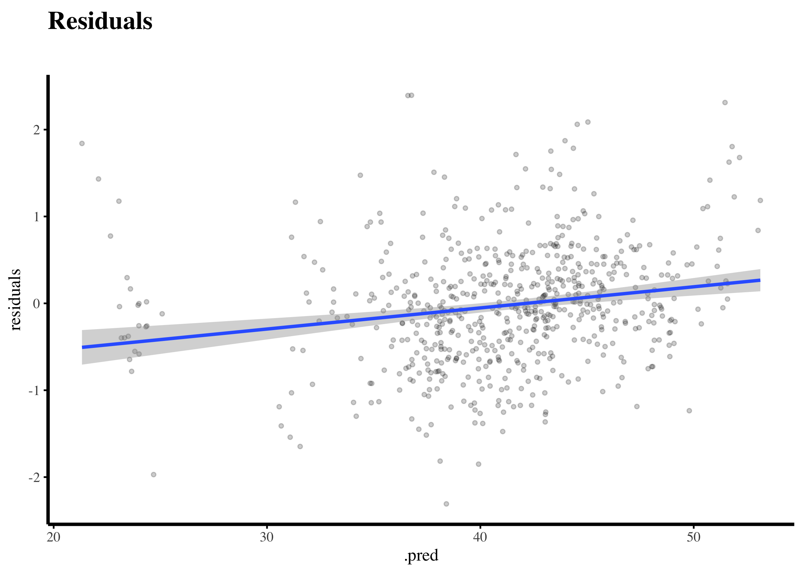

<link href="index_files/libs/htmltools-fill-0.5.8.1/fill.css" rel="stylesheet" />
<script src="index_files/libs/htmlwidgets-1.6.4/htmlwidgets.js"></script>
<link href="index_files/libs/datatables-css-0.0.0/datatables-crosstalk.css" rel="stylesheet" />
<script src="index_files/libs/datatables-binding-0.33/datatables.js"></script>
<script src="index_files/libs/jquery-3.6.0/jquery-3.6.0.min.js"></script>
<link href="index_files/libs/dt-core-1.13.6/css/jquery.dataTables.min.css" rel="stylesheet" />
<link href="index_files/libs/dt-core-1.13.6/css/jquery.dataTables.extra.css" rel="stylesheet" />
<script src="index_files/libs/dt-core-1.13.6/js/jquery.dataTables.min.js"></script>
<link href="index_files/libs/crosstalk-1.2.1/css/crosstalk.min.css" rel="stylesheet" />
<script src="index_files/libs/crosstalk-1.2.1/js/crosstalk.min.js"></script>


<script async src="https://pagead2.googlesyndication.com/pagead/js/adsbygoogle.js?client=ca-pub-7674504334497845" crossorigin="anonymous"></script>

<a href = "https://subscribepage.io/E3ia1B"> 
</a>

<br>

Understanding precipitation patterns is essential for climate analysis, agriculture, and water resource management. In the previous blog post, we conducted an exploratory data analysis (EDA) to uncover key trends, spatial distributions, and relationships within the dataset. This provided valuable insights into precipitation variability and guided feature selection for modeling.

Building on that foundation, this post explores machine learning approaches to predict precipitation using historical climate data. We will train an XGBoost model and evaluate his effectiveness in capturing complex climate patterns. Using cross-validation and standard regression metrics, we will compare model performance and identify the most suitable approach for precipitation prediction in this region.

## Data Preprocessing

The first step here is to load the data and preprocess it for modeling. We will extract relevant features and create a spatial weights matrix.

### Load the data

``` r
precipitation_data <- readRDS("Data/precipitation_sf.rds") |> 
  select(year, value) |> 
  filter(year>=1993 & year<=2023)
  
head(precipitation_data)
```

    Simple feature collection with 6 features and 2 fields
    Geometry type: POINT
    Dimension:     XY
    Bounding box:  xmin: -72.171 ymin: 46.489 xmax: -72.171 ymax: 46.489
    Geodetic CRS:  WGS 84
    # A tibble: 6 × 3
       year   value         geometry
      <dbl>   <dbl>      <POINT [°]>
    1  1993 0.00290 (-72.171 46.489)
    2  1993 0.00225 (-72.171 46.489)
    3  1993 0.00211 (-72.171 46.489)
    4  1993 0.00411 (-72.171 46.489)
    5  1993 0.00305 (-72.171 46.489)
    6  1993 0.00426 (-72.171 46.489)

### Aggregate the Data

For this analysis, I need the sum for each year at every point.

``` r
precipitation_data_agg <- precipitation_data |>
  mutate(lon = st_coordinates(precipitation_data)[,1],
         lat = st_coordinates(precipitation_data)[,2]) |> 
  group_by(year, lon, lat) |>
  mutate(pts_id=row_number()) |> 
  summarise(value = sum(value))
```

### Create a Distance Matrix

{}

We need some spatial information extracted from the coordinate to put into the temporal model. For this purpose, we will create a distance matrix using the `sf` package.

``` r
#Change for projected CRS
precipitation_data_proj<-precipitation_data_agg %>%
  sf::st_as_sf(.)%>% 
  st_transform(., 3978) 


#Create a distance matrix
buffer.dist<-precipitation_data_proj|> 
  filter(year==2023) |> 
  sf::st_distance(which="Euclidean") |> 
  as.data.frame() |> 
  mutate_all(as.numeric) 

buff.dist_all_years<-do.call("rbind", replicate(31, buffer.dist, simplify = FALSE))

#grouper les données avec la matrice de distance
data<-precipitation_data_proj %>%
  as.data.frame() %>% 
  bind_cols(buff.dist_all_years)%>% 
  na.omit() |> 
  select(-geometry)
```

## Modeling

Now that we have the spatial information, we can start training machine learning models to predict future emissions.

### Splitting Data

``` r
#Train/test
set.seed(123)
data_split <- initial_split(data)
data_train <- training(data_split)
data_test <- testing(data_split)
```

### Model Training

Next, we will train machine learning models to predict future emissions. We will train an XGBoost model evaluate his performance using the root mean square error (RMSE) metric.

``` r
# Model
spec <-boost_tree(mtry = tune(), min_n = tune(), trees = 1000) |> 
  set_mode("regression") |> 
  set_engine("xgboost")

#Grid
grid <- grid_space_filling(
  min_n(),
  finalize(mtry(), data_train),
  size = 10
)

#recipe
recipe<-recipe(as.formula(value ~.), data=data_train) |> 
    step_normalize(all_numeric_predictors())               

#Workflow
wf <- workflow() |> 
  add_recipe(recipe) |> 
  add_model(spec)

#Cross-validation 
data_folds <- vfold_cv(data_train)

res <- tune_grid(
  wf,
  resamples = data_folds,
  grid = grid,
  control = control_grid(save_pred = TRUE)
)
```

### Select Best Models

Next, we will select the best models based on the root mean square error (RMSE) metric. We will visualize the best models to compare their performance and identify any anomalies.

``` r
#best model
best_auc <- select_best(res, metric="rmse")
```

### Finalize Workflow

Finally, we will finalize the workflow and fit the best model to the training data. We will then use the model to predict future emissions in the test set and save the predictions for further analysis.

``` r
#Finalize worlfkow
final_xgb <- finalize_workflow(
  wf,
  best_auc
)

#Fit
fit_xgb <- final_xgb |> 
  fit(data_train)
```

### Evaluate Model Performance

Predicting the test data and evaluating the model performance using the RMSE metric.

``` r
#Predict test set
y_pred <-fit_xgb |> 
predict(new_data=data_test)
```

``` r
data_test_pred<-data_test |> 
  bind_cols(y_pred) |> 
  mutate(value=value*1000, 
         .pred=.pred*1000) |>
  mutate(residuals=value-.pred,
         sd=sd(value),
         sd_pred=sqrt((value-.pred)^2),
         sd_estimate=sqrt(sd^2+sd_pred^2),
         PI_05=.pred-1.645*sd_estimate,
         PI_95=.pred+1.645*sd_estimate,
         PE=(value-.pred)/value,
         APE=abs(PE),
         PE_sup=.pred+APE,
         PE_inf=.pred-APE)
```

#### RSQ

``` r
rsq<-data_test_pred |>  
  rsq(truth=value, estimate=.pred)
DT::datatable(rsq) |> 
  DT::formatRound(c(".estimate"), digits=2)
```

<div class="datatables html-widget html-fill-item" id="htmlwidget-ef5dc2b9a32fefcbfa5f" style="width:100%;height:auto;"></div>
<script type="application/json" data-for="htmlwidget-ef5dc2b9a32fefcbfa5f">{"x":{"filter":"none","vertical":false,"data":[["1"],["rsq"],["standard"],[0.9856713133646924]],"container":"<table class=\"display\">\n  <thead>\n    <tr>\n      <th> <\/th>\n      <th>.metric<\/th>\n      <th>.estimator<\/th>\n      <th>.estimate<\/th>\n    <\/tr>\n  <\/thead>\n<\/table>","options":{"columnDefs":[{"targets":3,"render":"function(data, type, row, meta) {\n    return type !== 'display' ? data : DTWidget.formatRound(data, 2, 3, \",\", \".\", null);\n  }"},{"className":"dt-right","targets":3},{"orderable":false,"targets":0},{"name":" ","targets":0},{"name":".metric","targets":1},{"name":".estimator","targets":2},{"name":".estimate","targets":3}],"order":[],"autoWidth":false,"orderClasses":false}},"evals":["options.columnDefs.0.render"],"jsHooks":[]}</script>

#### RMSE

``` r
rmse<-sqrt(mean(data_test_pred$residuals^2)) |> 
  as.data.frame() |> 
  rename(.estimate="sqrt(mean(data_test_pred$residuals^2))")
DT::datatable(rmse)|> 
  DT::formatRound(c(".estimate"), digits=2)
```

<div class="datatables html-widget html-fill-item" id="htmlwidget-aa5d1bd10d77c6d001dc" style="width:100%;height:auto;"></div>
<script type="application/json" data-for="htmlwidget-aa5d1bd10d77c6d001dc">{"x":{"filter":"none","vertical":false,"data":[["1"],[0.6850784245411075]],"container":"<table class=\"display\">\n  <thead>\n    <tr>\n      <th> <\/th>\n      <th>.estimate<\/th>\n    <\/tr>\n  <\/thead>\n<\/table>","options":{"columnDefs":[{"targets":1,"render":"function(data, type, row, meta) {\n    return type !== 'display' ? data : DTWidget.formatRound(data, 2, 3, \",\", \".\", null);\n  }"},{"className":"dt-right","targets":1},{"orderable":false,"targets":0},{"name":" ","targets":0},{"name":".estimate","targets":1}],"order":[],"autoWidth":false,"orderClasses":false}},"evals":["options.columnDefs.0.render"],"jsHooks":[]}</script>

#### MAPE

``` r
mape<-rmse/(mean(data_test_pred$value))*100 |> 
  as.data.frame()
DT::datatable(mape)|> 
  DT::formatRound(c(".estimate"), digits=2)
```

<div class="datatables html-widget html-fill-item" id="htmlwidget-2a2462b6d998fe5b569b" style="width:100%;height:auto;"></div>
<script type="application/json" data-for="htmlwidget-2a2462b6d998fe5b569b">{"x":{"filter":"none","vertical":false,"data":[["1"],[1.667112015162908]],"container":"<table class=\"display\">\n  <thead>\n    <tr>\n      <th> <\/th>\n      <th>.estimate<\/th>\n    <\/tr>\n  <\/thead>\n<\/table>","options":{"columnDefs":[{"targets":1,"render":"function(data, type, row, meta) {\n    return type !== 'display' ? data : DTWidget.formatRound(data, 2, 3, \",\", \".\", null);\n  }"},{"className":"dt-right","targets":1},{"orderable":false,"targets":0},{"name":" ","targets":0},{"name":".estimate","targets":1}],"order":[],"autoWidth":false,"orderClasses":false}},"evals":["options.columnDefs.0.render"],"jsHooks":[]}</script>

#### Visualize the Predictions

``` r
gg <- ggplot(data=as.data.frame(data_test_pred), aes(y=.pred, x=value))
gg <- gg + geom_point(size=1, alpha=0.2)
gg <- gg + geom_smooth(method = "lm", SE= FALSE , color="red")
gg <- gg + geom_smooth(aes(x=value, y=PI_05), linetype="dashed")
gg <- gg + geom_smooth(aes(x=value, y=PI_95), linetype="dashed")
gg <- gg + geom_smooth(aes(x=value, y=PE_sup), linetype="dashed")
gg <- gg + geom_smooth(aes(x=value, y=PE_inf), linetype="dashed")
gg <- gg + geom_hline(yintercept = 50, linetype="dashed")
gg <- gg + geom_vline(xintercept = 50, linetype="dashed")
gg <- gg + theme_serif()
gg <- gg + labs(title ="Comparing Predict to Actual Values of Precipitations (1993-2023)",
                y="Predicted Precipitation (mm)",
                x="Actual Precipitation (mm)")
print(gg)
```


#### Residuals

``` r
gg <- as.data.frame(data_test_pred) |>  
ggplot(aes(x=.pred, y=residuals))
gg <- gg + geom_point(size=1, alpha=0.2)
gg <- gg + geom_smooth(method = "lm")
gg <- gg + theme_serif()
gg <- gg + labs(title = "Residuals\n")
print(gg) 
```



## Predict 2024 to 2030

``` r
buff.dist_new_years<-do.call("rbind", replicate(7, buffer.dist, simplify = FALSE))

points<-data |> 
  select(lon, lat) |> 
  unique()

all_points<-do.call("rbind", replicate(7, points, simplify = FALSE))

data_futur <- data.frame(
  year=rep(c(2024,2025,2026, 2027, 2028, 2029, 2030),each=81), 
  value=NA)  |> 
  bind_cols(all_points) |>
  bind_cols(buff.dist_new_years)

#Predict test set
new_pred <-fit_xgb |> 
predict(new_data=data_futur)

data_futur_with_pred<-data_futur |> 
  bind_cols(new_pred) |> 
  select(year, .pred, lon, lat) |>
  rename(value=.pred)
```

``` r
precipitation_data_futur<-data |> 
  select(year, value, lon, lat) |>
  bind_rows(data_futur_with_pred) |> 
  st_as_sf(coords = c("lon", "lat")) |>
  st_set_crs(4326)
```

Let's take a look at the predicted precipitation values for 2024 to 2030.

``` r
valid<-precipitation_data_futur |> 
  as.data.frame() |> 
  select(year, value) |>
  mutate(value=value*1000) |>
  group_by(year) |>
  summarise(mean=mean(value), sd=sd(value)) |> 
  filter(year>=2020) 

DT::datatable(valid) |> 
  DT::formatRound(c("mean", "sd"), digits=2)
```

<div class="datatables html-widget html-fill-item" id="htmlwidget-b7706a1b68e714912bc8" style="width:100%;height:auto;"></div>
<script type="application/json" data-for="htmlwidget-b7706a1b68e714912bc8">{"x":{"filter":"none","vertical":false,"data":[["1","2","3","4","5","6","7","8","9","10","11"],[2020,2021,2022,2023,2024,2025,2026,2027,2028,2029,2030],[41.82448215569933,33.01121443826246,41.75739852211403,23.80545214853353,23.98284198141392,23.98284198141392,23.98284198141392,23.98284198141392,23.98284198141392,23.98284198141392,23.98284198141392],[1.671617109785621,2.39342419664615,2.709303794028265,0.5720241033171247,0.6327815779359863,0.6327815779359863,0.6327815779359863,0.6327815779359863,0.6327815779359863,0.6327815779359863,0.6327815779359863]],"container":"<table class=\"display\">\n  <thead>\n    <tr>\n      <th> <\/th>\n      <th>year<\/th>\n      <th>mean<\/th>\n      <th>sd<\/th>\n    <\/tr>\n  <\/thead>\n<\/table>","options":{"columnDefs":[{"targets":2,"render":"function(data, type, row, meta) {\n    return type !== 'display' ? data : DTWidget.formatRound(data, 2, 3, \",\", \".\", null);\n  }"},{"targets":3,"render":"function(data, type, row, meta) {\n    return type !== 'display' ? data : DTWidget.formatRound(data, 2, 3, \",\", \".\", null);\n  }"},{"className":"dt-right","targets":[1,2,3]},{"orderable":false,"targets":0},{"name":" ","targets":0},{"name":"year","targets":1},{"name":"mean","targets":2},{"name":"sd","targets":3}],"order":[],"autoWidth":false,"orderClasses":false}},"evals":["options.columnDefs.0.render","options.columnDefs.1.render"],"jsHooks":[]}</script>

So, we can clearly see here that even if this model seems to have a good performance, the predictions over many years are not very good. This is a proof that this model need to improve his understanding of the concept of seasonality.

# Conclusion

In this analysis, we trained an XGBoost model to predict precipitation patterns in Centre-du-Québec using historical climate data. The model performed well, but can't really capture complex climate patterns. By evaluating the model's performance using cross-validation and regression metrics, we identified the most effective approach for precipitation prediction in this region.

# Sign up for the newsletter

<a href = "https://dashboard.mailerlite.com/forms/1478852/152663752035010469/share"> 
</a>

<br>

# Session Info

``` r
sessionInfo()
```

    R version 4.4.2 (2024-10-31)
    Platform: aarch64-apple-darwin20
    Running under: macOS Sequoia 15.3.2

    Matrix products: default
    BLAS:   /Library/Frameworks/R.framework/Versions/4.4-arm64/Resources/lib/libRblas.0.dylib 
    LAPACK: /Library/Frameworks/R.framework/Versions/4.4-arm64/Resources/lib/libRlapack.dylib;  LAPACK version 3.12.0

    locale:
    [1] en_US.UTF-8/en_US.UTF-8/en_US.UTF-8/C/en_US.UTF-8/en_US.UTF-8

    time zone: America/Toronto
    tzcode source: internal

    attached base packages:
    [1] stats     graphics  grDevices datasets  utils     methods   base     

    other attached packages:
     [1] jofou.lib_0.0.0.9000 reticulate_1.40.0    tidytuesdayR_1.1.2  
     [4] tictoc_1.2.1         terra_1.8-10         sf_1.0-19           
     [7] pins_1.4.0           modeltime_1.3.1      fs_1.6.5            
    [10] timetk_2.9.0         yardstick_1.3.2      workflowsets_1.1.0  
    [13] workflows_1.1.4      tune_1.2.1           rsample_1.2.1       
    [16] parsnip_1.2.1        modeldata_1.4.0      infer_1.0.7         
    [19] dials_1.3.0          scales_1.3.0         broom_1.0.7         
    [22] tidymodels_1.2.0     recipes_1.1.0        doFuture_1.0.1      
    [25] future_1.34.0        foreach_1.5.2        skimr_2.1.5         
    [28] forcats_1.0.0        stringr_1.5.1        dplyr_1.1.4         
    [31] purrr_1.0.2          readr_2.1.5          tidyr_1.3.1         
    [34] tibble_3.2.1         ggplot2_3.5.1        tidyverse_2.0.0     
    [37] lubridate_1.9.4      kableExtra_1.4.0     inspectdf_0.0.12.1  
    [40] openxlsx_4.2.7.1     knitr_1.49          

    loaded via a namespace (and not attached):
     [1] rstudioapi_0.17.1   jsonlite_1.8.9      magrittr_2.0.3     
     [4] farver_2.1.2        rmarkdown_2.29      vctrs_0.6.5        
     [7] base64enc_0.1-3     blogdown_1.20       htmltools_0.5.8.1  
    [10] progress_1.2.3      sass_0.4.9          parallelly_1.41.0  
    [13] StanHeaders_2.32.10 KernSmooth_2.23-26  bslib_0.8.0        
    [16] htmlwidgets_1.6.4   zoo_1.8-12          cachem_1.1.0       
    [19] ggfittext_0.10.2    lifecycle_1.0.4     iterators_1.0.14   
    [22] pkgconfig_2.0.3     Matrix_1.7-2        R6_2.5.1           
    [25] fastmap_1.2.0       digest_0.6.37       colorspace_2.1-1   
    [28] furrr_0.3.1         crosstalk_1.2.1     labeling_0.4.3     
    [31] timechange_0.3.0    mgcv_1.9-1          compiler_4.4.2     
    [34] proxy_0.4-27        withr_3.0.2         backports_1.5.0    
    [37] DBI_1.2.3           MASS_7.3-64         lava_1.8.1         
    [40] rappdirs_0.3.3      classInt_0.4-11     tools_4.4.2        
    [43] units_0.8-5         zip_2.3.1           future.apply_1.11.3
    [46] nnet_7.3-20         glue_1.8.0          nlme_3.1-166       
    [49] grid_4.4.2          generics_0.1.3      gtable_0.3.6       
    [52] tzdb_0.4.0          class_7.3-23        data.table_1.16.4  
    [55] hms_1.1.3           xml2_1.3.6          pillar_1.10.1      
    [58] splines_4.4.2       lhs_1.2.0           lattice_0.22-6     
    [61] renv_1.0.7          survival_3.8-3      tidyselect_1.2.1   
    [64] svglite_2.1.3       xfun_0.50           hardhat_1.4.0      
    [67] timeDate_4041.110   DT_0.33             stringi_1.8.4      
    [70] DiceDesign_1.10     yaml_2.3.10         evaluate_1.0.3     
    [73] codetools_0.2-20    cli_3.6.3           RcppParallel_5.1.10
    [76] rpart_4.1.24        systemfonts_1.2.1   repr_1.1.7         
    [79] munsell_0.5.1       jquerylib_0.1.4     Rcpp_1.0.14        
    [82] globals_0.16.3      png_0.1-8           parallel_4.4.2     
    [85] gower_1.0.2         prettyunits_1.2.0   GPfit_1.0-8        
    [88] listenv_0.9.1       viridisLite_0.4.2   ipred_0.9-15       
    [91] xts_0.14.1          prodlim_2024.06.25  e1071_1.7-16       
    [94] crayon_1.5.3        rlang_1.1.5        
