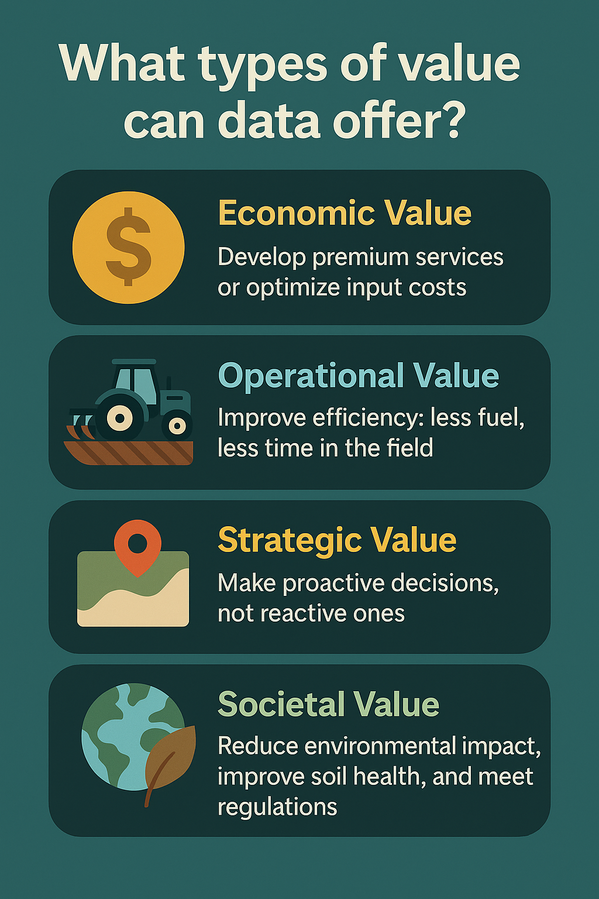
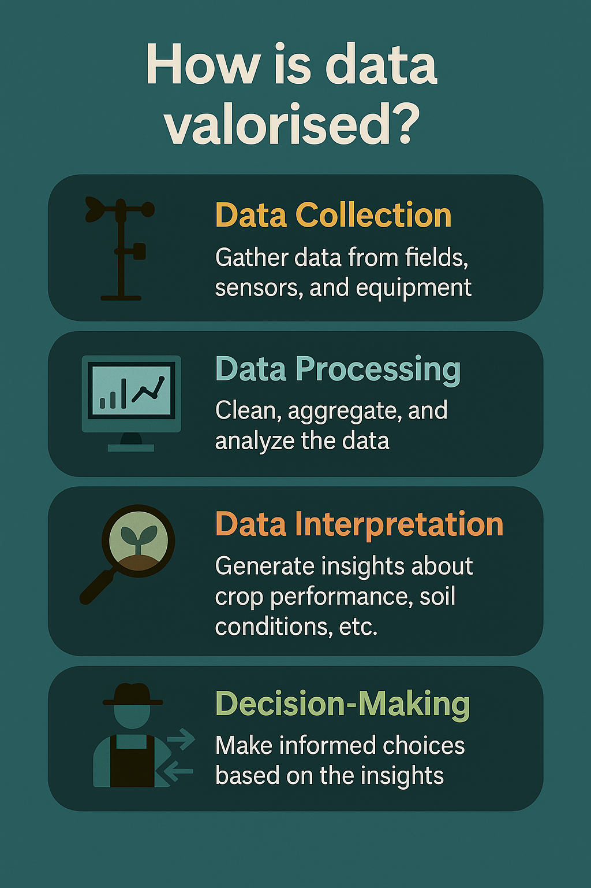
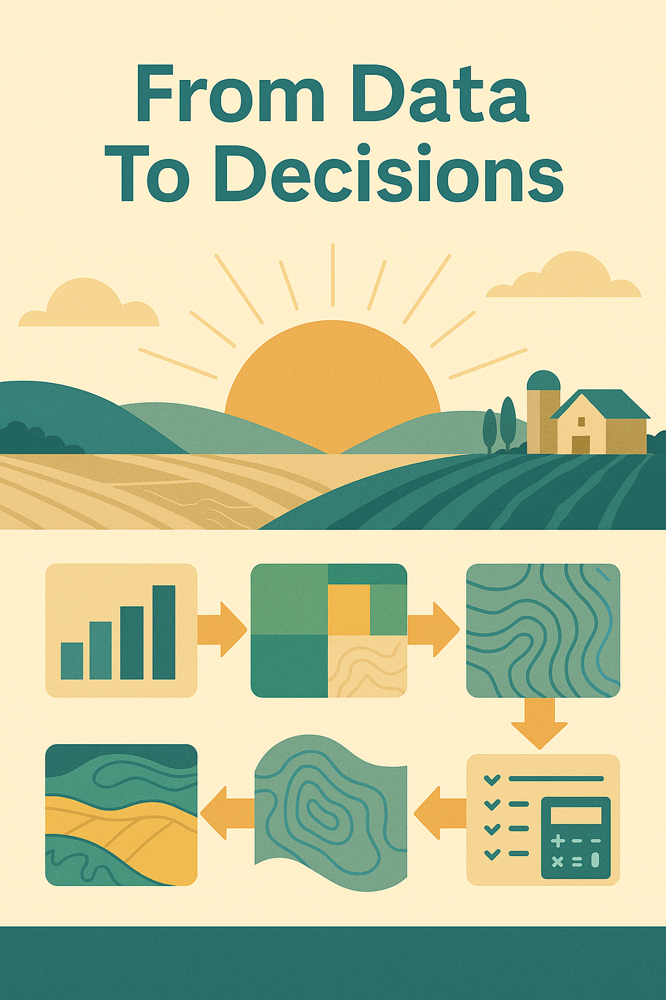

Subscribe button

 

 

From weather stations to soil tests, drones to spreadsheets, agricultural data is everywhere. Yet, much of it sits unused. Data valorisation is about changing that---by transforming raw information into insights that lead to better decisions, stronger returns, and more sustainable practices.

In this post, we explore 10 ways agricultural stakeholders---farmers, consultants, cooperatives, and agronomists---can unlock the true value of their data.

## What Is Data Valorisation and Why It Matters

Data valorisation is the act of converting existing agricultural data into actionable insights. It's not just about having data---it's about using it meaningfully. For example, you can use soil and yield data to optimize inputs, weather trends to assess pest risks, or milk quality logs to improve animal health. The goal is always the same: create value through better decisions.

## Why Farm Data Often Goes Unused

Despite the growing volume of data collected on farms, much of it never gets applied. This often happens because data is stuck in silos, producers lack time or technical support, or the purpose of the data isn't clearly defined. The solution is to start small---focus on one decision you'd like to improve, involve people who understand the data, and use tools that are already accessible to your team.

## Four Types of Value from Ag Data

Agricultural data can generate value in four major ways. Economically, it can reduce input costs or create new services. Operationally, it can streamline tasks and reduce waste. Strategically, it helps organizations make informed decisions faster. And societally, it supports sustainable practices, regulatory compliance, and responsible land management.

## The Four Pillars of Data Valorisation

To unlock value, data must meet four conditions. First, it must be relevant---it should help answer a practical question. Second, it must be high quality: accurate, consistent, and reliable. Third, it needs to be accessible to those who need it. And finally, it must be actionable, meaning it leads directly to a useful decision or intervention.

## Case Study -- Lime Application Zones

One producer had years of soil pH test results stored in spreadsheets but never used them. By georeferencing the data and interpolating it across their fields, we created a variable-rate lime application map. The result was lower lime usage, more uniform pH across zones, and improved nutrient uptake in the crop.

## Case Study -- Fertilization Zones from Soil Data

Another producer leveraged historical nutrient test data to create spatially-defined fertilizer zones. This allowed them to apply nutrients precisely where they were needed. The result was a drop in fertilizer costs, fewer environmental losses, and more consistent yields across the field.

## The Data Valorisation Mindset

Successful data valorisation doesn't come from technology alone---it starts with people. It requires curiosity to ask the right questions, collaboration between technical and field staff, and a commitment to using data for action. Culture is key: a team that values data is far more likely to use it to drive change.

## Tools & Skills to Get Started

You don't need to be a data scientist to start valorising farm data. Tools like Excel, QGIS, Google Earth Engine, or basic R/Python scripts can go a long way. What matters most is the ability to ask a good question, explore the data visually, and communicate insights clearly to decision-makers.

## Challenges & How to Overcome Them

Common obstacles include poor data quality, lack of time, and resistance to change. The key is to start with manageable datasets and focus on quick wins. Don't aim for perfection---look for small actions with clear results. One success story can build momentum for bigger transformations.

## From Data to Decisions

You likely already have valuable data---you just need to put it to work. Start with one question, one dataset, and one decision. Whether it's optimizing a practice, improving communication with clients, or building a smarter workflow, the value is already there, waiting to be unlocked.

## Sign up for the newsletter

Sign up

 
