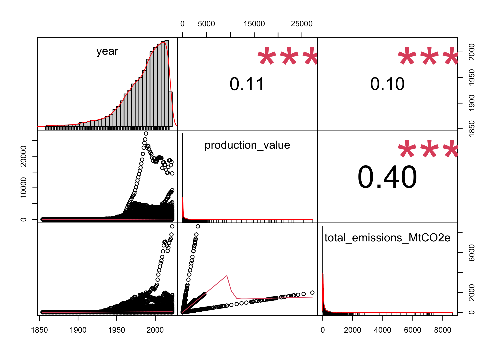
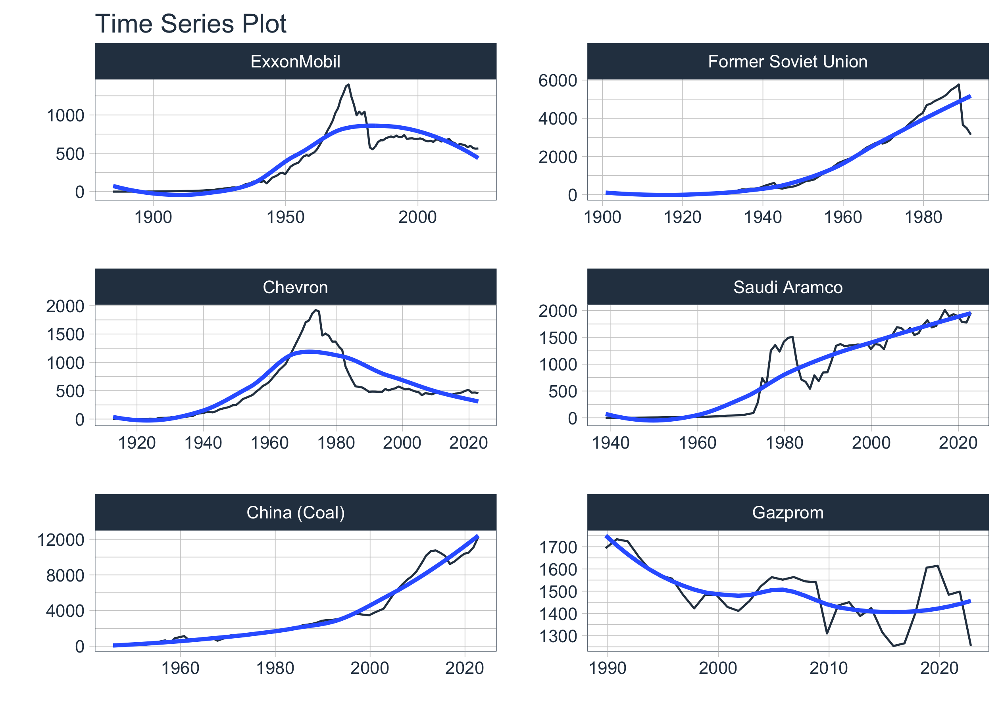
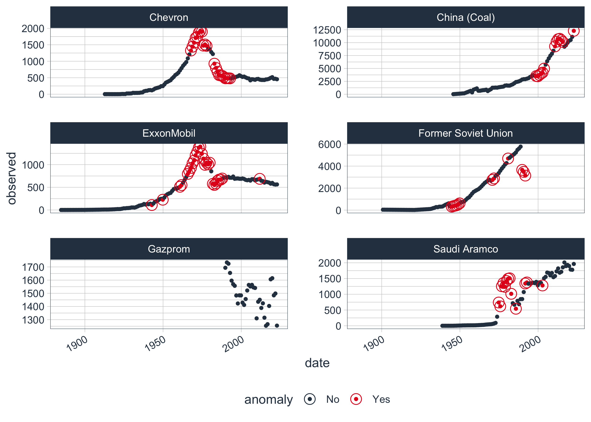
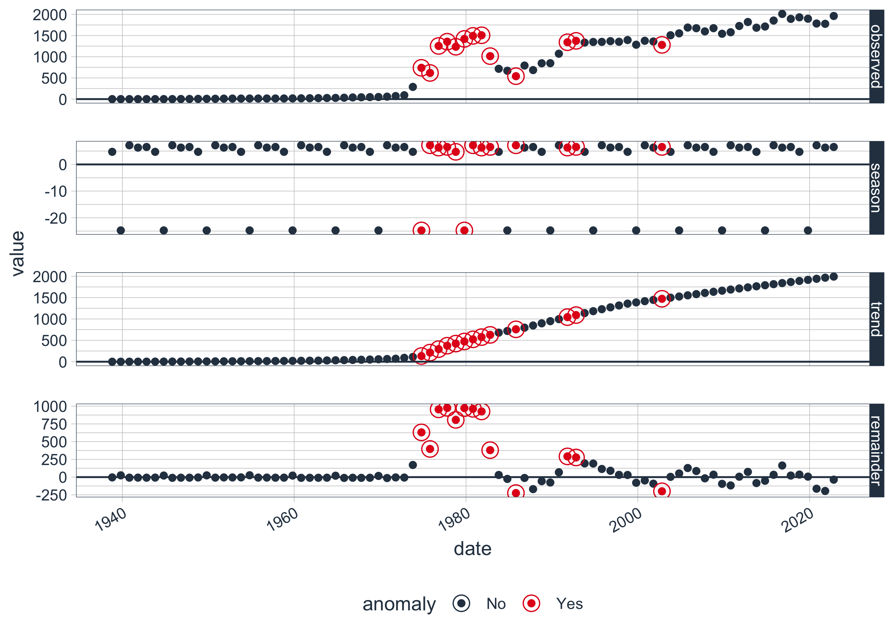

<script src="index_files/libs/htmlwidgets-1.5.4/htmlwidgets.js"></script>
<link href="index_files/libs/datatables-css-0.0.0/datatables-crosstalk.css" rel="stylesheet" />
<script src="index_files/libs/datatables-binding-0.19/datatables.js"></script>
<script src="index_files/libs/jquery-3.6.0/jquery-3.6.0.min.js"></script>
<link href="index_files/libs/dt-core-1.10.20/css/jquery.dataTables.min.css" rel="stylesheet" />
<link href="index_files/libs/dt-core-1.10.20/css/jquery.dataTables.extra.css" rel="stylesheet" />
<script src="index_files/libs/dt-core-1.10.20/js/jquery.dataTables.min.js"></script>
<link href="index_files/libs/crosstalk-1.1.1/css/crosstalk.css" rel="stylesheet" />
<script src="index_files/libs/crosstalk-1.1.1/js/crosstalk.min.js"></script>


I have worked extensively with spatial data over the past two years, so I decided to select suitable [`#TidyTuesday` dataset](https://github.com/rfordatascience/tidytuesday) and document what I have learned so far."

My latest contribution to the [`#TidyTuesday`](https://github.com/rfordatascience/tidytuesday) project featuring a recent dataset on carbon major emissions. The dataset is a compilation of emissions data from 1854 to 2019.

## Goal

The overall goal of this blog series is to predict carbon emissions over time and space.

In this first part, the goal is to do some Exploratory Data Analysis (EDA) to look at the data set and summarize the main characteristics. To do so, I will look at the data structure, anomalies, outliers and relationships.

## Get the data

Let's start by reading in the data:

``` r
emissions <- readr::read_csv('https://raw.githubusercontent.com/rfordatascience/tidytuesday/master/data/2024/2024-05-21/emissions.csv')

library(skimr)
library(PerformanceAnalytics)

skim(emissions)
```

<table style="width: auto;" class="table table-condensed">
<caption>
Data summary
</caption>
<tbody>
<tr>
<td style="text-align:left;">
Name
</td>
<td style="text-align:left;">
emissions
</td>
</tr>
<tr>
<td style="text-align:left;">
Number of rows
</td>
<td style="text-align:left;">
12551
</td>
</tr>
<tr>
<td style="text-align:left;">
Number of columns
</td>
<td style="text-align:left;">
7
</td>
</tr>
<tr>
<td style="text-align:left;">
\_\_\_\_\_\_\_\_\_\_\_\_\_\_\_\_\_\_\_\_\_\_\_
</td>
<td style="text-align:left;">
</td>
</tr>
<tr>
<td style="text-align:left;">
Column type frequency:
</td>
<td style="text-align:left;">
</td>
</tr>
<tr>
<td style="text-align:left;">
character
</td>
<td style="text-align:left;">
4
</td>
</tr>
<tr>
<td style="text-align:left;">
numeric
</td>
<td style="text-align:left;">
3
</td>
</tr>
<tr>
<td style="text-align:left;">
\_\_\_\_\_\_\_\_\_\_\_\_\_\_\_\_\_\_\_\_\_\_\_\_
</td>
<td style="text-align:left;">
</td>
</tr>
<tr>
<td style="text-align:left;">
Group variables
</td>
<td style="text-align:left;">
None
</td>
</tr>
</tbody>
</table>

**Variable type: character**

<table>
<thead>
<tr>
<th style="text-align:left;">
skim_variable
</th>
<th style="text-align:right;">
n_missing
</th>
<th style="text-align:right;">
complete_rate
</th>
<th style="text-align:right;">
min
</th>
<th style="text-align:right;">
max
</th>
<th style="text-align:right;">
empty
</th>
<th style="text-align:right;">
n_unique
</th>
<th style="text-align:right;">
whitespace
</th>
</tr>
</thead>
<tbody>
<tr>
<td style="text-align:left;">
parent_entity
</td>
<td style="text-align:right;">
0
</td>
<td style="text-align:right;">
1
</td>
<td style="text-align:right;">
2
</td>
<td style="text-align:right;">
39
</td>
<td style="text-align:right;">
0
</td>
<td style="text-align:right;">
122
</td>
<td style="text-align:right;">
0
</td>
</tr>
<tr>
<td style="text-align:left;">
parent_type
</td>
<td style="text-align:right;">
0
</td>
<td style="text-align:right;">
1
</td>
<td style="text-align:right;">
12
</td>
<td style="text-align:right;">
22
</td>
<td style="text-align:right;">
0
</td>
<td style="text-align:right;">
3
</td>
<td style="text-align:right;">
0
</td>
</tr>
<tr>
<td style="text-align:left;">
commodity
</td>
<td style="text-align:right;">
0
</td>
<td style="text-align:right;">
1
</td>
<td style="text-align:right;">
6
</td>
<td style="text-align:right;">
19
</td>
<td style="text-align:right;">
0
</td>
<td style="text-align:right;">
9
</td>
<td style="text-align:right;">
0
</td>
</tr>
<tr>
<td style="text-align:left;">
production_unit
</td>
<td style="text-align:right;">
0
</td>
<td style="text-align:right;">
1
</td>
<td style="text-align:right;">
6
</td>
<td style="text-align:right;">
18
</td>
<td style="text-align:right;">
0
</td>
<td style="text-align:right;">
4
</td>
<td style="text-align:right;">
0
</td>
</tr>
</tbody>
</table>

**Variable type: numeric**

<table>
<thead>
<tr>
<th style="text-align:left;">
skim_variable
</th>
<th style="text-align:right;">
n_missing
</th>
<th style="text-align:right;">
complete_rate
</th>
<th style="text-align:right;">
mean
</th>
<th style="text-align:right;">
sd
</th>
<th style="text-align:right;">
p0
</th>
<th style="text-align:right;">
p25
</th>
<th style="text-align:right;">
p50
</th>
<th style="text-align:right;">
p75
</th>
<th style="text-align:right;">
p100
</th>
<th style="text-align:left;">
hist
</th>
</tr>
</thead>
<tbody>
<tr>
<td style="text-align:left;">
year
</td>
<td style="text-align:right;">
0
</td>
<td style="text-align:right;">
1
</td>
<td style="text-align:right;">
1987.15
</td>
<td style="text-align:right;">
29.20
</td>
<td style="text-align:right;">
1854
</td>
<td style="text-align:right;">
1973.00
</td>
<td style="text-align:right;">
1994.00
</td>
<td style="text-align:right;">
2009.00
</td>
<td style="text-align:right;">
2022.00
</td>
<td style="text-align:left;">
▁▁▁▅▇
</td>
</tr>
<tr>
<td style="text-align:left;">
production_value
</td>
<td style="text-align:right;">
0
</td>
<td style="text-align:right;">
1
</td>
<td style="text-align:right;">
412.71
</td>
<td style="text-align:right;">
1357.57
</td>
<td style="text-align:right;">
0
</td>
<td style="text-align:right;">
10.60
</td>
<td style="text-align:right;">
63.20
</td>
<td style="text-align:right;">
320.66
</td>
<td style="text-align:right;">
27192.00
</td>
<td style="text-align:left;">
▇▁▁▁▁
</td>
</tr>
<tr>
<td style="text-align:left;">
total_emissions_MtCO2e
</td>
<td style="text-align:right;">
0
</td>
<td style="text-align:right;">
1
</td>
<td style="text-align:right;">
113.22
</td>
<td style="text-align:right;">
329.81
</td>
<td style="text-align:right;">
0
</td>
<td style="text-align:right;">
8.79
</td>
<td style="text-align:right;">
33.06
</td>
<td style="text-align:right;">
102.15
</td>
<td style="text-align:right;">
8646.91
</td>
<td style="text-align:left;">
▇▁▁▁▁
</td>
</tr>
</tbody>
</table>

``` r
chart.Correlation(select_if(emissions, is.numeric))
```



So, we have a temporal dataset because their's a *year* column, 3 classifications columns (*parent_entity*, *parent_type*, *commodity*) and our variable of interest *total_emission_MtCO2e*.

## Trend over time

Is there a general trend over time?

``` r
sum_emissions_year<-emissions  |> 
  group_by(year) |>  
  summarise(sum=sum(total_emissions_MtCO2e)) |>  
  ungroup()

ggplot(data=sum_emissions_year, aes(x=year, y=sum))+
  geom_line()
```


We can see a clear augmentation of carbon emissions over time.

The ultimate goal for this blog series will be to predict over time and space the carbon emission and visualize the result. To achieve that, we first need to understand more the relationship between *parent_entity* and *total_emission_MtCO2e*.

## Space trend

``` r
sum_emissions_entity<-emissions  |> 
  group_by(parent_entity) |>  
  summarise(sum=sum(total_emissions_MtCO2e)) |>  
  ungroup() |> 
  arrange(desc(sum))

DT::datatable(sum_emissions_entity) |> 
  DT::formatRound(columns=c("sum"), digits=0)
```

<div id="htmlwidget-f60512fad21e01a42060" style="width:100%;height:auto;" class="datatables html-widget"></div>
<script type="application/json" data-for="htmlwidget-f60512fad21e01a42060">{"x":{"filter":"none","vertical":false,"data":[["1","2","3","4","5","6","7","8","9","10","11","12","13","14","15","16","17","18","19","20","21","22","23","24","25","26","27","28","29","30","31","32","33","34","35","36","37","38","39","40","41","42","43","44","45","46","47","48","49","50","51","52","53","54","55","56","57","58","59","60","61","62","63","64","65","66","67","68","69","70","71","72","73","74","75","76","77","78","79","80","81","82","83","84","85","86","87","88","89","90","91","92","93","94","95","96","97","98","99","100","101","102","103","104","105","106","107","108","109","110","111","112","113","114","115","116","117","118","119","120","121","122"],["China (Coal)","Former Soviet Union","Saudi Aramco","Chevron","ExxonMobil","Gazprom","National Iranian Oil Co.","BP","Shell","Coal India","Poland","Pemex","Russian Federation","China (Cement)","ConocoPhillips","British Coal Corporation","CNPC","Peabody Coal Group","TotalEnergies","Abu Dhabi National Oil Company","Petroleos de Venezuela","Kuwait Petroleum Corp.","Iraq National Oil Company","Sonatrach","Rosneft","Occidental Petroleum","BHP","Petrobras","CONSOL Energy","Nigerian National Petroleum Corp.","Czechoslovakia","Petronas","Eni","QatarEnergy","Pertamina","Anglo American","Libya National Oil Corp.","Arch Resources","Lukoil","Kazakhstan","Equinor","RWE","Rio Tinto","Glencore","Alpha Metallurgical Resources","ONGC India","Sasol","Ukraine","Surgutneftegas","Repsol","Petroleum Development Oman","Sinopec","Egyptian General Petroleum","TurkmenGaz","Petoro","CNOOC","North Korea","Marathon Oil","Bumi Resources","Devon Energy","Singareni Collieries","Sonangol","Holcim Group","Novatek","Ecopetrol","Suncor Energy","Hess Corporation","Ovintiv","Czech Republic","Canadian Natural Resources","Cyprus AMAX Minerals","Westmoreland Mining","BASF","American Consolidated Natural Resources","Exxaro Resources Ltd","Bapco Energies","Adaro Energy","YPF","Cenovus Energy","APA Corporation","Banpu","PetroEcuador","EOG Resources","Alliance Resource Partners","Kiewit Mining Group","Heidelberg Materials","North American Coal","Chesapeake Energy","Syrian Petroleum","Cloud Peak","Vistra","Teck Resources","Inpex","Naftogaz","Coterra Energy","PTTEP","OMV Group","EQT Corporation","Southwestern Energy","Woodside Energy","UK Coal","Cemex","Santos","Pioneer Natural Resources","Murphy Oil","Orlen","Antero","Taiheiyo Cement","Continental Resources","Tourmaline Oil","Whitehaven Coal","Navajo Transitional Energy Company","Wolverine Fuels","Seriti Resources","Obsidian Energy","Vale","SM Energy","Adani Enterprises","CNX Resources","CRH","Tullow Oil","Slovakia"],[276458.02492082,135112.668813454,68831.5371038049,57897.8526780308,55105.0951438195,50686.9725960528,43111.6933371727,42530.4193021717,40674.0595286655,29391.301962912,28749.881872077,25496.9702223447,23412.4597853956,23161.2674748,20222.2587592593,19745.3614159457,18950.9099374694,17735.4272607568,17583.5566389311,17383.1781780909,16900.9964886558,15921.8100817819,15188.3319625943,14954.6969185315,14294.5995626711,12907.1666995437,11042.1107132738,10799.3014774493,10490.1353121505,10243.4346425407,9618.47096479113,9130.3042923771,9074.62598421214,8404.87718545639,8269.72842642096,8162.76285199174,8146.45093179807,7969.29320263312,7835.30435399672,7768.91312157044,7738.84445852112,7584.75041806049,6767.00067503288,6329.25433231514,6127.22336061584,5917.36393716968,4991.74738532649,4969.16296710561,4734.52335389813,4584.29006915196,4386.74015392261,4374.18031699524,4318.01143317843,4222.7028687985,4173.51889785532,4147.45195702434,4103.6786217367,3804.40360061962,3762.01223959853,3296.65217966089,3290.96068860636,3281.23149402648,3172.61488629005,3096.41678676808,3095.75610781481,3072.27555015738,3026.03861025751,2992.80130871679,2737.35005584155,2640.05036633372,2568.88336291029,2339.07321609418,2313.43445405336,2239.72239693733,2159.90141611748,2127.18114419001,2068.44584656087,2038.97607788709,1965.29890484058,1963.91632421968,1942.73452903939,1922.40210164233,1806.07862580342,1777.07079047006,1688.6139943611,1683.69769631625,1643.72803770716,1608.84172667945,1578.27098510082,1476.15740538291,1393.53784597781,1307.51870577066,1256.04352675101,1252.49025479955,1183.72510380333,1079.56774370571,1014.16171050331,1000.97785430615,981.974828995937,918.253426767465,881.959476578908,867.4431883275,836.503784597426,825.675499865858,765.018468149223,720.309583008861,606.199782562199,580.217273699,455.424224997692,449.588109759621,428.392375723516,389.715756839308,384.717350233232,361.397036552038,355.74103477328,317.151646348455,316.173342181209,316.050246230678,227.074903356675,216.74008502,210.986423185838,104.499507804202]],"container":"<table class=\"display\">\n  <thead>\n    <tr>\n      <th> <\/th>\n      <th>parent_entity<\/th>\n      <th>sum<\/th>\n    <\/tr>\n  <\/thead>\n<\/table>","options":{"columnDefs":[{"targets":2,"render":"function(data, type, row, meta) {\n    return type !== 'display' ? data : DTWidget.formatRound(data, 0, 3, \",\", \".\");\n  }"},{"className":"dt-right","targets":2},{"orderable":false,"targets":0}],"order":[],"autoWidth":false,"orderClasses":false}},"evals":["options.columnDefs.0.render"],"jsHooks":[]}</script>

We have a clear indication that country does not produce the same amount of carbon.

## Spatio-temporal trend

Can we link the spatial trend to the temporal trend? Let's find out by looking at the top 10 countries with the highest emissions.

``` r
top10_entity<-sum_emissions_entity |> 
  top_n(6, sum) |> 
  select(parent_entity)

emissions_top10<-emissions |> 
  filter(parent_entity %in% top10_entity$parent_entity) 

plot_data<-emissions_top10 |> 
  group_by(parent_entity, year) |>
  summarize(sum=sum(total_emissions_MtCO2e)) |>
  ungroup() |>
  mutate(date=as.Date(as.character(year), "%Y"),
         parent_entity_fct=as.factor(parent_entity)) |>
  select(parent_entity_fct, date, sum) |>
  pad_by_time(date, .by = "year")

plot_data |> 
    group_by(parent_entity_fct) |> 
    plot_time_series(
        .date_var    = date,
        .value       = sum,
        .interactive = FALSE,
        .facet_ncol  = 2,
        .facet_scales = "free",
    )
```



Each *parent_entity* has its own trend over time.

## Anomalies and outliers

``` r
library(anomalize)

plot_data |> 
    group_by(parent_entity_fct) |> 
    time_decompose(sum) |> 
    anomalize(remainder) |>
  plot_anomalies(size_dots = 1, ncol = 2)
```



``` r
plot_data |> 
    filter(parent_entity_fct=="Saudi Aramco") |> 
    time_decompose(sum) |> 
    anomalize(remainder) |>
  plot_anomaly_decomposition()
```



So for simplicity, I will replace the anomalies detected by the trend for all the data. All the subsequent analysis will be done with the corrected data for the top 50 countries

``` r
top50_entity<-sum_emissions_entity |> 
  top_n(50, sum) |> 
  select(parent_entity)


final_data<-emissions |> 
  filter(parent_entity %in% top50_entity$parent_entity) |>
  group_by(parent_entity, year) |>
  summarize(sum=sum(total_emissions_MtCO2e)) |>
  ungroup() |>
  mutate(date=as.Date(as.character(year), "%Y"),
         parent_entity_fct=as.factor(parent_entity)) |>
  select(parent_entity_fct, date, sum) |>
  filter(parent_entity_fct %ni% c("Seriti Resources", "CNX Resources", "Navajo Transitional Energy Company"))|> 
  pad_by_time(date, 
              .by = "year", 
              .pad_value = NA) |> 
    group_by(parent_entity_fct) |> 
    time_decompose(sum) |> 
    anomalize(remainder) |> 
  mutate(observed=case_when(anomaly=="Yes" ~ trend,
                            TRUE ~ observed)) |> 
  select(parent_entity_fct, date, observed)
```

## Conclusion

In this first part, we have explored the dataset and identified the main characteristics. We have seen that the carbon emissions have increased over time and that the top 50 countries have different trends. We have also identified some anomalies and outliers that have been correct for the work to come in the next part.

<a href = "https://johaniefournier.aweb.page/p/4b2b1e24-af09-488d-8ff6-7b46ce61e367"> 

## Session Info

``` r
sessionInfo()
```

    R version 4.1.1 (2021-08-10)
    Platform: x86_64-apple-darwin17.0 (64-bit)
    Running under: macOS Big Sur 10.16

    Matrix products: default
    BLAS:   /Library/Frameworks/R.framework/Versions/4.1/Resources/lib/libRblas.0.dylib
    LAPACK: /Library/Frameworks/R.framework/Versions/4.1/Resources/lib/libRlapack.dylib

    locale:
    [1] en_US.UTF-8/en_US.UTF-8/en_US.UTF-8/C/en_US.UTF-8/en_US.UTF-8

    attached base packages:
    [1] stats     graphics  grDevices datasets  utils     methods   base     

    other attached packages:
     [1] anomalize_0.3.0            PerformanceAnalytics_2.0.4
     [3] xts_0.12.1                 zoo_1.8-12                
     [5] jofou.lib_0.0.0.9000       reticulate_1.37.0         
     [7] tidytuesdayR_1.0.2         tictoc_1.2.1              
     [9] terra_1.6-17               sf_1.0-5                  
    [11] pins_1.0.1.9000            fs_1.5.2                  
    [13] timetk_2.6.1               yardstick_1.2.0           
    [15] workflowsets_0.1.0         workflows_0.2.4           
    [17] tune_0.1.6                 rsample_0.1.0             
    [19] parsnip_1.1.1              modeldata_0.1.1           
    [21] infer_1.0.0                dials_0.0.10              
    [23] scales_1.2.1               broom_1.0.4               
    [25] tidymodels_0.1.4           recipes_0.1.17            
    [27] doFuture_0.12.0            future_1.22.1             
    [29] foreach_1.5.1              skimr_2.1.5               
    [31] forcats_1.0.0              stringr_1.5.0             
    [33] dplyr_1.1.2                purrr_1.0.1               
    [35] readr_2.1.4                tidyr_1.3.0               
    [37] tibble_3.2.1               ggplot2_3.4.2             
    [39] tidyverse_2.0.0            lubridate_1.9.2           
    [41] kableExtra_1.3.4.9000      inspectdf_0.0.11          
    [43] openxlsx_4.2.4             knitr_1.36                

    loaded via a namespace (and not attached):
      [1] readxl_1.4.2       backports_1.4.1    systemfonts_1.0.3 
      [4] lazyeval_0.2.2     repr_1.1.7         splines_4.1.1     
      [7] crosstalk_1.1.1    listenv_0.8.0      usethis_2.0.1     
     [10] digest_0.6.29      htmltools_0.5.8.1  fansi_0.5.0       
     [13] magrittr_2.0.3     tzdb_0.1.2         globals_0.14.0    
     [16] ggfittext_0.9.1    gower_0.2.2        vroom_1.6.0       
     [19] svglite_2.0.0      hardhat_1.3.0      timechange_0.1.1  
     [22] tseries_0.10-48    forecast_8.15      prettyunits_1.1.1 
     [25] colorspace_2.0-2   rvest_1.0.3        rappdirs_0.3.3    
     [28] xfun_0.39          crayon_1.4.2       jsonlite_1.8.4    
     [31] survival_3.2-11    iterators_1.0.13   glue_1.6.2        
     [34] gtable_0.3.0       ipred_0.9-12       webshot_0.5.2     
     [37] future.apply_1.8.1 quantmod_0.4.18    padr_0.6.0        
     [40] DBI_1.1.1          Rcpp_1.0.13        viridisLite_0.4.0 
     [43] progress_1.2.2     units_0.7-2        GPfit_1.0-8       
     [46] bit_4.0.4          proxy_0.4-26       tibbletime_0.1.8  
     [49] DT_0.19            lava_1.6.10        prodlim_2019.11.13
     [52] htmlwidgets_1.5.4  httr_1.4.6         farver_2.1.0      
     [55] pkgconfig_2.0.3    sass_0.4.0         nnet_7.3-16       
     [58] utf8_1.2.2         labeling_0.4.2     tidyselect_1.2.0  
     [61] rlang_1.1.1        DiceDesign_1.9     munsell_0.5.0     
     [64] cellranger_1.1.0   tools_4.1.1        cli_3.6.1         
     [67] sweep_0.2.5        generics_0.1.3     evaluate_0.14     
     [70] fastmap_1.2.0      yaml_2.2.1         bit64_4.0.5       
     [73] zip_2.2.0          nlme_3.1-152       xml2_1.3.4        
     [76] compiler_4.1.1     rstudioapi_0.14    plotly_4.10.0     
     [79] curl_5.2.3         png_0.1-7          e1071_1.7-9       
     [82] lhs_1.1.3          bslib_0.3.1        stringi_1.7.5     
     [85] highr_0.9          lattice_0.20-44    Matrix_1.3-4      
     [88] classInt_0.4-3     urca_1.3-0         vctrs_0.6.5       
     [91] pillar_1.9.0       lifecycle_1.0.3    furrr_0.2.3       
     [94] lmtest_0.9-38      jquerylib_0.1.4    data.table_1.14.2 
     [97] R6_2.5.1           renv_1.0.7         KernSmooth_2.23-20
    [100] parallelly_1.28.1  codetools_0.2-18   assertthat_0.2.1  
    [103] MASS_7.3-54        withr_2.5.0        fracdiff_1.5-1    
    [106] parallel_4.1.1     hms_1.1.3          quadprog_1.5-8    
    [109] grid_4.1.1         rpart_4.1-15       timeDate_3043.102 
    [112] class_7.3-19       rmarkdown_2.25     TTR_0.24.2        
    [115] base64enc_0.1-3   
