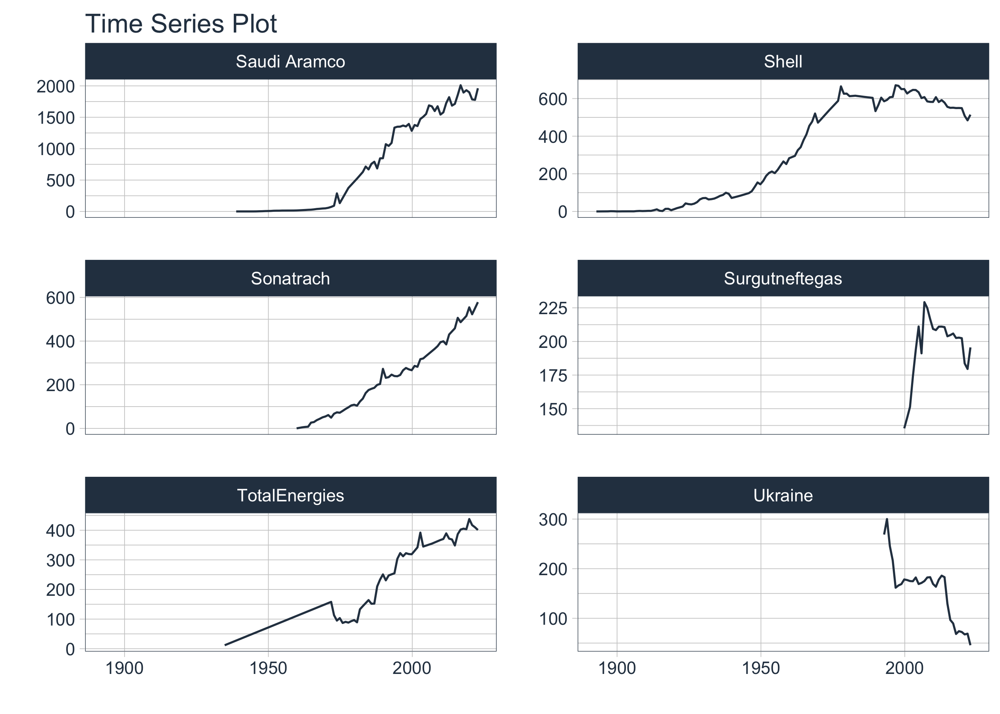
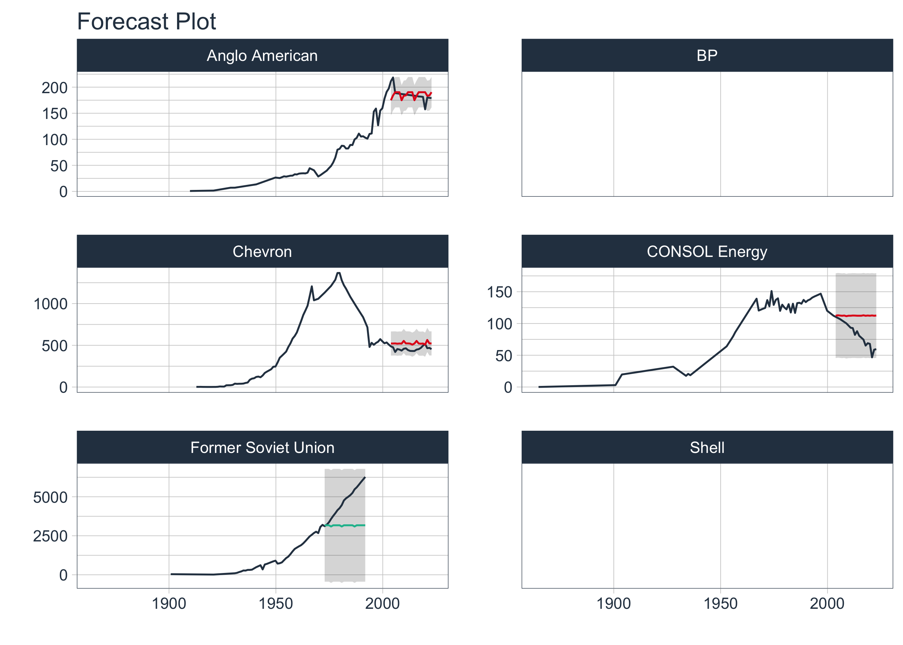

<link href="index_files/libs/htmltools-fill-0.5.8.1/fill.css" rel="stylesheet" />
<script src="index_files/libs/htmlwidgets-1.6.4/htmlwidgets.js"></script>
<link href="index_files/libs/datatables-css-0.0.0/datatables-crosstalk.css" rel="stylesheet" />
<script src="index_files/libs/datatables-binding-0.33/datatables.js"></script>
<script src="index_files/libs/jquery-3.6.0/jquery-3.6.0.min.js"></script>
<link href="index_files/libs/dt-core-1.13.6/css/jquery.dataTables.min.css" rel="stylesheet" />
<link href="index_files/libs/dt-core-1.13.6/css/jquery.dataTables.extra.css" rel="stylesheet" />
<script src="index_files/libs/dt-core-1.13.6/js/jquery.dataTables.min.js"></script>
<link href="index_files/libs/crosstalk-1.2.1/css/crosstalk.min.css" rel="stylesheet" />
<script src="index_files/libs/crosstalk-1.2.1/js/crosstalk.min.js"></script>


This is my latest contribution to the [`#TidyTuesday` dataset](https://github.com/rfordatascience/tidytuesday) project, featuring a recent dataset on carbon major emissions.

In the [firs part](https://www.johaniefournier.com/blog/tyt2024w21_eda/), the goal was to do some Exploratory Data Analysis (EDA). To do so, I looked at the data structure, anomalies, outliers and relationships to ensure I have everithing I need for this second part.

In this second part, I will be predicting carbon emissions over space and time. I will be using machine learning techniques to predict future emissions based on historical data. I will be using the `spdep` package to create a spatial weights matrix, and the `modeltime` package to train machine learning models and make predictions for future emissions. Let's get started!

{}

## Data Preprocessing

The first step here is to add the GPS coordinate for all th 50 *parent_entity* in the dataset. To do so, we first need to find the headquarters location for each company.

### Get Headquarters Location

``` r
# Load the data
data<-read_rds("data/final_data.rds")
head(data)
```

    # A tibble: 6 × 3
      parent_entity_fct              date       observed
      <fct>                          <date>        <dbl>
    1 Abu Dhabi National Oil Company 1962-10-24    0.498
    2 Abu Dhabi National Oil Company 1963-10-24    1.05 
    3 Abu Dhabi National Oil Company 1964-10-24    4.17 
    4 Abu Dhabi National Oil Company 1965-10-24    6.19 
    5 Abu Dhabi National Oil Company 1966-10-24    7.56 
    6 Abu Dhabi National Oil Company 1967-10-24    8.00 

``` r
parent_entity<-data|>  
  mutate(parent_entity = as.character(parent_entity_fct))|> 
  select(parent_entity)|>  
  unique()

DT::datatable(parent_entity)
```

<div class="datatables html-widget html-fill-item" id="htmlwidget-0be696abd135366757ed" style="width:100%;height:auto;"></div>
<script type="application/json" data-for="htmlwidget-0be696abd135366757ed">{"x":{"filter":"none","vertical":false,"data":[["1","2","3","4","5","6","7","8","9","10","11","12","13","14","15","16","17","18","19","20","21","22","23","24","25","26","27","28","29","30","31","32","33","34","35","36","37","38","39","40","41","42","43","44","45","46","47","48","49","50"],["Abu Dhabi National Oil Company","Alpha Metallurgical Resources","Anglo American","Arch Resources","BHP","BP","British Coal Corporation","Chevron","China (Cement)","China (Coal)","CNPC","Coal India","ConocoPhillips","CONSOL Energy","Czechoslovakia","Eni","Equinor","ExxonMobil","Former Soviet Union","Gazprom","Glencore","Iraq National Oil Company","Kazakhstan","Kuwait Petroleum Corp.","Libya National Oil Corp.","Lukoil","National Iranian Oil Co.","Nigerian National Petroleum Corp.","Occidental Petroleum","ONGC India","Peabody Coal Group","Pemex","Pertamina","Petrobras","Petroleos de Venezuela","Petronas","Poland","QatarEnergy","Repsol","Rio Tinto","Rosneft","Russian Federation","RWE","Sasol","Saudi Aramco","Shell","Sonatrach","Surgutneftegas","TotalEnergies","Ukraine"]],"container":"<table class=\"display\">\n  <thead>\n    <tr>\n      <th> <\/th>\n      <th>parent_entity<\/th>\n    <\/tr>\n  <\/thead>\n<\/table>","options":{"columnDefs":[{"orderable":false,"targets":0},{"name":" ","targets":0},{"name":"parent_entity","targets":1}],"order":[],"autoWidth":false,"orderClasses":false}},"evals":[],"jsHooks":[]}</script>

``` python
import pandas as pd
import requests

# Load data
data = r.parent_entity

# Function to get headquarters from Wikidata
def get_wikidata_headquarters(company):
    try:
        # Search for the company in Wikidata
        search_url = f"https://www.wikidata.org/w/api.php?action=wbsearchentities&search={company}&language=en&format=json"
        search_response = requests.get(search_url).json()
        
        if search_response['search']:
            # Get the Wikidata ID of the first search result
            wikidata_id = search_response['search'][0]['id']

            # Get detailed information from Wikidata using the ID
            entity_url = f"https://www.wikidata.org/wiki/Special:EntityData/{wikidata_id}.json"
            entity_response = requests.get(entity_url).json()

            # Extract the headquarters location
            entity_data = entity_response['entities'].get(wikidata_id, {})
            claims = entity_data.get('claims', {})
            headquarters_claim = claims.get('P159', [])
            
            if headquarters_claim:
                # Get the headquarters location label
                location_id = headquarters_claim[0]['mainsnak']['datavalue']['value']['id']
                location_url = f"https://www.wikidata.org/wiki/Special:EntityData/{location_id}.json"
                location_response = requests.get(location_url).json()

                location_data = location_response['entities'].get(location_id, {})
                location_label = location_data['labels'].get('en', {}).get('value', 'Unknown')
                
                return location_label
        return 'Headquarters not found'
    except Exception as e:
        return f'Error: {str(e)}'

# Assuming 'data' is your dataframe and 'parent_entity' is the column containing company names
data['headquarters'] = data['parent_entity'].apply(get_wikidata_headquarters)

# Display the updated dataframe
data.head()
```

``` r
# Complete missing headquarters
headquarters<-py$data |> 
  mutate(headquarters=case_when(
    parent_entity=="Alpha Metallurgical Resources" ~ "Bristol, Tennessee, États-Unis",
    parent_entity=="BHP" ~ "Melbourne, Ausralie",
    parent_entity=="BP" ~ "Londres, Royaume-Uni",
    parent_entity=="British Coal Corporation" ~ "Hobart House, Grosvenor Place, London",
    parent_entity=="Chevron" ~ "San Ramon, Californie, États-Unis",
    parent_entity=="China (Cement)" ~ "China",
    parent_entity=="China (Coal)" ~ "Beijing, Chine",
    parent_entity=="Czechoslovakia" ~ "Czech Republic",
    parent_entity=="Eni" ~ "Rpme, Italie",
    parent_entity=="Former Soviet Union" ~ "Moscou, Russie",
    parent_entity=="Kazakhstan" ~ "Astana, Kazakhstan",
    parent_entity=="Kuwait Petroleum Corp." ~ "Kuwait City, Koweït",
    parent_entity=="Libya National Oil Corp." ~ "Tripoli, Libye",
    parent_entity=="National Iranian Oil Co." ~ "Tehran, Iran",
    parent_entity=="Nigerian National Petroleum Corp." ~ "Abuja, Nigeria",
    parent_entity=="ONGC India" ~ "India",
    parent_entity=="Peabody Coal Group" ~ "Saint-Louis, Missouri, États-Unis",
    parent_entity=="Poland" ~ "Poland",
    parent_entity=="Russian Federation" ~ "Russie",
    parent_entity=="Shell" ~ "Londres, Royaume-Uni",
    parent_entity=="Ukraine" ~ "Ukraine",
    TRUE ~ headquarters
  ))
```

### Get GPS Coordinates

Now that we have the headquarters locations, we can extract the GPS coordinates for each location using the `ggmap` package.

``` r
#Get GPS coordinate with ggmap
ggmap::register_google("Insert_your_key_here")
geocoded_data<-ggmap::geocode(headquarters$headquarters) |> 
  bind_cols(headquarters) |> 
    drop_na()

write_rds(geocoded_data, "data/geocoded_data.rds")
```

``` r
#Load my data
geocoded_data<-read_rds("data/geocoded_data.rds")
head(geocoded_data)
```

    # A tibble: 6 × 4
          lon   lat parent_entity                  headquarters                  
        <dbl> <dbl> <chr>                          <chr>                         
    1  54.4    24.5 Abu Dhabi National Oil Company Abu Dhabi                     
    2 -82.2    36.6 Alpha Metallurgical Resources  Bristol, Tennessee, États-Unis
    3  -0.128  51.5 Anglo American                 London                        
    4 -90.2    38.6 Arch Resources                 St. Louis                     
    5 145.    -37.8 BHP                            Melbourne, Ausralie           
    6  -0.128  51.5 BP                             Londres, Royaume-Uni          

Let's put it all together!

``` r
data_final<-data |> 
  mutate(parent_entity = as.character(parent_entity_fct)) |>
  right_join(geocoded_data, by=c("parent_entity")) |> 
  select(-parent_entity_fct, -headquarters) 
```

### Create a Spatial Weights Matrix

We need some spatial information extracted from the coordinate to put into the temporal model. We will use the GPS coordinates to create a k-nearest neighbors spatial weights matrix. This matrix will be used as spatial information of the observed emissions, which will be used as a predictor in the machine learning models.

``` r
# Extract coordinates
coords <- data_final |> 
  select(lon, lat)

# Create k-nearest neighbors spatial weights matrix (example with k = 4)
knn <- spdep::knearneigh(coords, k = 4)
nb <- spdep::knn2nb(knn)
listw_knn <- spdep::nb2listw(nb, style = "W")

# Compute spatial lag using the weights matrix
spatial_lag <- spdep::lag.listw(listw_knn, data_final$observed)

# Add the spatial lag
data_spatial <- data_final |> 
  mutate(spatial_lag = spatial_lag) |> 
  select(-lon, -lat)
```

``` r
top6_entity<-data_spatial |>
  select(parent_entity) |>
  unique() |> 
  top_n(6) 

data_spatial |> 
    group_by(parent_entity) |> 
    filter(parent_entity %in% top6_entity$parent_entity) |> 
    plot_time_series(date, observed,
                     .facet_ncol = 2,
                     .smooth = FALSE, 
                     .interactive = FALSE)
```



## Modeling

Now that we have the spatial information, we can start training machine learning models to predict future emissions. We will use the `modeltime` package to train and evaluate the models.

### Extend, Nesting and Splitting Data

First, we need to extend the time series data to include future observations for the next 20 years, then nest the data by the parent entity, and finally split the data into training and testing sets.

``` r
nested_data_tbl <- data_spatial|> 
    group_by(parent_entity)|> 
  #Extend
    extend_timeseries(
        .id_var = parent_entity,
        .date_var = date,
        .length_future = 20
    )|> 
  #Nest
    nest_timeseries(
        .id_var = parent_entity,
        .length_future = 20
    )|> 
  #Split
    split_nested_timeseries(
        .length_test = 20
    )
```

### Model training

Next, we will train machine learning models to predict future emissions. We will train two XGBoost models with different learning rates and a Temporal Hierarchical Forecasting (THief) model.

``` r
# Recipe
rec_xgb <- recipe(observed ~ ., extract_nested_train_split(nested_data_tbl)) |> 
    step_timeseries_signature(date) |> 
    step_rm(date) |> 
    step_zv(all_predictors()) |> 
    step_dummy(all_nominal_predictors(), one_hot = TRUE)

# Models 
wflw_xgb_1 <- workflow()|> 
    add_model(boost_tree("regression", learn_rate = 0.35)|>  set_engine("xgboost"))|> 
    add_recipe(rec_xgb)

wflw_xgb_2 <- workflow()|> 
    add_model(boost_tree("regression", learn_rate = 0.50)|>  set_engine("xgboost"))|> 
    add_recipe(rec_xgb)

wflw_thief <- workflow()|> 
    add_model(temporal_hierarchy()|>  set_engine("thief"))|> 
    add_recipe(recipe(observed ~ ., extract_nested_train_split(nested_data_tbl)))


# Nested Modeling
parallel_start(6)
nested_modeltime_tbl <- nested_data_tbl|> 
    modeltime_nested_fit(
        model_list = list(
            wflw_xgb_1,
            wflw_xgb_2,
            wflw_thief
        ),
        control = control_nested_fit(
            verbose   = TRUE,
            allow_par = TRUE
        )
    )
```

### Review Errors

Before selecting the best model, we need to review any errors that occurred during the training process. We will also check the accuracy of the models and investigate any anomalies.

``` r
# #1) list errors
# errors<-nested_modeltime_tbl|> 
#   extract_nested_error_report()
# 
# #2) Spot too high accuracy
# nested_modeltime_tbl |> 
#     extract_nested_test_accuracy() |> 
#     table_modeltime_accuracy()
# 
# #3) Investigate
# nested_modeltime_tbl|> 
#     filter(parent_entity == "Lukoil") |> 
#     extract_nested_train_split()
# 
# nested_modeltime_tbl|> 
#     extract_nested_test_forecast() |> 
#     filter(parent_entity == "Former Soviet Union") |> 
#     group_by(parent_entity) |> 
#     plot_modeltime_forecast(.facet_ncol = 3,
#                             .interactive = FALSE)

#4) remove small time series
ids_small_timeseries <- c("Lukoil", "Rosneft", "Glencore","Surgutneftegas", "Ukraine")

nested_modeltime_subset_tbl <- nested_modeltime_tbl|> 
    filter(!parent_entity %in% ids_small_timeseries)
```

### Select Best Models

Next, we will select the best models based on the root mean square error (RMSE) metric. We will visualize the best models to compare their performance and identify any anomalies.

``` r
nested_best_tbl <- nested_modeltime_subset_tbl|> 
    modeltime_nested_select_best(metric = "rmse")

nested_best_tbl |> 
    extract_nested_test_forecast() |> 
    filter(parent_entity %in% c("CONSOL Energy", "Shell", "Former Soviet Union", "Anglo American","Chevron","BP")) |> 
    group_by(parent_entity) |> 
    plot_modeltime_forecast(.facet_ncol = 2, 
                            .legend_show = FALSE,
                            .interactive = FALSE)
```



### Refit Models

Finally, we will refit the best models on the entire dataset to make predictions for future emissions. We will also review any errors that occurred during the refitting process and visualize the future forecasts for the selected companies.

``` r
# Refit
nested_best_refit_tbl <- nested_best_tbl|> 
    modeltime_nested_refit(
        control = control_refit(
            verbose   = TRUE,
            allow_par = TRUE
        )
    )

# Error last check
nested_best_refit_tbl|>  extract_nested_error_report()
```

    # A tibble: 5 × 4
      parent_entity                 .model_id .model_desc .error_desc               
      <chr>                             <int> <chr>       <chr>                     
    1 Alpha Metallurgical Resources        NA NULL        No method for an object o…
    2 CNPC                                 NA NULL        No method for an object o…
    3 Gazprom                              NA NULL        No method for an object o…
    4 Kazakhstan                           NA NULL        No method for an object o…
    5 Russian Federation                   NA NULL        No method for an object o…

``` r
# Visualize Future Forecast 
nested_best_refit_tbl|> 
    extract_nested_future_forecast()|> 
    filter(parent_entity %in% c("CONSOL Energy", "Shell", "Former Soviet Union", "Anglo American","Chevron","BP"))%>%
    group_by(parent_entity)|> 
    plot_modeltime_forecast(.facet_ncol = 2, 
                            .legend_show = FALSE,
                            .interactive = FALSE)
```


## Save preds

Finally, we will save the predictions for future emissions to a file for further analysis and visualization.

``` r
nested_best_refit_tbl |> 
    extract_nested_future_forecast() |> 
    write_rds("data/data_with_pred.rds")
```

## Conclusion

In this post, I have shown how to predict carbon emissions over space and time using the Carbon Majors dataset. I have demonstrated how to preprocess the data, create a spatial weights matrix, and train machine learning models to predict future emissions. I have also shown how to evaluate the model's performance and make predictions for future emissions. This is just one example of how machine learning can be used to analyze environmental data and make predictions about future trends. I hope this post has been helpful and informative, and that it has inspired you to explore the Carbon Majors dataset further and apply machine learning techniques to other environmental datasets.

<a href = "https://johaniefournier.aweb.page/p/4b2b1e24-af09-488d-8ff6-7b46ce61e367"> 

## Session Info

``` r
sessionInfo()
```

    R version 4.4.2 (2024-10-31)
    Platform: aarch64-apple-darwin20
    Running under: macOS Sequoia 15.2

    Matrix products: default
    BLAS:   /Library/Frameworks/R.framework/Versions/4.4-arm64/Resources/lib/libRblas.0.dylib 
    LAPACK: /Library/Frameworks/R.framework/Versions/4.4-arm64/Resources/lib/libRlapack.dylib;  LAPACK version 3.12.0

    locale:
    [1] en_US.UTF-8/en_US.UTF-8/en_US.UTF-8/C/en_US.UTF-8/en_US.UTF-8

    time zone: America/Toronto
    tzcode source: internal

    attached base packages:
    [1] stats     graphics  grDevices datasets  utils     methods   base     

    other attached packages:
     [1] jofou.lib_0.0.0.9000 reticulate_1.40.0    tidytuesdayR_1.1.2  
     [4] tictoc_1.2.1         terra_1.8-10         sf_1.0-19           
     [7] pins_1.4.0           modeltime_1.3.1      fs_1.6.5            
    [10] timetk_2.9.0         yardstick_1.3.2      workflowsets_1.1.0  
    [13] workflows_1.1.4      tune_1.2.1           rsample_1.2.1       
    [16] parsnip_1.2.1        modeldata_1.4.0      infer_1.0.7         
    [19] dials_1.3.0          scales_1.3.0         broom_1.0.7         
    [22] tidymodels_1.2.0     recipes_1.1.0        doFuture_1.0.1      
    [25] future_1.34.0        foreach_1.5.2        skimr_2.1.5         
    [28] forcats_1.0.0        stringr_1.5.1        dplyr_1.1.4         
    [31] purrr_1.0.2          readr_2.1.5          tidyr_1.3.1         
    [34] tibble_3.2.1         ggplot2_3.5.1        tidyverse_2.0.0     
    [37] lubridate_1.9.4      kableExtra_1.4.0     inspectdf_0.0.12.1  
    [40] openxlsx_4.2.7.1     knitr_1.49          

    loaded via a namespace (and not attached):
     [1] rstudioapi_0.17.1   jsonlite_1.8.9      wk_0.9.4           
     [4] magrittr_2.0.3      farver_2.1.2        rmarkdown_2.29     
     [7] vctrs_0.6.5         spdep_1.3-10        base64enc_0.1-3    
    [10] htmltools_0.5.8.1   progress_1.2.3      s2_1.1.7           
    [13] spData_2.3.4        parallelly_1.41.0   StanHeaders_2.32.10
    [16] KernSmooth_2.23-26  zoo_1.8-12          ggfittext_0.10.2   
    [19] lifecycle_1.0.4     iterators_1.0.14    pkgconfig_2.0.3    
    [22] Matrix_1.7-2        R6_2.5.1            fastmap_1.2.0      
    [25] digest_0.6.37       colorspace_2.1-1    furrr_0.3.1        
    [28] labeling_0.4.3      timechange_0.3.0    compiler_4.4.2     
    [31] proxy_0.4-27        doParallel_1.0.17   withr_3.0.2        
    [34] backports_1.5.0     DBI_1.2.3           MASS_7.3-64        
    [37] lava_1.8.1          rappdirs_0.3.3      classInt_0.4-11    
    [40] tools_4.4.2         units_0.8-5         zip_2.3.1          
    [43] future.apply_1.11.3 nnet_7.3-20         anomalize_0.3.0    
    [46] glue_1.8.0          grid_4.4.2          generics_0.1.3     
    [49] gtable_0.3.6        tzdb_0.4.0          class_7.3-23       
    [52] data.table_1.16.4   hms_1.1.3           sp_2.1-4           
    [55] xml2_1.3.6          utf8_1.2.4          pillar_1.10.1      
    [58] splines_4.4.2       lhs_1.2.0           lattice_0.22-6     
    [61] renv_1.0.7          survival_3.8-3      deldir_2.0-4       
    [64] tidyselect_1.2.1    svglite_2.1.3       xfun_0.50          
    [67] hardhat_1.4.0       timeDate_4041.110   stringi_1.8.4      
    [70] DiceDesign_1.10     yaml_2.3.10         boot_1.3-31        
    [73] evaluate_1.0.3      codetools_0.2-20    cli_3.6.3          
    [76] RcppParallel_5.1.10 rpart_4.1.24        systemfonts_1.2.1  
    [79] repr_1.1.7          munsell_0.5.1       Rcpp_1.0.14        
    [82] globals_0.16.3      png_0.1-8           parallel_4.4.2     
    [85] gower_1.0.2         prettyunits_1.2.0   GPfit_1.0-8        
    [88] listenv_0.9.1       viridisLite_0.4.2   ipred_0.9-15       
    [91] xts_0.14.1          prodlim_2024.06.25  e1071_1.7-16       
    [94] crayon_1.5.3        rlang_1.1.5        
