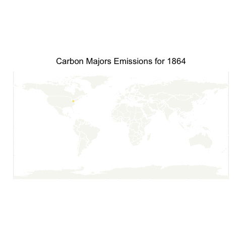

This is my latest contribution to the [`#TidyTuesday` dataset](https://github.com/rfordatascience/tidytuesday) project, featuring a recent dataset on carbon major emissions.

In the first part, I did some Exploratory Data Analysis (EDA) to look at the data set and summarize the main characteristics. In the second part, I built a spatio-temporal machine learning model to predict future emissions. In this part, I'm creating an animated map of the data including the predictions.

## Load the Data

``` r
data_with_pred<- read_rds("data/data_with_pred.rds") |> 
  left_join(read_rds("data/geocoded_data.rds"), by=c("parent_entity")) |> 
  rename(total_emissions_MtCO2e=.value) |> 
  mutate(date=year(as.Date(.index))) |>
  select(lon, lat, total_emissions_MtCO2e, date) 
```

## Animated Visualization

``` r
library(gganimate)
library(rnaturalearth)
library(rnaturalearthdata)

#world data
world <- ne_countries(scale = "medium", returnclass = "sf")

#Create the base map
base_map <- ggplot() +
 geom_sf(data=world, fill="#F7F7F2", color="white") +
 geom_point(data=data_with_pred, 
            aes(x=lon, 
                y=lat, 
                group=date, 
                color=total_emissions_MtCO2e,
                size=total_emissions_MtCO2e,
                alpha = 50)) +
  transition_time(date) +
  ggtitle('Carbon Majors Emissions for {frame_time}') +
  shadow_mark() +
  scale_color_gradient2(low = "darkgreen", mid="gold", high = "#F51400")+
  theme(legend.position = "none", 
        axis.title.x = element_blank(),
        axis.title.y = element_blank(),
        plot.title=element_text(hjust=0.5))
num_years <- max(data_with_pred$date) - min(data_with_pred$date) + 1

# Save the animation as a GIF
anim <- animate(base_map, nframes = num_years)
anim_save("data/ggmap_animation.gif", animation = anim)
```

``` r
# Read and display the saved GIF animation
animation <- magick::image_read("data/ggmap_animation.gif")
print(animation, info = FALSE)
```



## Conclusion

This animated map shows the evolution of carbon emissions over time. The size of the points represents the amount of emissions, while the color represents the intensity of the emissions. The map shows how emissions have evolved over time and how they are distributed geographically.

<a href = "https://johaniefournier.aweb.page/p/4b2b1e24-af09-488d-8ff6-7b46ce61e367"> 

## Session Info

``` r
sessionInfo()
```

    R version 4.1.1 (2021-08-10)
    Platform: x86_64-apple-darwin17.0 (64-bit)
    Running under: macOS Big Sur 10.16

    Matrix products: default
    BLAS:   /Library/Frameworks/R.framework/Versions/4.1/Resources/lib/libRblas.0.dylib
    LAPACK: /Library/Frameworks/R.framework/Versions/4.1/Resources/lib/libRlapack.dylib

    locale:
    [1] en_US.UTF-8/en_US.UTF-8/en_US.UTF-8/C/en_US.UTF-8/en_US.UTF-8

    attached base packages:
    [1] stats     graphics  grDevices datasets  utils     methods   base     

    other attached packages:
     [1] rnaturalearthdata_1.0.0 rnaturalearth_1.0.1     gganimate_1.0.9        
     [4] jofou.lib_0.0.0.9000    reticulate_1.37.0       tidytuesdayR_1.0.2     
     [7] tictoc_1.2.1            terra_1.6-17            sf_1.0-5               
    [10] pins_1.0.1.9000         fs_1.5.2                timetk_2.6.1           
    [13] yardstick_1.2.0         workflowsets_0.1.0      workflows_0.2.4        
    [16] tune_0.1.6              rsample_0.1.0           parsnip_1.1.1          
    [19] modeldata_0.1.1         infer_1.0.0             dials_0.0.10           
    [22] scales_1.3.0            broom_1.0.4             tidymodels_0.1.4       
    [25] recipes_0.1.17          doFuture_0.12.0         future_1.22.1          
    [28] foreach_1.5.1           skimr_2.1.5             forcats_1.0.0          
    [31] stringr_1.5.0           dplyr_1.1.2             purrr_1.0.1            
    [34] readr_2.1.4             tidyr_1.3.0             tibble_3.2.1           
    [37] ggplot2_3.5.1           tidyverse_2.0.0         lubridate_1.9.2        
    [40] kableExtra_1.3.4.9000   inspectdf_0.0.11        openxlsx_4.2.4         
    [43] knitr_1.36             

    loaded via a namespace (and not attached):
     [1] readxl_1.4.2       backports_1.4.1    systemfonts_1.0.3  repr_1.1.7        
     [5] splines_4.1.1      listenv_0.8.0      usethis_2.0.1      digest_0.6.29     
     [9] htmltools_0.5.8.1  magick_2.7.3       fansi_0.5.0        magrittr_2.0.3    
    [13] tzdb_0.1.2         globals_0.14.0     ggfittext_0.9.1    gower_0.2.2       
    [17] xts_0.12.1         svglite_2.0.0      hardhat_1.3.0      timechange_0.1.1  
    [21] prettyunits_1.1.1  colorspace_2.0-2   rvest_1.0.3        rappdirs_0.3.3    
    [25] xfun_0.39          crayon_1.4.2       jsonlite_1.8.4     survival_3.2-11   
    [29] zoo_1.8-12         iterators_1.0.13   glue_1.6.2         gtable_0.3.0      
    [33] ipred_0.9-12       webshot_0.5.2      future.apply_1.8.1 DBI_1.1.1         
    [37] Rcpp_1.0.13        viridisLite_0.4.0  progress_1.2.2     units_0.7-2       
    [41] GPfit_1.0-8        proxy_0.4-26       lava_1.6.10        prodlim_2019.11.13
    [45] httr_1.4.6         pkgconfig_2.0.3    farver_2.1.0       nnet_7.3-16       
    [49] utf8_1.2.2         tidyselect_1.2.0   rlang_1.1.1        DiceDesign_1.9    
    [53] munsell_0.5.0      cellranger_1.1.0   tools_4.1.1        cli_3.6.1         
    [57] generics_0.1.3     evaluate_0.14      fastmap_1.2.0      yaml_2.2.1        
    [61] zip_2.2.0          xml2_1.3.4         compiler_4.1.1     rstudioapi_0.14   
    [65] curl_5.2.3         png_0.1-7          e1071_1.7-9        lhs_1.1.3         
    [69] tweenr_2.0.3       stringi_1.7.5      lattice_0.20-44    Matrix_1.3-4      
    [73] classInt_0.4-3     vctrs_0.6.5        pillar_1.9.0       lifecycle_1.0.3   
    [77] furrr_0.2.3        R6_2.5.1           renv_1.0.7         KernSmooth_2.23-20
    [81] parallelly_1.28.1  codetools_0.2-18   MASS_7.3-54        withr_2.5.0       
    [85] parallel_4.1.1     hms_1.1.3          grid_4.1.1         rpart_4.1-15      
    [89] timeDate_3043.102  class_7.3-19       rmarkdown_2.25     base64enc_0.1-3   
