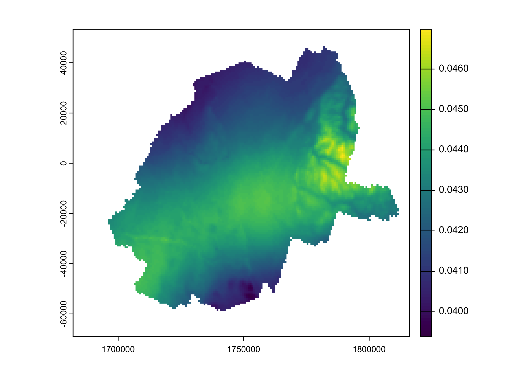

<a href = "https://johaniefournier.aweb.page/p/4b2b1e24-af09-488d-8ff6-7b46ce61e367"> 
</a>

<br>

Understanding precipitation patterns is essential for climate analysis, agriculture, and water resource management. In previous blog posts, we conducted an exploratory data analysis (EDA) to uncover key trends, spatial distributions, and relationships within the dataset. Then build an XGBoost model to predict precipitation using historical climate data. In this post, we will create an animated visualization of future precipitation predictions to better understand the trends and anomalies in the data.

# Get the Data

``` r
# Create raster from predicted data
year=1993:2023
for (y in year){

data<-readRDS("Data/data_spatial.rds") |>
  filter(year %in% y) |>
  select(-year) 

raster<-data|> 
  terra::vect() |> 
  terra::rast()

terra::values(raster) <- data$value

writeRaster(raster, paste0("Data/precipitation_",y,".tif"), overwrite=TRUE)
}

# Create a raster stack
rastlist <- list.files(path = "Data/", pattern='.tif', 
all.files=TRUE, full.names=TRUE)

allrasters <- rast(rastlist) 

#Changes name
names(allrasters)<-as.character(year)
```

# Disaggregate the data

To augment the resolution of the data, we will disaggregate the data to a daily level. This will allow us to better understand the trends and patterns in the data.

### Extraction the covariate

``` r
library(KrigR)
CDQ_rast <- terra::rast("Data/precipitation_raster.tif")

Covsls <- CovariateSetup(
  Training = CDQ_rast,
  Target = .009,
  Dir = Dir.Covariates,
  Keep_Global = TRUE
)
```

## Krigging

``` r
QuickStart_Krig <- Kriging(
  Data = CDQ_rast, # data we want to krig as a raster object
  Covariates_training = Covs_ls[[1]], # training covariate as a raster object
  Covariates_target = Covs_ls[[2]], # target covariate as a raster object
  Equation = "GMTED2010", # the covariate(s) we want to use
  nmax = 40, # degree of localisation
  Cores = 3, # we want to krig using three cores to speed this process up
  FileName = "QuickStart_Krig", # the file name for our full kriging output
  Dir = Dir.Exports # which directory to save our final input in
)
```

``` r
precipitation_krigged <- terra::rast("Exports/QuickStart_Krig_Kriged.nc")

qc_sf <- rgeoboundaries::gb_adm2(country = "CAN") |>
  filter(shapeName %in% c("Centre-du-Québec")) |> 
  select(shapeName, geometry) 


precip_predicted <- precipitation_krigged |>
    terra::crop(
        qc_sf,
        snap = "in",
        mask = TRUE
    ) |>
    terra::project("EPSG:3978")
```

``` r
terra::plot(precip_predicted[[1]])
```



# Animated Map

## Prepare the data

``` r
#Change layer name
names(precip_predicted)<-as.character(year)
 
# convert into a data frame
precip_predicted_df <- as.data.frame(
    precip_predicted,
    xy = TRUE, na.rm = TRUE
)

precip_predicted_long <- precip_predicted_df |>
    tidyr::pivot_longer(
        !c(x, y),
        names_to = "year",
        values_to = "value"
    )


# year ton integer and m to mm
precip_predicted_long<-precip_predicted_long |>
  mutate(year=as.integer(year),
         precip=value*1000) |>
  select(-value)


# create breaks

vmin <- min(precip_predicted_long$precip)
vmax <- max(precip_predicted_long$precip)

breaks <- classInt::classIntervals(
    precip_predicted_long$precip,
    n = 14,
    style = "equal"
)$brks
```

## Create the visual

``` r
#color
cols <- hcl.colors(
    n = length(breaks),
    palette = "Spectral",
    rev = TRUE
)

#theme
theme_for_the_win <- function(){
    theme_void() +
    theme(
        legend.position = "bottom",
        legend.title = element_text(
            size = 50, color = "grey10"
        ),
        legend.text = element_text(
            size = 30, color = "grey10"
        ),
        plot.title = element_text(
            size = 60, color = "grey10",
            hjust = .5, vjust = -1
        ),
        plot.subtitle = element_text(
            size = 70, color = "#c43c4e",
            hjust = .5, vjust = -1
        ), # plot.subtitle
        plot.margin = unit(
            c(
                t = 0, r = 0,
                l = 0, b = 0
            ), "lines"
        )
    )    
}

temp_map <- ggplot() +
    geom_raster(
        data = precip_predicted_long,
        aes(
            x = x, y = y,
            fill = precip
        )
    ) +
    scale_fill_gradientn(
        name = "Precipitation (mm)",
        colors = cols,
        limits = c(vmin, vmax),
        breaks = breaks,
        labels = round(
            breaks, 0
        )
    ) +
    guides(
        fill = guide_colorbar(
            direction = "horizontal",
            barheight = unit(
                1,
                units = "cm"
            ),
            barwidth = unit(
                50,
                units = "cm"
            ),
            title.position = "top",
            label.position = "bottom",
            title.hjust = .5,
            label.hjust = .5,
            nrow = 1,
            byrow = TRUE
        )
    ) +
    coord_sf(crs = "EPSG:3978") +
    labs(
        title = "Centre-du-Québec (1993-2023)",
        subtitle = "{round(as.integer(frame_time), 0)}"
    ) +
    theme_for_the_win()
```

``` r
timelapse_map <- temp_map +
    gganimate::transition_time(
        year
    ) +
    gganimate::ease_aes(
        "linear",
        interval = .1
    )
```

## Animate

``` r
animated_map <- gganimate::animate(
    timelapse_map,
    nframes = 100,
    duration = 20,
    start_pause = 3,
    end_pause = 30,
    height = 1200,
    width = 1200,
    units = "px",
    renderer = gganimate::gifski_renderer(
        loop = TRUE
    )
)

gganimate::anim_save(
    "precip CDQ animated.gif",
    animated_map
)
```

``` r
# Read and display the saved GIF animation
animation <- magick::image_read("precip CDQ animated.gif")
print(animation, info = FALSE)
```


# Conclusion

In this post, we created an animated visualization of future precipitation predictions for Centre-du-Québec. This visualization allows us to better understand the trends and anomalies in the data, which can help inform decision-making in agriculture, water resource management, and climate analysis. By disaggregating the data to a daily level and krigging the data, we were able to create a more detailed and accurate visualization of future precipitation patterns. This visualization can be used to identify areas of high and low precipitation, as well as trends over time. Overall, this animated visualization provides valuable insights into future precipitation patterns in Centre-du-Québec.

<!-- AWeber Web Form Generator 3.0.1 -->
<style type="text/css">
#af-form-88198013 .af-body{font-family:Tahoma, serif;font-size:18px;color:#333333;background-image:none;background-position:inherit;background-repeat:no-repeat;padding-top:0px;padding-bottom:0px;}
#af-form-88198013 .af-body .privacyPolicy{font-family:Tahoma, serif;font-size:18px;color:#333333;}
#af-form-88198013 {border-style:none;border-width:none;border-color:#F8F8F8;background-color:#F8F8F8;}
#af-form-88198013 .af-standards .af-element{padding-left:50px;padding-right:50px;}
#af-form-88198013 .af-quirksMode{padding-left:50px;padding-right:50px;}
#af-form-88198013 .af-header{font-family:Tahoma, serif;font-size:16px;color:#333333;border-top-style:none;border-right-style:none;border-bottom-style:none;border-left-style:none;border-width:1px;background-image:none;background-position:inherit;background-repeat:no-repeat;background-color:#F8F8F8;padding-left:20px;padding-right:20px;padding-top:40px;padding-bottom:20px;}
#af-form-88198013 .af-footer{font-family:Tahoma, serif;font-size:16px;color:#333333;border-top-style:none;border-right-style:none;border-bottom-style:none;border-left-style:none;border-width:1px;background-image:url("https://awas.aweber-static.com/images/forms/journey/basic/background.png");background-position:top center;background-repeat:no-repeat;background-color:#F8F8F8;padding-left:20px;padding-right:20px;padding-top:80px;padding-bottom:80px;}
#af-form-88198013 .af-body input.text, #af-form-88198013 .af-body textarea{border-color:#000000;border-width:1px;border-style:solid;font-family:Tahoma, serif;font-size:18px;font-weight:normal;font-style:normal;text-decoration:none;color:#333333;background-color:#FFFFFF;}
#af-form-88198013 .af-body input.text:focus, #af-form-88198013 .af-body textarea:focus{border-style:solid;border-width:1px;border-color:#EDEDED;background-color:#FAFAFA;}
#af-form-88198013 .af-body label.previewLabel{font-family:Tahoma, serif;font-size:18px;font-weight:normal;font-style:normal;text-decoration:none;color:#333333;display:block;float:left;text-align:left;width:25%;}
#af-form-88198013 .af-body .af-textWrap{width:70%;display:block;float:right;}
#af-form-88198013 .buttonContainer input.submit{font-family:Tahoma, serif;font-size:24px;font-weight:normal;font-style:normal;text-decoration:none;color:#FFFFFF;background-color:#333333;background-image:none;}
#af-form-88198013 .buttonContainer{text-align:center;}
#af-form-88198013 .af-body label.choice{font-family:inherit;font-size:inherit;font-weight:normal;font-style:normal;text-decoration:none;color:#000000;}
#af-form-88198013 .af-body a{font-weight:normal;font-style:normal;text-decoration:underline;color:#000000;}
#af-form-88198013, #af-form-88198013 .quirksMode{width:100%;max-width:486.0px;}
#af-form-88198013.af-quirksMode{overflow-x:hidden;}
#af-form-88198013 .af-quirksMode .bodyText{padding-top:2px;padding-bottom:2px;}
#af-form-88198013{overflow:hidden;}
#af-form-88198013 button,#af-form-88198013 input,#af-form-88198013 submit,#af-form-88198013 textarea,#af-form-88198013 select,#af-form-88198013 label,#af-form-88198013 optgroup,#af-form-88198013 option {float:none;margin:0;position:static;}
#af-form-88198013 select,#af-form-88198013 label,#af-form-88198013 optgroup,#af-form-88198013 option {padding:0;}
#af-form-88198013 input,#af-form-88198013 button,#af-form-88198013 textarea,#af-form-88198013 select {font-size:100%;}
#af-form-88198013 .buttonContainer input.submit {width:auto;}
#af-form-88198013 form,#af-form-88198013 textarea,.af-form-wrapper,.af-form-close-button,#af-form-88198013 img {float:none;color:inherit;margin:0;padding:0;position:static;background-color:none;border:none;}
#af-form-88198013 div {margin:0;}
#af-form-88198013 {display:block;}
#af-form-88198013 body,#af-form-88198013 dl,#af-form-88198013 dt,#af-form-88198013 dd,#af-form-88198013 h1,#af-form-88198013 h2,#af-form-88198013 h3,#af-form-88198013 h4,#af-form-88198013 h5,#af-form-88198013 h6,#af-form-88198013 pre,#af-form-88198013 code,#af-form-88198013 fieldset,#af-form-88198013 legend,#af-form-88198013 blockquote,#af-form-88198013 th,#af-form-88198013 td { float:none;color:inherit;margin:0;padding:0;position:static;}
#af-form-88198013 p { color:inherit;}
#af-form-88198013 ul,#af-form-88198013 ol {list-style-image:none;list-style-position:outside;list-style-type:disc;padding-left:40px;}
#af-form-88198013 .bodyText p {margin:1em 0;}
#af-form-88198013 table {border-collapse:collapse;border-spacing:0;}
#af-form-88198013 fieldset {border:0;}
.af-clear{clear:both;}
.af-form{box-sizing:border-box; margin:auto; text-align:left;}
.af-element{padding-bottom:5px; padding-top:5px;}
.af-form-wrapper{text-indent: 0;}
.af-body input.submit, .af-body input.image, .af-form .af-element input.button{float:none!important;}
.af-body input.submit{white-space: inherit;}
.af-body input.text{width:100%; padding:2px!important;}
.af-body .af-textWrap{text-align:left;}
.af-element label{float:left; text-align:left;}
.lbl-right .af-element label{text-align:right;}
.af-quirksMode .af-element{padding-left: 0!important; padding-right: 0!important;}
.af-body.af-standards input.submit{padding:4px 12px;}
.af-body input.image{border:none!important;}
.af-body input.text{float:none;}
.af-element label{display:block; float:left;}
.af-header,.af-footer { margin-bottom:0; margin-top:0; padding:10px; }
body {
}

#af-form-88198013 .af-body .af-textWrap {
  width: 100% !important;
}

#af-form-88198013 .af-body .af-element {
  padding-top: 0px!important;
  padding-bottom: 0.5rem!important;
}
#af-form-88198013 .af-body .af-element:first-child {
  margin-top: 0 !important;
}
#af-form-88198013 .af-body input.text,
#af-form-88198013 .af-body textarea {
  box-sizing: border-box !important;
  border-radius:2px;
  margin-bottom: 0.75rem !important;
  padding: 8px 12px !important;
  -webkit-transition-duration: 0.3s;
          transition-duration: 0.3s;
}

#af-form-88198013 .af-body select {
  width: 100%;
}
#af-form-88198013 .choiceList-radio-stacked {
  margin-bottom: 1rem !important;
  width: 100% !important;
}
#af-form-88198013 .af-element-radio {
  margin: 0 !important;
}
#af-form-88198013 .af-element-radio input.radio {
  display: inline;
  height: 0;
  opacity: 0;
  overflow: hidden;
  width: 0;
}
#af-form-88198013 .af-element-radio input.radio:checked ~ label {
  font-weight: 700 !important;
}
#af-form-88198013 .af-element-radio input.radio:focus ~ label {
  box-shadow: inset 0 0 0 2px rgba(25,35,70,.25);
}
#af-form-88198013 .af-element-radio input.radio:checked ~ label:before {
  background-color: #777777;
  border-color: #d6dee3;
}
#af-form-88198013 .af-element-radio label.choice {
  display: block !important;
  font-weight: 300 !important;
  margin: 0rem 0rem 0.5rem 1rem !important;
  padding: 0.25rem 1rem !important;
  position: relative;
  -webkit-transition-duration: 0.3s;
          transition-duration: 0.3s;
}
#af-form-88198013 .af-element-radio label.choice:before {
  background-color: #FFF;
  border: 1px solid #d6dee3;
  border-radius: 50%;
  content: '';
  height: 0.75rem;
  margin-top: 0.25rem;
  margin-left: -1.3rem;
  position: absolute;
  -webkit-transition-duration: 0.3s;
          transition-duration: 0.3s;
  width: 0.75rem;
}
#af-form-88198013 .af-selectWrap, 
#af-form-88198013 .af-dateWrap {
  width:100% !important;
  margin: 0.5rem 0rem 0.5rem !important;
  -webkit-transition-duration: 0.3s;
          transition-duration: 0.3s;
}
#af-form-88198013 .af-selectWrap select {
  padding: 0.5rem !important;
  height: 2.5rem;
}
#af-form-88198013 .af-dateWrap select {
  width: 32% !important;
  height: 2.5rem;
  padding: 0.5rem !important;
  margin: 0rem 0rem 0.75rem 0rem !important;
}
#af-form-88198013 .af-checkWrap {
  padding: 0.5rem 0.5rem 0.75rem !important;
}
#af-form-88198013 .buttonContainer {
  box-sizing: border-box !important;
}
#af-form-88198013 .af-footer {
  box-sizing: border-box !important;
}

#af-form-88198013 .af-footer p {
  margin: 0 !important;
}
#af-form-88198013 input.submit,
#af-form-88198013 #webFormSubmitButton {
  border: none;
  border-radius:2px;
  font-weight: bold;
  margin-top: 0.75rem !important;
  margin-bottom: 1.5rem !Important;
  padding: 0.75rem 2rem !important;
  -webkit-transition-duration: 0.3s;
          transition-duration: 0.3s;
  }
#af-form-88198013 input.submit:hover,
#af-form-88198013 #webFormSubmitButton:hover {
  cursor: pointer;
  opacity: 0.8;
}

#af-form-88198013 input.text:hover {
  cursor: pointer;
  opacity: 0.8;
}

.poweredBy a,
.privacyPolicy p {
  color: #333333 !important;
  font-size: 0.75rem !important;
  margin-bottom: 0rem !important;
}
</style>
<form method="post" class="af-form-wrapper" accept-charset="UTF-8" action="https://www.aweber.com/scripts/addlead.pl">

<input type="hidden" name="meta_web_form_id" value="88198013" />
<input type="hidden" name="meta_split_id" value="" />
<input type="hidden" name="listname" value="awlist6634098" />
<input type="hidden" name="redirect" value="https://www.aweber.com/thankyou-coi.htm?m=text" id="redirect_54bc847594a3cbc94af88c076598c2e4" />

<input type="hidden" name="meta_adtracking" value="Sign_Up_Form" />
<input type="hidden" name="meta_message" value="1" />
<input type="hidden" name="meta_required" value="name,email" />

<input type="hidden" name="meta_tooltip" value="" />

<h5>
<br><span style="font-size:36px;"><strong>WANT MORE?</strong></span>
</h5>
<p>
Sign up for exclusive content, emails & things I doesn't share anywhere else.
</p>

<label class="previewLabel" for="awf_field-117870704">Name:</label>

<input id="awf_field-117870704" type="text" name="name" class="text" value="" onfocus=" if (this.value == '') { this.value = ''; }" onblur="if (this.value == '') { this.value='';} " tabindex="500" />

<label class="previewLabel" for="awf_field-117870705">Email:</label>

<input class="text" id="awf_field-117870705" type="email" name="email" value="" tabindex="501" onfocus=" if (this.value == '') { this.value = ''; }" onblur="if (this.value == '') { this.value='';}" />

<input name="submit" class="submit" type="submit" value="Let&#x27;s do it!" tabindex="502" />

<p>
We respect your <a title="Privacy Policy" href="https://www.aweber.com/permission.htm" target="_blank" rel="nofollow">email privacy</a>
</p>

<p>
<a href="https://www.aweber.com" title="AWeber Email Marketing" target="_blank" rel="nofollow">Powered by AWeber Email Marketing</a>
</p>

<p>
 
</p>


</form>
<!-- /AWeber Web Form Generator 3.0.1 -->

## Session Info

``` r
sessionInfo()
```

    R version 4.4.2 (2024-10-31)
    Platform: aarch64-apple-darwin20
    Running under: macOS Sequoia 15.2

    Matrix products: default
    BLAS:   /Library/Frameworks/R.framework/Versions/4.4-arm64/Resources/lib/libRblas.0.dylib 
    LAPACK: /Library/Frameworks/R.framework/Versions/4.4-arm64/Resources/lib/libRlapack.dylib;  LAPACK version 3.12.0

    locale:
    [1] en_US.UTF-8/en_US.UTF-8/en_US.UTF-8/C/en_US.UTF-8/en_US.UTF-8

    time zone: America/Toronto
    tzcode source: internal

    attached base packages:
    [1] stats     graphics  grDevices datasets  utils     methods   base     

    other attached packages:
     [1] jofou.lib_0.0.0.9000 reticulate_1.40.0    tidytuesdayR_1.1.2  
     [4] tictoc_1.2.1         terra_1.8-10         sf_1.0-19           
     [7] pins_1.4.0           modeltime_1.3.1      fs_1.6.5            
    [10] timetk_2.9.0         yardstick_1.3.2      workflowsets_1.1.0  
    [13] workflows_1.1.4      tune_1.2.1           rsample_1.2.1       
    [16] parsnip_1.2.1        modeldata_1.4.0      infer_1.0.7         
    [19] dials_1.3.0          scales_1.3.0         broom_1.0.7         
    [22] tidymodels_1.2.0     recipes_1.1.0        doFuture_1.0.1      
    [25] future_1.34.0        foreach_1.5.2        skimr_2.1.5         
    [28] forcats_1.0.0        stringr_1.5.1        dplyr_1.1.4         
    [31] purrr_1.0.2          readr_2.1.5          tidyr_1.3.1         
    [34] tibble_3.2.1         ggplot2_3.5.1        tidyverse_2.0.0     
    [37] lubridate_1.9.4      kableExtra_1.4.0     inspectdf_0.0.12.1  
    [40] openxlsx_4.2.7.1     knitr_1.49          

    loaded via a namespace (and not attached):
     [1] DBI_1.2.3           rlang_1.1.5         magrittr_2.0.3     
     [4] furrr_0.3.1         e1071_1.7-16        compiler_4.4.2     
     [7] png_0.1-8           systemfonts_1.2.1   vctrs_0.6.5        
    [10] lhs_1.2.0           pkgconfig_2.0.3     crayon_1.5.3       
    [13] fastmap_1.2.0       magick_2.8.5        backports_1.5.0    
    [16] rmarkdown_2.29      prodlim_2024.06.25  ggfittext_0.10.2   
    [19] tzdb_0.4.0          xfun_0.50           jsonlite_1.8.9     
    [22] progress_1.2.3      parallel_4.4.2      prettyunits_1.2.0  
    [25] R6_2.5.1            StanHeaders_2.32.10 stringi_1.8.4      
    [28] parallelly_1.41.0   rpart_4.1.24        Rcpp_1.0.14        
    [31] iterators_1.0.14    future.apply_1.11.3 zoo_1.8-12         
    [34] base64enc_0.1-3     Matrix_1.7-2        splines_4.4.2      
    [37] nnet_7.3-20         timechange_0.3.0    tidyselect_1.2.1   
    [40] rstudioapi_0.17.1   yaml_2.3.10         timeDate_4041.110  
    [43] codetools_0.2-20    listenv_0.9.1       lattice_0.22-6     
    [46] withr_3.0.2         evaluate_1.0.3      survival_3.8-3     
    [49] units_0.8-5         proxy_0.4-27        RcppParallel_5.1.10
    [52] zip_2.3.1           xts_0.14.1          xml2_1.3.6         
    [55] pillar_1.10.1       KernSmooth_2.23-26  renv_1.0.7         
    [58] generics_0.1.3      hms_1.1.3           munsell_0.5.1      
    [61] globals_0.16.3      class_7.3-23        glue_1.8.0         
    [64] tools_4.4.2         data.table_1.16.4   gower_1.0.2        
    [67] grid_4.4.2          ipred_0.9-15        colorspace_2.1-1   
    [70] repr_1.1.7          cli_3.6.3           DiceDesign_1.10    
    [73] rappdirs_0.3.3      viridisLite_0.4.2   svglite_2.1.3      
    [76] lava_1.8.1          gtable_0.3.6        GPfit_1.0-8        
    [79] digest_0.6.37       classInt_0.4-11     htmltools_0.5.8.1  
    [82] lifecycle_1.0.4     hardhat_1.4.0       MASS_7.3-64        
